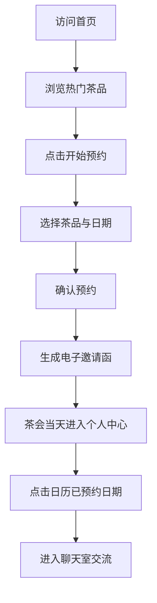

## 1. 产品概述

「茶话会」是一款在线虚拟茶会预约与茶品推荐平台，用户可根据个人口味偏好浏览茶品、预约茶会日期、获取电子邀请函，并在茶会当天进入实时聊天室与同好茶友交流品茶心得。旨在打造温暖、文艺、有质感的线上品茶社交空间。

## 2. 核心功能

### 2.1 用户角色

| 角色 | 注册方式 | 核心权限 |
|------|----------|----------|
| 普通用户 | 用户名注册 | 浏览茶品、预约茶会、参与聊天室 |

### 2.2 功能模块

1. **首页**：Hero 大海报（茶叶飘动动画 + 热茶蒸汽动画）、开始预约按钮、热门茶品推荐横向滚动卡片
2. **个人中心**：个人信息展示、月视图茶会日历、已预约茶会详情弹窗、电子邀请函
3. **聊天室**：在线成员列表、实时消息收发、茶品信息展示、茶会倒计时

### 2.3 页面详情

| 页面名称 | 模块名称 | 功能描述 |
|----------|----------|----------|
| 首页 | Hero 海报区 | 背景从 #F2E8D5 到 #E8DAC1 渐变，中央热茶图标配蒸汽曲线动画，茶叶飘动效果，开始预约按钮 |
| 首页 | 热门茶品推荐 | 横向滚动卡片，每张 160px 宽，含茶品缩略图、名称、风味描述，悬停上移 8px 并增加阴影 |
| 个人中心 | 个人信息栏 | 左侧展示头像、用户名、茶会次数统计，浅米色背景，圆角设计，#C9B99A 细线边框 |
| 个人中心 | 茶会日历 | 右侧月视图日历，已预约日期用浅绿色小圆点标记，点击弹出茶会详情（茶品名、时间、聊天室入口） |
| 聊天室 | 成员列表 | 左侧在线成员列表，圆形头像 + 昵称，移动端改为顶部滑动条 |
| 聊天室 | 消息区 | 文字和 emoji 消息气泡，自己消息浅绿 #D4E9D6 靠右，他人消息白色靠左，背景浅灰 #F5F2EB |
| 聊天室 | 输入区 | 底部输入框 + 发送按钮，焦点时边框变 #8B7355 并带 0.3s 呼吸光效 |
| 聊天室 | 顶部栏 | 当前茶品名称 + 距离茶会结束倒计时 |

## 3. 核心流程

用户访问首页 → 浏览热门茶品 → 点击开始预约 → 选择茶品和日期 → 确认预约 → 系统生成电子邀请函 → 茶会当天进入个人中心 → 点击日历中已预约日期 → 进入聊天室与茶友交流

## 4. 用户界面设计

### 4.1 设计风格

- **主色调**：米色渐变（#F2E8D5 → #E8DAC1）、浅绿 #D4E9D6、棕色边框 #C9B99A、深棕 #8B7355
- **按钮样式**：圆角设计，按下时弹簧回弹动画（transform scale 0.95 → 1.0，0.2s）
- **字体**：衬线体（Georgia / "Noto Serif SC"），温暖文艺的纸墨风格
- **布局风格**：卡片式布局，统一圆角，细线边框
- **图标风格**：线性简洁图标，融入茶文化元素

### 4.2 页面设计概述

| 页面名称 | 模块名称 | UI 元素 |
|----------|----------|---------|
| 首页 | Hero 海报区 | 渐变背景、热茶 SVG 图标、蒸汽曲线动画、茶叶飘动粒子、衬线大标题、圆角按钮 |
| 首页 | 茶品推荐 | 横向滚动容器、圆角卡片（160px 宽）、悬停上移阴影过渡、茶品图片、名称、风味标签 |
| 个人中心 | 信息栏 | 头像圆形裁剪、用户名大号衬线字体、统计数字、圆角卡片边框 |
| 个人中心 | 日历 | 月视图表格、浅绿色圆点标记、点击弹窗、聊天室入口按钮 |
| 聊天室 | 成员列表 | 垂直滚动列表、圆形头像、昵称、在线状态点 |
| 聊天室 | 消息区 | 聊天气泡、文字 + emoji、时间戳、背景浅灰纹理 |
| 聊天室 | 输入区 | 圆角输入框、发送按钮、聚焦呼吸光效动画 |
| 聊天室 | 顶部栏 | 茶品名称标签、倒计时数字显示 |

### 4.3 响应式设计

- **桌面端**：个人中心左右布局（信息栏 + 日历），聊天室左右布局（成员列表 + 消息区）
- **移动端**：个人中心垂直排列，聊天室成员列表改为顶部横向滑动条
- **触控优化**：按钮最小尺寸 44px，卡片点击区域充足

### 4.4 性能要求

- 聊天室消息推送延迟 ≤ 500ms
- 日历加载时间 ≤ 500ms
- 首页动画帧率 ≥ 50fps
