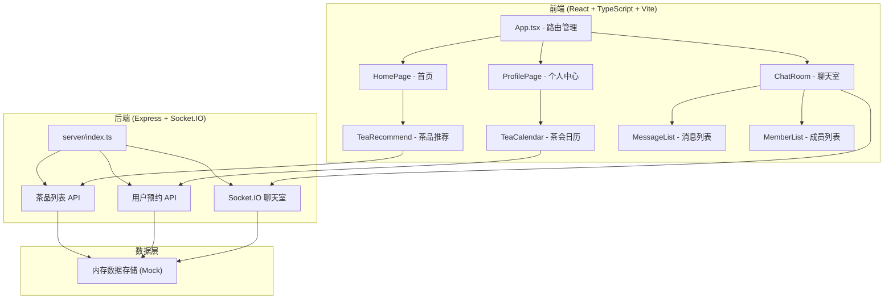
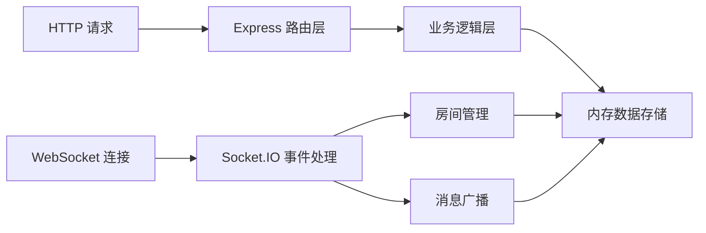
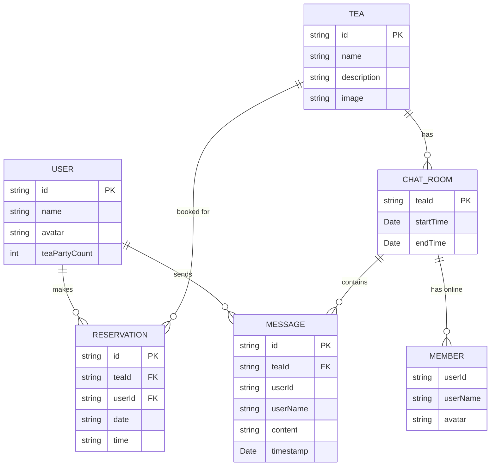

## 1. 架构设计



## 2. 技术描述

- **前端**：React 18 + TypeScript + Vite + React Router DOM + Socket.IO Client
- **后端**：Express 4 + Socket.IO + CORS + UUID
- **构建工具**：Vite（开发服务器 + HMR + 代理到后端 3001 端口）
- **样式方案**：原生 CSS（含 CSS 动画、渐变、响应式媒体查询）
- **并发启动**：concurrently 同时启动前后端

## 3. 路由定义

| 路由 | 用途 |
|------|------|
| `/` | 首页（Hero 海报 + 热门茶品推荐） |
| `/profile` | 个人中心（个人信息 + 茶会日历） |
| `/chat/:teaId` | 聊天室（实时消息 + 成员列表 + 倒计时） |

## 4. API 定义

### 4.1 茶品列表

```typescript
interface Tea {
  id: string;
  name: string;
  description: string;
  flavor: string[];
  image: string;
}

// GET /api/teas
// Response: Tea[]
```

### 4.2 用户预约

```typescript
interface TeaReservation {
  id: string;
  teaId: string;
  userId: string;
  date: string;
  time: string;
}

// POST /api/reservations
// Request Body: { teaId, userId, date, time }
// Response: TeaReservation

// GET /api/reservations/:userId
// Response: TeaReservation[]
```

### 4.3 Socket.IO 事件

```typescript
// 客户端发送
'join': { teaId, userId, userName }
'message': { teaId, userId, userName, content, timestamp }
'leave': { teaId, userId }

// 服务端广播
'members': Member[]
'message': { id, userId, userName, content, timestamp, avatar }
```

## 5. 服务端架构



## 6. 数据模型

### 6.1 数据模型定义



### 6.2 Mock 数据初始化

后端启动时初始化：
- 6-8 款热门茶品数据（名称、风味描述、图片）
- 演示用户数据
- 预约数据示例
