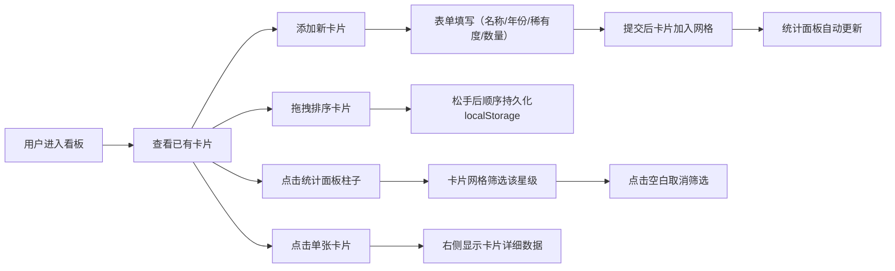

## 1. 产品概述

交互式收藏卡片统计看板，面向个人收藏者社区，提供直观可交互的收藏品稀有度与分布特征展示方式。用户可动态添加收藏卡片（球星卡、邮票等），通过拖拽排序和点击筛选探索多维度统计数据，并以可视化图表呈现收藏稀有度分布。

## 2. 核心功能

### 2.1 用户角色

| 角色 | 注册方式 | 核心权限 |
|------|---------|---------|
| 收藏者 | 无需注册（本地存储） | 添加卡片、拖拽排序、筛选查看、统计分析 |

### 2.2 功能模块

1. **主看板页面**：卡片添加表单、收藏卡片网格、统计面板

### 2.3 页面详情

| 页面名称 | 模块名称 | 功能描述 |
|---------|---------|---------|
| 主看板 | 添加表单 | 输入卡片名称、发行年份、稀有度（五星选择）、收藏数量 |
| 主看板 | 卡片网格 | 两列/三列/四列响应式布局，卡片悬浮动效，点击高亮，拖拽排序持久化 |
| 主看板 | 统计面板 | 稀有度分布柱状图（1-5星），收藏总数，点击柱子筛选，空白取消筛选 |

## 3. 核心流程

## 4. 用户界面设计

### 4.1 设计风格

- **主色调**：深蓝色 #1E3A5F（标题栏）、金色 #FFD700（5星高亮）
- **背景**：径向渐变 #F5F5F5 → #E8F0FE
- **卡片**：白色背景 + 柔和阴影 box-shadow: 0 2px 8px rgba(0,0,0,0.08)，圆角 8px
- **字体**：系统无衬线字体
- **按钮风格**：圆角，hover过渡0.2秒
- **动效**：拖拽缩放0.95半透明，悬浮上浮5px加深阴影，柱状图入场0.2秒

### 4.2 页面设计概览

| 页面名称 | 模块名称 | UI元素 |
|---------|---------|-------|
| 主看板 | 顶部标题栏 | 固定高度60px，深蓝色背景，白色标题文字 |
| 主看板 | 添加表单区域 | 名称输入框、年份输入框、五星稀有度选择、数量输入框、添加按钮 |
| 主看板 | 卡片网格区域 | 左60%宽度，响应式列数（2/3/4列），间距12px，可滚动隐藏滚动条 |
| 主看板 | 统计面板 | 右35%宽度，间距5%，固定位置，柱状图+总数+详细数据 |

### 4.3 响应式设计

- **桌面端（≥1024px）**：卡片网格四列布局
- **平板端（768-1023px）**：卡片网格三列布局
- **移动端（<768px）**：卡片网格两列布局，统计面板自适应宽度

### 4.4 性能指标

- 添加卡片和筛选响应 < 100ms
- 拖拽操作保持 60FPS
- 100张卡片滚动不卡顿
