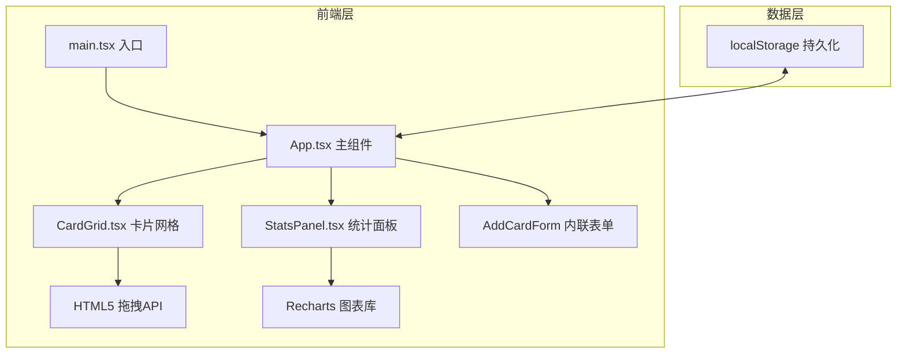
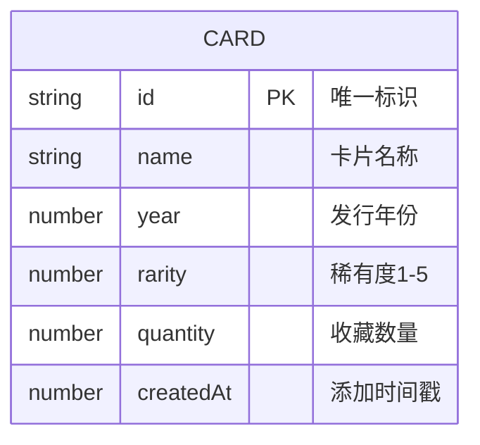

## 1. 架构设计



**数据流向**：
- App.tsx 维护全局卡片状态 → 通过 props 分发给 CardGrid 和 StatsPanel
- CardGrid 用户拖拽排序后 → 通过回调回传新顺序到 App
- StatsPanel 用户点击筛选 → 通过回调回传筛选条件到 App
- AddCardForm 用户提交 → 通过回调添加新卡片到 App
- App 状态变更 → 自动写入 localStorage

## 2. 技术栈说明

- **前端框架**：React 18 + TypeScript
- **构建工具**：Vite 5（server.port=3000）
- **图表库**：Recharts
- **存储方案**：Browser localStorage
- **样式方案**：原生CSS + CSS变量

## 3. 依赖说明

| 依赖包 | 版本 | 用途 |
|--------|------|------|
| react | ^18.2.0 | 核心UI框架 |
| react-dom | ^18.2.0 | DOM渲染 |
| typescript | ^5.0.0 | 类型系统 |
| vite | ^5.0.0 | 构建与开发服务器 |
| @vitejs/plugin-react | ^4.0.0 | Vite React插件 |
| recharts | ^2.10.0 | 数据可视化图表 |

## 4. 项目文件结构

```
├── index.html                 # 入口HTML
├── package.json               # 依赖与脚本
├── vite.config.js             # Vite配置
├── tsconfig.json              # TypeScript配置（严格模式ES2020）
└── src/
    ├── main.tsx              # React渲染入口
    ├── App.tsx               # 主应用组件（状态管理、布局）
    ├── types/
    │   └── index.ts           # 类型定义（Card接口等）
    ├── utils/
    │   └── storage.ts         # localStorage工具函数
    └── components/
        ├── CardGrid.tsx       # 卡片网格（拖拽排序、点击高亮）
        └── StatsPanel.tsx     # 统计面板（柱状图、筛选、详情）
```

## 5. 数据模型

### 5.1 数据模型定义



### 5.2 TypeScript 类型定义

```typescript
interface Card {
  id: string;
  name: string;
  year: number;
  rarity: 1 | 2 | 3 | 4 | 5;
  quantity: number;
  createdAt: number;
}

type RarityFilter = 1 | 2 | 3 | 4 | 5 | null;
```

## 6. 性能优化策略

1. **React.memo** 包裹 CardGrid 和 StatsPanel 避免不必要重渲染
2. **useCallback** 包裹事件回调函数
3. **transform: translate** 而非 top/left 实现拖拽动画（GPU加速）
4. **will-change: transform** 提示浏览器优化
5. **requestAnimationFrame** 实现60FPS拖拽
6. CSS过渡使用 transform 和 opacity 而非 layout 属性
