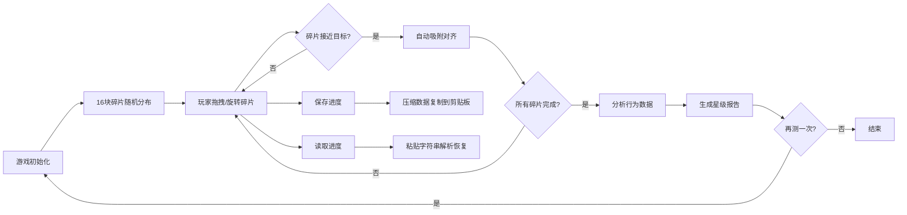

## 1. 产品概述

「心灵镜像」是一款基于浏览器的互动拼图心理测试小游戏。玩家通过拖拽彩色碎片拼合成完整图形，系统根据拼图顺序、用时、旋转次数等行为数据，分析玩家的性格倾向，并生成一份带星形评级的图文报告。

- 主要用途：通过游戏化互动提供轻松的心理测试体验
- 目标用户：对心理测试感兴趣的普通用户、独立游戏爱好者
- 市场价值：结合艺术化拼图体验与心理分析，提供独特的互动娱乐产品

## 2. 核心功能

### 2.1 用户角色

| 角色 | 注册方式 | 核心权限 |
|------|---------|---------|
| 普通玩家 | 无需注册，直接游玩 | 进行拼图测试、查看报告、保存/读取进度 |

### 2.2 功能模块

1. **拼图游戏主界面**：Canvas画布、碎片统计面板、计时器、操作按钮
2. **碎片管理系统**：16块异形彩色碎片生成、拖拽移动、滚轮旋转、碰撞吸附
3. **物理反馈系统**：碎片排斥力模拟、吸附弹性动画、发光描边效果
4. **进度保存系统**：lz-string数据压缩、剪贴板复制、进度读取恢复
5. **心理分析报告系统**：行为数据分析、性格判定（果断型/犹豫型）、星形评级、图文报告展示

### 2.3 页面详情

| 页面名称 | 模块名称 | 功能描述 |
|---------|---------|------------|
| 拼图游戏页 | Canvas画布 | 全屏绘制，背景渐变#0F3443到#34E89E |
| 拼图游戏页 | 统计面板 | 左上角毛玻璃效果，显示剩余碎片数和计时器 |
| 拼图游戏页 | 操作按钮 | 右下角保存进度、读取进度、提交、重置按钮 |
| 拼图游戏页 | 碎片交互 | 鼠标拖拽移动、滚轮旋转、碰撞检测、自动吸附 |
| 报告展示页 | 报告卡片 | 420px白色卡片，显示评级、统计数据、心理描述 |
| 报告展示页 | 星级评定 | Canvas绘制五角星，金色渐变，闪烁动画 |
| 报告展示页 | 再测一次 | 重置游戏状态返回拼图界面 |
| 进度读取模态框 | 文本输入 | 粘贴压缩字符串，确认/取消按钮 |

## 3. 核心流程

玩家进入游戏后，16块彩色异形碎片随机分布在画布上。玩家通过鼠标拖拽移动碎片，滚轮旋转碎片角度。当碎片接近目标位置时自动吸附对齐。所有碎片放置完成后系统自动分析行为数据，生成心理报告并展示。玩家可随时保存或读取进度，或重置游戏。

## 4. 用户界面设计

### 4.1 设计风格

- **主色调**：#0F3443（深蓝）、#34E89E（翠绿）渐变背景
- **碎片颜色**：#FF6B6B（珊瑚红）、#4ECDC4（青色）、#45B7D1（天蓝）、#96CEB4（薄荷绿）随机分配
- **按钮样式**：圆角6px、高度40px、白色字体，确认色#2ECC71，取消色#95A5A6，悬浮透明度0.9并放大1.05倍
- **毛玻璃面板**：rgba(255,255,255,0.15) + backdrop-filter: blur(8px) + 圆角12px
- **动画效果**：吸附弹性动画0.3秒、星形闪烁0.5秒、按钮过渡0.2秒

### 4.2 页面设计概述

| 页面名称 | 模块名称 | UI元素 |
|---------|---------|---------|
| 拼图游戏页 | 整体布局 | 全屏Canvas，渐变背景，左上统计面板，右下操作按钮群 |
| 拼图游戏页 | 碎片 | 异形多边形，带2-4个弧形缺口，彩色填充，发光描边（PC端hover） |
| 拼图游戏页 | 目标点阵 | 9x9网格，间距50px，16个选中点标记 |
| 报告展示页 | 背景 | 深色渐变#1A1A2E到#16213E |
| 报告展示页 | 卡片 | 420px宽，白色#FFFFFF，圆角8px，内边距24px，居中 |
| 报告展示页 | 星级 | Canvas绘制五角星，渐变#FFD700到#FFA500，闪烁动画 |
| 进度模态框 | 弹窗 | 宽320px，白色背景，多行文本框，确认/取消按钮 |

### 4.3 响应式设计

- **PC端**（≥768px）：碎片外接圆半径40px，吸附距离20px，旋转增量15°，hover发光描边
- **移动端**（<768px）：碎片尺寸缩小至70%（半径28px），吸附距离12px，旋转增量10°，四角滑动提示箭头
- 桌面优先设计，媒体查询适配移动端

### 4.4 性能优化

- requestAnimationFrame驱动游戏循环，PC端稳定55-60FPS
- lz-string压缩/解压<500字符时≤5ms完成
- Canvas局部重绘优化，减少不必要的渲染开销
