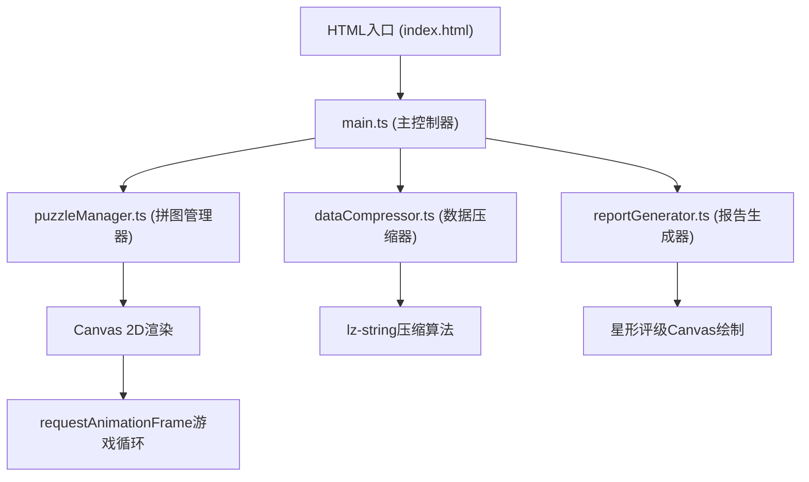

## 1. 架构设计



## 2. 技术描述

- **前端框架**：原生 TypeScript + Canvas 2D API（无UI框架，纯Canvas绘制）
- **构建工具**：Vite 5.x，支持HMR热更新
- **语言版本**：TypeScript 5.x，目标ES2020，模块ESNext，严格模式
- **数据压缩**：lz-string库，Base64编码存储
- **并发处理**：Web Workers（预留接口，lz-string压缩可在Worker中执行）
- **无后端**：纯前端应用，所有数据本地存储/剪贴板传输

## 3. 文件结构与数据流向

| 文件路径 | 职责 | 调用关系 | 数据流向 |
|---------|------|---------|---------|
| package.json | 项目依赖管理 | 被Vite读取 | typescript、vite、lz-string |
| vite.config.js | Vite构建配置 | 被npm run dev调用 | HMR配置、ES模块解析 |
| tsconfig.json | TypeScript编译配置 | 被tsc/Vite读取 | 严格模式、ES2020目标 |
| index.html | 页面入口 | 加载main.ts | Canvas元素、DOM按钮容器 |
| src/main.ts | 主控制器 | 引用puzzleManager、dataCompressor、reportGenerator | 用户拖拽输入→拼图管理器→状态更新→渲染→行为数据→压缩器→报告生成器 |
| src/puzzleManager.ts | 拼图碎片管理 | 被main.ts调用，输出到Canvas | 拖动坐标→碰撞检测→吸附逻辑→碎片状态→重绘触发 |
| src/dataCompressor.ts | 数据压缩解压 | 被main.ts调用，使用lz-string | 原始行为JSON→lz-string压缩→Base64字符串 |
| src/reportGenerator.ts | 报告生成 | 被main.ts调用 | 压缩数据→解压→特征分析→报告对象（评级/统计/描述） |

## 4. 数据模型定义

### 4.1 拼图碎片数据结构

```typescript
interface PuzzlePiece {
  id: number;
  color: string;
  x: number;
  y: number;
  rotation: number;
  targetX: number;
  targetY: number;
  radius: number;
  shape: ArcNotch[];
  isPlaced: boolean;
  isDragging: boolean;
  isHovering: boolean;
  snapAnimation?: SnapAnimationState;
  repelVelocity: { vx: number; vy: number };
  repelDecayTime: number;
}

interface ArcNotch {
  angle: number;
  depth: number;
  radius: number;
  direction: 'in' | 'out';
}

interface SnapAnimationState {
  startX: number;
  startY: number;
  startTime: number;
  duration: number;
}
```

### 4.2 玩家行为数据结构

```typescript
interface PlayerBehaviorData {
  pieceOrder: number[];
  placementTimes: number[];
  dragCounts: Record<number, number>;
  rotationCounts: Record<number, number>;
  totalDrags: number;
  totalRotations: number;
  startTime: number;
  endTime: number;
  pieces: PuzzlePieceSnapshot[];
}

interface PuzzlePieceSnapshot {
  id: number;
  x: number;
  y: number;
  rotation: number;
  isPlaced: boolean;
}
```

### 4.3 心理报告数据结构

```typescript
interface PsychologyReport {
  personalityType: 'decisive' | 'hesitant';
  personalityLabel: string;
  starRating: 1 | 2 | 3 | 4 | 5;
  totalTime: number;
  totalDrags: number;
  totalRotations: number;
  timeStdDev: number;
  description: string;
  stats: {
    label: string;
    value: string;
    percentage: number;
  }[];
}
```

## 5. 核心算法说明

### 5.1 碎片吸附判定
- 计算碎片中心与目标点的欧氏距离
- 距离 < 吸附阈值（PC:20px, 移动端:12px）时触发吸附
- 使用二次贝塞尔曲线模拟0.3秒弹性动画

### 5.2 碎片排斥力物理模拟
- 每帧遍历所有未放置碎片对
- 距离 < 10px时，沿连线方向施加排斥力
- 速度向量在0.5秒内线性衰减至零

### 5.3 性格判定算法
```
条件：
- 总用时 < 60秒
- 拖动次数 < 30次
- 旋转次数 < 10次
- 放置时间间隔标准差 < 5秒

全部满足 → 「果断型」，星级按满足度加权计算
任一不满足 → 「犹豫型」，星级按偏差程度递减
```

### 5.4 星级评定算法
- 5星：满足全部条件且各项指标优（时间<45s，拖动<20，旋转<5，标准差<3）
- 4星：满足全部条件
- 3星：满足3项条件
- 2星：满足2项条件
- 1星：满足0-1项条件
