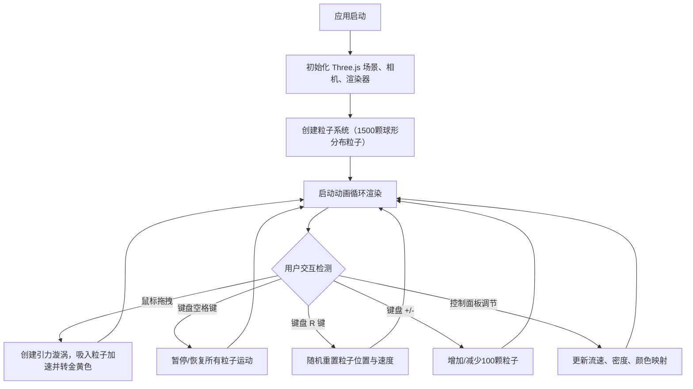

## 1. 产品概述

星尘编织者是一款在浏览器中运行的 3D 交互式星云生成与动态编织应用，用户可通过直觉化手势在三维空间中用发光粒子实时编织出具有复杂流动纹理和渐变色彩的动态星云。

- **目标用户**：创意设计师、艺术爱好者、对粒子视觉效果感兴趣的普通用户
- **核心价值**：提供沉浸式、直觉化的 3D 粒子艺术创作体验，无需专业技能即可创造独特的星云视觉作品

## 2. 核心功能

### 2.1 功能模块

1. **主场景页面**：3D 粒子星云渲染、鼠标编织交互、状态显示、色轮指示器、控制面板

### 2.2 页面详情

| 页面名称 | 模块名称 | 功能描述 |
|----------|----------|--------------|
| 主场景 | 3D 粒子系统 | 1500 颗半透明粒子均匀分布在半径 6 单位的球体内，品红到青蓝渐变，沿 Z 轴旋转并沿法线漂移 |
| 主场景 | 编织交互 | 鼠标左键拖拽时在路径上形成引力漩涡，吸入粒子加速旋转，3 秒后衰减消散并转为金黄色 |
| 主场景 | 色轮指示器 | 左侧半透明圆形色轮，显示当前颜色映射渐变，平滑跟随鼠标移动（0.3秒延迟） |
| 主场景 | 控制面板 | 右下角磨砂玻璃面板，包含流速滑块、编织密度滑块、颜色映射下拉选项 |
| 主场景 | 状态显示 | 顶部中央显示编织状态文字与粒子总数，左下角显示粒子数与 FPS 计数器 |
| 主场景 | 键盘交互 | 空格暂停/恢复，R 键重置，+/- 增减粒子密度 |

## 3. 核心流程

## 4. 用户界面设计

### 4.1 设计风格

- **主色调**：深空蓝黑渐变背景（#0A0A14 到 #121224），粒子默认品红-青蓝渐变，编织轨迹金黄色
- **视觉风格**：深空暗色主题，磨砂玻璃质感 UI 面板，发光粒子效果
- **字体**：简洁现代的无衬线字体
- **动效**：UI 元素悬停 0.2 秒透明度变化（0.7→0.9）和 2px 向上位移；颜色切换 1.5 秒指数缓动过渡

### 4.2 页面设计概述

| 页面名称 | 模块名称 | UI 元素 |
|----------|----------|----------|
| 主场景 | 3D 画布 | 全屏无边框，粒子系统居中渲染 |
| 主场景 | 色轮指示器 | 左侧中部，直径 60px，半透明圆形，渐变环外圈发光（透明度 0.2），平滑跟随鼠标 |
| 主场景 | 控制面板 | 右下角，圆角 12px，磨砂玻璃背景 rgba(20,20,36,0.7)，backdrop-filter blur 8px，内边距 16px；滑块轨道 4px，按钮直径 14px，悬停放大到 18px 并增强发光 |
| 主场景 | 状态文字 | 顶部中央显示"编织中..."或"暂停"及粒子总数 |
| 主场景 | 计数器 | 左下角显示粒子数和 FPS |

### 4.3 响应式设计

- 桌面端优先设计
- 宽度小于 768px 时，控制面板自动折叠为悬浮按钮，点击展开
- 粒子系统始终全屏展示

### 4.4 3D 场景指导

- **环境**：深空蓝黑渐变背景，无额外光源，粒子自发光
- **相机**：PerspectiveCamera，视角能完整展示半径 6 单位的球体
- **粒子渲染**：使用 Three.js Points + BufferAttribute，半透明 AdditiveBlending
- **性能**：1500 粒子 60FPS，5000 粒子不低于 30FPS
