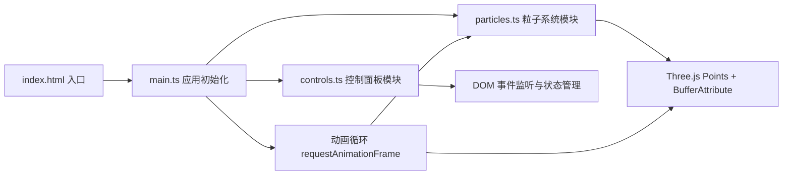

## 1. 架构设计



## 2. 技术说明

- **前端**：TypeScript + Three.js + Vite
- **构建工具**：Vite（支持 HMR）
- **3D 渲染**：Three.js（使用 three/addons）
- **类型定义**：@types/three
- **目标**：ES2020，模块 ESNext

## 3. 项目文件结构

| 文件路径 | 用途 |
|----------|------|
| /package.json | 项目依赖与脚本（three, three/addons, typescript, vite, @types/three） |
| /index.html | 入口页面，全屏 3D 容器，左下角计数器，右下角控制面板容器 |
| /tsconfig.json | TypeScript 严格模式，target ES2020，module ESNext |
| /vite.config.js | Vite 基本构建配置，支持 HMR |
| /src/main.ts | 应用初始化：场景/相机/渲染器创建、动画循环、事件挂载、模块协调 |
| /src/particles.ts | 粒子系统核心：位置/速度/颜色/生命周期管理，初始化/更新/增减粒子/颜色映射/暂停恢复 |
| /src/controls.ts | 控制面板 UI：流速/密度/颜色映射状态管理，DOM 事件，回调传递 |

## 4. 核心数据流

1. **初始化阶段**：`main.ts` 创建 Three.js 环境 → 调用 `particles.ts` 初始化粒子 → 调用 `controls.ts` 绑定 UI 事件
2. **动画循环**：每帧 `main.ts` 读取 `controls.ts` 的 UI 状态 → 传入 `particles.ts` 更新粒子 → 渲染场景
3. **用户交互**：鼠标/键盘事件 → `main.ts` 处理编织逻辑 → 调用 `particles.ts` 应用引力和颜色变化
4. **状态回调**：`controls.ts` 通过回调通知 `main.ts` 参数变化 → `main.ts` 转发给 `particles.ts`

## 5. 粒子系统数据结构

```typescript
// particles.ts 内部数据
interface ParticleData {
  positions: Float32Array;      // x,y,z 每颗粒子位置
  velocities: Float32Array;     // x,y,z 每颗粒子速度
  colors: Float32Array;         // r,g,b 当前颜色
  targetColors: Float32Array;   // r,g,b 目标颜色（用于过渡）
  colorTransition: Float32Array; // 0-1 颜色过渡进度
  sizes: Float32Array;          // 每颗粒子半径
  phases: Float32Array;         // 粒子漂移相位
  weaveLife: Float32Array;      // 编织效果剩余生命（0 表示无编织效果）
  weaveStrength: Float32Array;  // 编织强度（影响速度倍率和金色混合）
}
```

## 6. 控制面板状态接口

```typescript
// controls.ts
export interface ControlState {
  flowSpeed: number;        // 0.1 - 2.0，默认 1.0
  particleCount: number;    // 500 - 5000，默认 1500
  colorMap: ColorMapPreset; // 'magenta-cyan' | 'gold-green' | 'fire-ice' | 'violet-starry'
  paused: boolean;
}

export type ColorMapPreset = 
  | 'magenta-cyan'    // 品红-青蓝 #FF3366 → #00CCFF
  | 'gold-green'      // 金黄-翠绿 #FFD700 → #00FF88
  | 'fire-ice'        // 烈焰-冰川 #FF4400 → #00AAFF
  | 'violet-starry';  // 紫罗兰-星空 #9933FF → #3366FF
```
