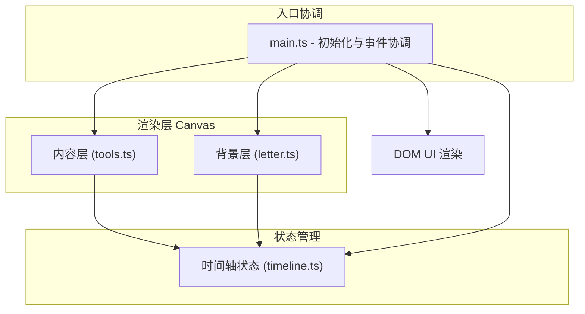

## 1. 架构设计

本项目为纯前端浏览器应用，采用 TypeScript + Vite 构建，不涉及后端服务。整体架构分为渲染层、状态层和交互层。



## 2. 技术栈

- **构建工具**：Vite 5.x
- **语言**：TypeScript 5.x（严格模式，目标 ES2020，模块 ESNext）
- **渲染**：HTML5 Canvas 2D API（双层 Canvas：背景层 + 内容层）
- **样式**：原生 CSS（内联在 index.html 的 `<style>` 标签中）
- **字体**：Google Fonts 中文手写体（Ma Shan Zheng / Zhi Mang Xing）
- **存储**：内存存储（创作内容保存在 JS 对象中，按时段索引）

## 3. 文件结构

```
/
├── index.html              入口页面，含全屏 root 容器和样式
├── package.json            依赖与脚本
├── tsconfig.json           TypeScript 配置
├── vite.config.js          Vite 构建配置
└── src/
    ├── main.ts             模块入口：初始化 Canvas、UI、协调各模块
    ├── letter.ts           信纸背景：纹理生成、时段渐变、过渡动画
    ├── timeline.ts         时间轴：时间状态、跳转、自动流转
    └── tools.ts            工具栏：书写、涂鸦、图章、清空、保存
```

## 4. 模块职责与接口定义

### 4.1 src/letter.ts - 信纸渲染模块

```typescript
export type TimeOfDay = 'dawn' | 'noon' | 'dusk' | 'night';

export interface LetterOptions {
  width: number;
  height: number;
}

export class LetterRenderer {
  constructor(canvas: HTMLCanvasElement, options: LetterOptions);
  setHour(hour: number, animate?: boolean): void;   // 设置当前小时，触发时段渐变
  render(): void;                                     // 重绘背景层
  resize(width: number, height: number): void;        // 响应式缩放
}
```

职责：
- 生成手造纸纤维纹理（随机短线，透明度 0.05，离屏 Canvas 缓存）
- 根据小时计算当前时段（dawn: 5-9, noon: 10-15, dusk: 16-19, night: 20-4）
- 计算时段渐变插值（支持相邻时段间平滑过渡，8s cubic-bezier 动画）
- 绘制三层叠加：纯色 + 纤维纹理 + 渐变色调

### 4.2 src/timeline.ts - 时间轴状态模块

```typescript
export interface TimelineState {
  currentHour: number;          // 当前小时 (0-23)，支持小数表示分钟
  isAutoFlow: boolean;          // 是否开启自动流转
}

export type TimelineListener = (state: TimelineState) => void;

export class TimelineController {
  constructor();
  getState(): TimelineState;
  setHour(hour: number): void;                          // 跳转到指定时刻
  toggleAutoFlow(enabled: boolean): void;               // 开关自动流转
  subscribe(listener: TimelineListener): () => void;    // 订阅状态变化
  destroy(): void;
}
```

职责：
- 管理当前小时（0-23，支持小数）
- 自动流转模式：每实际分钟推进 1 小时（即 60s 走完 24 小时，约 2.5s/小时）
- 发布订阅模式通知状态变更

### 4.3 src/tools.ts - 工具栏与创作模块

```typescript
export type ToolMode = 'idle' | 'write' | 'doodle' | 'stamp';

export interface DoodleOptions {
  color: string;
  size: number;  // 5-12
}

export interface WriteOptions {
  color: string;  // #3A3C42 or #8B7355
}

export interface StoredItem {
  hour: number;           // 创作时的小时
  type: 'text' | 'doodle' | 'stamp';
  // 具体绘制数据
  data: TextItem | DoodleItem | StampItem;
}

export interface TextItem {
  x: number; y: number; text: string; color: string;
}
export interface DoodleItem {
  points: { x: number; y: number }[]; color: string; size: number;
}
export interface StampItem {
  x: number; y: number; emoji: string; rotation: number; scale: number;
}

export class ToolController {
  constructor(canvas: HTMLCanvasElement, timeline: TimelineController);
  setMode(mode: ToolMode): void;
  setDoodleColor(color: string): void;
  setDoodleSize(size: number): void;
  setWriteColor(color: string): void;
  placeStamp(x: number, y: number, emoji: string): void;
  clearAll(): void;
  exportPNG(background: HTMLCanvasElement): string;  // 合成背景+内容导出
  resize(scale: number): void;
}
```

职责：
- 管理当前工具模式（书写/涂鸦/图章）
- 处理 Canvas 鼠标/触摸事件
- 按时段存储所有创作内容
- 根据当前小时决定内容可见性（已创作=1.0，未来=0.2+禁用蒙层）
- 支持清空和导出 PNG

### 4.4 src/main.ts - 入口协调

职责：
- 创建 DOM 结构（信纸容器、双 Canvas、时间轴 UI、工具栏 UI）
- 实例化 LetterRenderer、TimelineController、ToolController
- 连接各模块事件（时间变化 → 背景重绘 + 内容刷新）
- 处理窗口 resize 事件，计算响应式缩放
- 绑定 UI 交互事件

## 5. 数据模型

创作内容以 `StoredItem[]` 数组存储在内存中，按 `hour` 字段索引。渲染时根据 `TimelineController.currentHour` 过滤：
- `item.hour <= currentHour`：正常显示（切换时带 2s opacity 渐入）
- `item.hour > currentHour`：透明度 0.2，且在其上叠加半透明禁用蒙层

## 6. 性能策略

1. **Canvas 分层**：背景层（更新频率低，时段切换时重绘）与内容层（绘制时重绘）分离，避免重复绘制背景
2. **纹理缓存**：纤维纹理用离屏 Canvas 预生成一次，后续通过 drawImage 复用
3. **动画节流**：时段渐变动画使用 requestAnimationFrame，避免不必要重绘
4. **响应式缩放**：通过 CSS transform scale 缩放容器，内部 Canvas 保持高分辨率绘制
