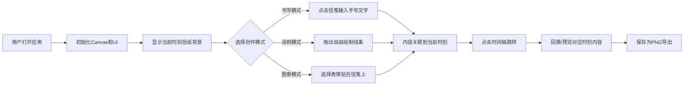

## 1. 产品概述

「时序笺」是一款浏览器端数字信笺应用，让用户在随时间变化的信纸上书写、涂鸦、盖心情图章。信笺的纹理、配色和装饰元素会根据一天中的不同时段（清晨、正午、黄昏、深夜）缓慢切换，创造出被时光浸染的独特体验。

## 2. 核心特性

### 2.1 功能模块

1. **动态信纸背景**：多层纹理叠加（纯色底层 + 手造纸纤维中层 + 时段渐变上层），时段切换带 8 秒过渡动画
2. **时间轴指示器**：纵向 24 小时时间点，当前时刻高亮发光，点击跳转预览，支持自动流转加速
3. **创作工具栏**：书写模式（手写体文字）、涂鸦模式（自由绘制）、心情图章（表情贴纸）、清空、保存 PNG
4. **时光回溯**：回到过去时刻可重现当时内容（渐入动画），未来内容半透明显示
5. **响应式适配**：窄屏下信笺缩放、时间轴底部横向、工具栏图标化

### 2.2 页面详情

| 页面名称 | 模块名称 | 功能描述 |
|-----------|-------------|---------------------|
| 主页面 | 动态信笺区 | 700×900px A4 尺寸信纸，居中展示，多层纹理叠加，随时间渐变 |
| 主页面 | 右侧时间轴 | 24 小时节点圆点，点击跳转，自动流转开关 |
| 主页面 | 底部工具栏 | 书写/涂鸦/图章模式切换，清空，保存为 PNG |
| 主页面 | 创作内容层 | Canvas 绘制文字、线条、图章，按时段存储与回溯 |

## 3. 核心流程

用户打开应用 → 看到当前时刻样式的信纸 → 选择书写/涂鸦/图章模式进行创作 → 内容自动关联到当前时刻 → 点击时间轴可跳转到其他时刻预览 → 开启自动流转可观看时光流逝 → 保存为 PNG 导出作品

## 4. 用户界面设计

### 4.1 设计风格

- **主色系**：柔灰背景 #F0ECE3，信纸底色 #FAF6EE，工具栏 #2C2E33（半透明 0.85）
- **时段渐变**：
  - 清晨：淡橙 → 米白
  - 正午：亮白 → 奶黄
  - 黄昏：琥珀 → 砖红
  - 深夜：灰蓝 → 深靛
- **书写色**：#3A3C42（深灰）、#8B7355（棕褐）
- **涂鸦色**：赭石、墨绿、朱红、群青、藤黄、钛白
- **字体**：手写体用于书写模式（如 Ma Shan Zheng、Zhi Mang Xing 或 cursive）
- **圆角**：工具栏 8px，按钮柔和圆角
- **动画**：8 秒 cubic-bezier 时段过渡，2 秒内容渐入，0.9-1.1 图章缩放

### 4.2 页面布局

| 区域 | 位置 | 尺寸 | 元素 |
|-----------|-------------|-------------|-------------|
| 信纸区 | 页面居中 | 700×900px | 多层背景 Canvas + 创作内容 Canvas |
| 时间轴 | 信纸右侧 | 宽 60px | 24 个圆点、时间文本、自动流转开关 |
| 工具栏 | 信纸底部上方 | 自适应宽度 | 5 个功能按钮 + 颜色/笔刷选择 |

### 4.3 响应式设计

- Desktop-first 设计
- 屏幕宽度 < 900px：
  - 信笺宽度缩放到屏幕的 90%，高度按比例缩放
  - 时间轴移至底部横向排列
  - 工具按钮仅显示图标，隐藏文字标签

### 4.4 性能要求

- 所有动画和绘制保持 50FPS 以上
- Canvas 分层渲染优化（背景层、内容层分离）
- 合理使用 requestAnimationFrame
