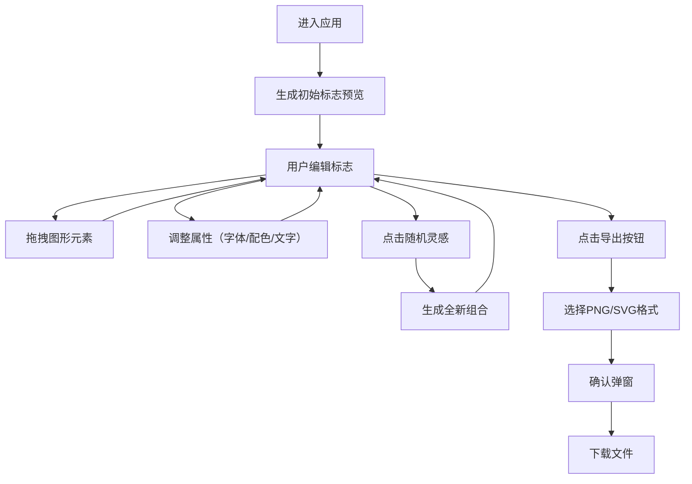

## 1. 产品概述

智能品牌标志生成器是一款面向非设计专业人士的在线标志设计工具，帮助用户快速创建具有统一视觉风格的品牌标志（包含图形、字体、配色组合）。通过提供直观的拖拽式界面、丰富的预设元素库和一键灵感生成功能，降低品牌设计门槛，让任何人都能在几分钟内创建专业级标志。

- **核心价值**：让非设计师也能快速产出专业品牌视觉资产
- **目标用户**：初创团队、个人创业者、自媒体运营者、小型企业主

---

## 2. 核心功能

### 2.1 功能模块

1. **标志设计工作台**：画板区域、拖拽交互、缩放平移、层级管理
2. **图形元素库**：基础几何图形（圆、三角、六边形、星形、箭头、波浪线）、预设品牌图形组合
3. **属性配置面板**：字体选择、配色主题、文字内容编辑
4. **随机灵感系统**：一键生成全新图形+字体+配色组合
5. **导出功能**：PNG（透明背景，≥300x300）和SVG（矢量格式）导出

### 2.2 页面详情

| 页面名称 | 模块名称 | 功能描述 |
|-----------|-------------|---------------------|
| 设计工作台 | 顶部工具栏 | 随机灵感按钮、导出按钮（PNG/SVG） |
| 设计工作台 | 左侧元素库 | 可拖拽图形元素，悬停显示名称，60x60预览 |
| 设计工作台 | 中央画板 | 800x600白色画板，支持拖拽、缩放（0.5-3倍）、元素操作 |
| 设计工作台 | 右侧属性面板 | 字体选择、颜色主题、文字内容编辑，实时更新 |
| 设计工作台 | 导出弹窗 | 浅蓝背景圆角弹窗，确认导出格式 |

---

## 3. 核心流程

### 3.1 主流程描述

用户进入应用后，系统自动生成一个初始标志预览（基础几何图形+BRAND文字）。用户可以通过左侧元素库拖拽新图形到画板，通过右下角拖拽点调整大小、滚轮/旋转手柄旋转、右键菜单调整层级。在右侧面板修改字体、配色、文字内容，画板实时预览。点击"随机灵感"按钮获取全新设计组合。完成后选择导出PNG或SVG格式。

### 3.2 核心流程图

---

## 4. 用户界面设计

### 4.1 设计风格

- **主色调**：靛蓝 #3B49DF，悬停加深至 #2C37B8（0.15秒过渡）
- **背景色**：工作区淡灰色 #EAE8E3，画板白色，边框浅灰 #D0CCC4 / #D8D5CD
- **辅助色**：深灰 #2C3E50（按钮），浅蓝 #EAF2F8（弹窗背景）
- **按钮样式**：圆角按钮，悬停发光效果 box-shadow: 0 0 8px rgba(59,73,223,0.2)
- **卡片/面板**：8px圆角，1px浅边框，选中时边框变靛蓝并发光
- **字体**：Google Fonts - Playfair Display、Montserrat、Roboto、Pacifico、Bebas Neue
- **布局**：三栏式布局（左侧元素库 + 中央画板 + 右侧属性面板），顶部工具栏
- **滚动条**：半透明流畅滚动条
- **动画**：0.3秒渐入（随机灵感）、0.2秒淡入（弹窗）、缩放平滑过渡

### 4.2 页面设计概览

| 页面名称 | 模块名称 | UI元素 |
|-----------|-------------|-------------|
| 设计工作台 | 顶部工具栏 | 深灰圆角按钮、品牌Logo、间距均匀 |
| 设计工作台 | 左侧元素库 | 60x60图形缩略图网格，悬停显示名称tooltip，半透明滚动条 |
| 设计工作台 | 中央画板 | 白色画布带浅灰边框，元素选中时显示控制点和旋转手柄 |
| 设计工作台 | 右侧属性面板 | 分组卡片式布局，字体下拉、配色方案卡片、文字输入框 |
| 设计工作台 | 导出弹窗 | 浅蓝背景12px圆角，格式选择卡片，确认/取消按钮 |

### 4.3 响应式设计

- 采用桌面端优先设计，最小支持宽度1280px
- 画板区域自适应剩余空间，侧边栏和属性面板固定宽度
- 移动端暂不支持（面向专业设计场景）

### 4.4 性能要求

- 拖拽与属性修改操作帧率 ≥ 55fps
- 属性修改画板更新延迟 ≤ 100ms
- 导出SVG/PNG响应时间 ≤ 2秒
- 缩放范围：0.5倍 - 3倍
