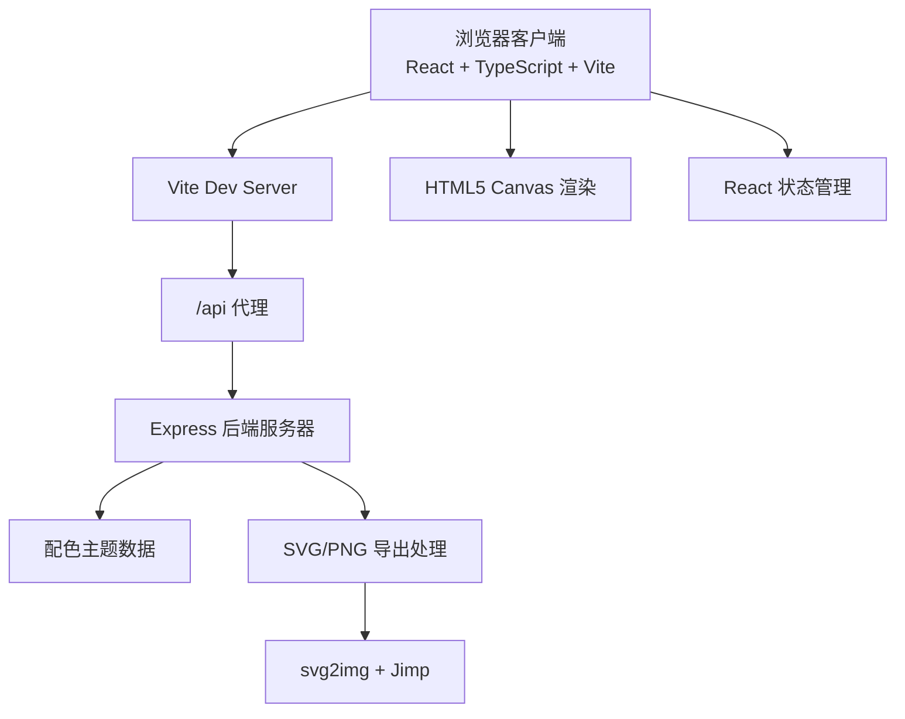

## 1. 架构设计



---

## 2. 技术选型

| 层级 | 技术栈 | 版本 | 说明 |
|------|--------|------|------|
| 前端框架 | React | ^18 | 组件化UI开发 |
| 前端语言 | TypeScript | ^5 | 类型安全 |
| 构建工具 | Vite | ^5 | 快速开发构建，支持API代理 |
| 前端渲染 | HTML5 Canvas API | - | 画板内容绘制 |
| 后端框架 | Express | ^4 | REST API服务 |
| 后端语言 | TypeScript | ^5 | 类型安全 |
| 图片处理 | Jimp | ^1 | PNG图像处理 |
| SVG转图片 | svg2img | ^1 | SVG转PNG |
| 跨域 | cors | ^2 | 允许跨域请求 |
| 文件上传 | multer | ^1 | 文件处理中间件 |
| ID生成 | uuid | ^9 | 唯一标识符 |

---

## 3. 目录结构

```
auto265/
├── package.json
├── index.html
├── vite.config.js
├── tsconfig.json
├── src/
│   ├── App.tsx          # 主应用组件，状态与交互管理
│   └── Canvas.tsx       # 画板渲染组件
└── server/
    └── server.ts        # Express后端服务
```

---

## 4. 路由定义

| 路由 | 方法 | 用途 |
|------|------|------|
| / | GET | 前端入口页面（Vite提供） |
| /api/themes | GET | 获取预设配色主题列表 |
| /api/export/png | POST | 将标志数据导出为PNG图片 |
| /api/export/svg | POST | 将标志数据导出为SVG矢量文件 |

---

## 5. API定义

### 5.1 获取配色主题

**GET /api/themes**

响应：
```typescript
interface ColorTheme {
  id: string;
  name: string;
  colors: string[]; // 主色、辅色
}

interface ThemesResponse {
  themes: ColorTheme[];
}
```

### 5.2 导出PNG

**POST /api/export/png**

请求：
```typescript
interface ExportPngRequest {
  svg: string;       // SVG字符串
  width?: number;    // 默认300
  height?: number;   // 默认300
}
```

响应：
```
Content-Type: image/png
二进制PNG图片数据
```

### 5.3 导出SVG

**POST /api/export/svg**

请求：
```typescript
interface ExportSvgRequest {
  svg: string;
}
```

响应：
```
Content-Type: image/svg+xml
Content-Disposition: attachment; filename="logo.svg"
SVG字符串
```

---

## 6. 前端数据模型

```typescript
// 画布元素类型
type ElementType = 'circle' | 'triangle' | 'hexagon' | 'star' | 'arrow' | 'wave' | 'preset' | 'text';

interface CanvasElement {
  id: string;
  type: ElementType;
  x: number;           // 中心点X坐标
  y: number;           // 中心点Y坐标
  width: number;
  height: number;
  rotation: number;    // 旋转角度（度）
  zIndex: number;      // 层级
  fill: string;        // 填充色
  stroke?: string;     // 描边色
  strokeWidth?: number;
  // 文字元素特有
  text?: string;
  fontSize?: number;
  fontFamily?: string;
  fontWeight?: number;
  // 预设图形特有
  presetId?: string;
}

// 颜色主题
interface ColorTheme {
  id: string;
  name: string;
  colors: string[];
}

// 字体配置
interface FontOption {
  id: string;
  name: string;
  family: string;
}

// 画布状态
interface CanvasState {
  elements: CanvasElement[];
  selectedId: string | null;
  zoom: number;        // 0.5 - 3
  offsetX: number;     // 平移X
  offsetY: number;     // 平移Y
  brandName: string;
  subtitle: string;
  fontFamily: string;
  themeId: string;
  primaryColor: string;
  secondaryColor: string;
}
```

---

## 7. 预设数据

### 7.1 配色主题（8组）

| ID | 名称 | 主色 | 辅色 |
|----|------|------|------|
| blue | 单色蓝 | #1A73E8 | #4A90E2 |
| orange | 暖橙 | #FF6B35 | #F7931E |
| green | 翠绿 | #2ECC71 | #27AE60 |
| purple | 优雅紫 | #9B59B6 | #8E44AD |
| red | 热情红 | #E74C3C | #C0392B |
| teal | 清新青 | #1ABC9C | #16A085 |
| pink | 柔粉 | #FF6B9D | #FF8FB1 |
| gold | 尊贵金 | #F39C12 | #E67E22 |

### 7.2 字体选项（5种Google Fonts）

| ID | 名称 | Font Family |
|----|------|-------------|
| playfair | Playfair Display | 'Playfair Display', serif |
| montserrat | Montserrat | 'Montserrat', sans-serif |
| roboto | Roboto | 'Roboto', sans-serif |
| pacifico | Pacifico | 'Pacifico', cursive |
| bebas | Bebas Neue | 'Bebas Neue', sans-serif |

---

## 8. 性能优化策略

1. **Canvas渲染优化**：使用requestAnimationFrame，仅在状态变化时重绘
2. **拖拽防抖**：mousemove事件使用requestAnimationFrame节流
3. **属性更新**：使用useMemo/useCallback减少不必要重渲染
4. **Canvas分层**：背景静态层与交互元素层分离
5. **字体预加载**：Google Fonts使用preconnect预连接
