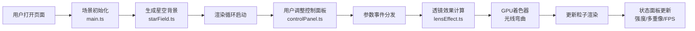

## 1. 产品概述
引力透镜模拟器是一个基于Three.js的交互式天文科普应用，通过3D可视化让公众直观理解引力透镜效应——遥远星系的星光经过大质量天体附近时光线发生弯曲，形成光弧和多重像的奇异天文现象。
- 目标用户：数字天文学家、天文爱好者、学生和普通公众
- 产品价值：将抽象的广义相对论效应转化为可交互、可感知的视觉体验，降低科学知识传播门槛

## 2. 核心功能

### 2.1 用户角色
| 角色 | 描述 | 核心权限 |
|------|------|----------|
| 普通用户 | 浏览者 | 查看3D场景、调整参数、观察透镜效果 |

### 2.2 功能模块
1. **3D渲染主场景**：星空背景、引力透镜天体、光线弯曲效果、多重像生成
2. **透镜效果核心模块**：GPU着色器光线弯曲计算、爱因斯坦环生成、多重像副本生成
3. **交互控制面板**：透镜强度调节、透镜位置控制（X/Z轴）、观察角度旋转
4. **实时状态显示**：透镜强度值、多重像数量、FPS计数器、数据流向说明

### 2.3 页面详情
| 页面名称 | 模块名称 | 功能描述 |
|----------|----------|----------|
| 主页面 | 3D渲染容器 | 全屏Three.js场景，展示星空粒子和引力透镜效果 |
| 主页面 | 信息面板 | 左上角实时显示透镜强度、多重像数量、FPS、数据流向说明 |
| 主页面 | 控制面板 | 右下角磨砂玻璃风格面板，包含透镜强度、位置、角度滑块 |
| 主页面 | 透镜天体 | 半透明蓝色球体，带光晕纹理，半径和透明度随强度变化 |

## 3. 核心流程
用户打开页面 → 3D场景初始化（星空粒子3000颗、默认透镜参数）→ 用户通过控制面板调整参数 → 参数变化通过事件分发传递给渲染模块 → GPU着色器实时计算光线弯曲 → 屏幕显示光弧、爱因斯坦环和多重像 → 实时更新状态面板数据

## 4. 用户界面设计

### 4.1 设计风格
- **主色调**：深空深蓝渐变（#0A0C1A → #141832），发光蓝绿色（#00E5FF）作为强调色
- **视觉风格**：深空科幻、磨砂玻璃质感、精细光效
- **字体**：白色半透明无衬线字体
- **动效**：平滑过渡动画（transition: all 0.2s ease），脉冲光晕动画

### 4.2 页面设计概述
| 页面名称 | 模块名称 | UI元素 |
|----------|----------|--------|
| 主页面 | 3D场景 | 全屏Canvas，3000颗闪烁星点，蓝色透镜天体，光弧和爱因斯坦环 |
| 主页面 | 信息面板 | 左上角浮层，白色半透明文字，显示强度值（0.1精度）、多重像数量、FPS、数据流向 |
| 主页面 | 控制面板 | 右下角磨砂玻璃面板（rgba(20,30,50,0.7)，blur 8px），发光蓝绿色滑块轨道，白色圆形手柄 |
| 主页面 | 透镜天体 | 半透明蓝色球体（半径0.5-1.5），表面光晕纹理，高强度时脉冲动画 |

### 4.3 响应式设计
- **大屏（≥1200px）**：控制面板固定右下角，宽280px
- **中屏（800-1199px）**：控制面板缩小至200px宽
- **小屏（<800px）**：面板悬浮底部，高100px，宽度100%，滑块水平排列

### 4.4 3D场景指导
- **环境**：深空黑色背景，无外部光源，星点自发光
- **光照**：粒子使用AdditiveBlending，透镜球体使用自发光材质
- **相机**：PerspectiveCamera，FOV 60°，近裁剪面0.1，远裁剪面1000，OrbitControls交互
- **构图**：透镜天体位于场景中心附近，星空粒子分布在半径20单位球壳内
- **交互**：鼠标拖拽旋转视角，滚轮缩放，参数滑块实时响应
- **后处理**：无后处理，使用自定义顶点着色器实现光线弯曲
- **性能预算**：粒子数固定3000，FPS ≥ 50，单帧计算延迟 < 16ms
