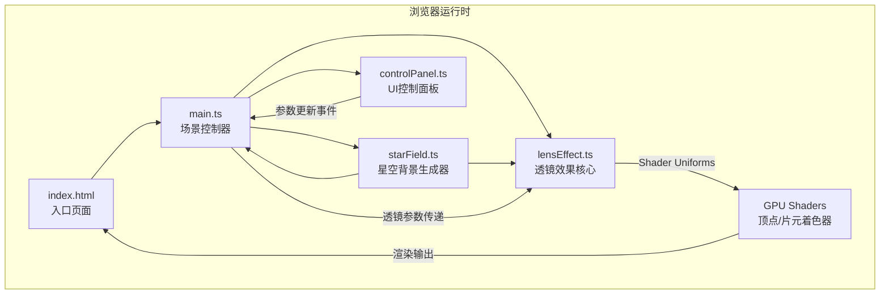

## 1. 架构设计



**模块调用关系和数据流向：**
1. `index.html` → 加载并启动 `main.ts`
2. `main.ts` → 初始化Three.js场景，创建相机、渲染器、OrbitControls
3. `main.ts` → 调用 `starField.ts` 生成3000颗星空粒子，获取粒子位置/颜色数组
4. `main.ts` → 调用 `lensEffect.ts` 创建透镜材质和自定义着色器
5. `controlPanel.ts` → 用户交互时派发 `lensParamsChange` 自定义事件
6. `main.ts` → 监听事件，将新参数传递给 `lensEffect.ts` 更新Shader Uniforms
7. `lensEffect.ts` → GPU着色器在顶点阶段计算光线弯曲偏移，输出渲染结果
8. `main.ts` → 动画循环中实时读取 `lensEffect.ts` 状态，更新UI信息面板

## 2. 技术描述
- **前端框架**：无（原生TypeScript + Three.js，按用户要求不使用React/Vue）
- **构建工具**：Vite 5.x（支持HMR热更新）
- **3D引擎**：Three.js latest + three/addons（OrbitControls）
- **类型系统**：TypeScript 5.x 严格模式
- **语言目标**：ES2020，模块系统 ESNext
- **无后端、无数据库**：纯前端单页应用

## 3. 文件结构

| 文件路径 | 职责 | 输出/依赖 |
|----------|------|-----------|
| `package.json` | 项目依赖和脚本配置 | 依赖：three, typescript, vite, @types/three |
| `vite.config.js` | Vite构建配置 | 支持HMR，TypeScript编译 |
| `tsconfig.json` | TypeScript编译配置 | strict: true, target: ES2020, module: ESNext |
| `index.html` | 入口页面，包含3D容器和UI面板DOM | 全屏Canvas容器，信息面板，控制面板占位 |
| `src/main.ts` | 场景初始化和主控制器 | 创建Scene/Camera/Renderer，驱动动画循环，协调各模块 |
| `src/starField.ts` | 星空背景生成 | 输出：粒子位置Float32Array、颜色Float32Array、闪烁频率数组 |
| `src/lensEffect.ts` | 引力透镜核心效果 | 输入：强度/位置/角度参数；输出：带自定义Shader的Points材质和多重像Mesh |
| `src/controlPanel.ts` | UI控制面板和事件分发 | 输出：自定义事件lensParamsChange，携带参数对象 |

## 4. 核心数据类型定义

```typescript
interface LensParams {
  strength: number;      // 0-10，透镜强度
  positionX: number;     // -5到5，X轴位置
  positionZ: number;     // -5到5，Z轴位置
  viewAngleY: number;    // 0-360度，Y轴观察角度
}

interface StarData {
  positions: Float32Array;  // 3000 * 3 = 9000个浮点数 (x,y,z)
  colors: Float32Array;     // 3000 * 3 = 9000个浮点数 (r,g,b)
  sizes: Float32Array;      // 3000个浮点数，0.05-0.15
  flickerFreq: Float32Array; // 3000个浮点数，0.5-2Hz
}

interface LensEffectOutput {
  pointsMaterial: THREE.ShaderMaterial;  // 含自定义顶点着色器
  multipleImages: THREE.Points[];        // 2-8个多重像粒子系统
  lensSphere: THREE.Mesh;                // 透镜天体球体
  multipleImageCount: number;            // 当前多重像数量
}
```

## 5. GPU着色器设计

### 顶点着色器（光线弯曲计算）
```glsl
uniform float uLensStrength;
uniform vec3  uLensPosition;
uniform float uTime;
attribute float aFlickerFreq;
attribute float aSize;

varying float vFlicker;

void main() {
  vec3 pos = position;
  
  // 计算粒子到透镜中心的距离（XZ平面）
  vec2 toLens = pos.xz - uLensPosition.xz;
  float dist = length(toLens);
  
  // 引力弯曲偏移：距离越近偏移越大，强度越高偏移越大
  // 爱因斯坦环半径：2 + (uLensStrength / 10) * 4  (范围2-6)
  float einsteinRing = 2.0 + (uLensStrength / 10.0) * 4.0;
  
  if (dist > 0.01 && uLensStrength > 0.01) {
    // 弯曲方向：朝向透镜中心
    vec2 bendDir = normalize(toLens);
    
    // 弯曲强度：高斯分布，在爱因斯坦环附近弯曲最强烈
    float bendFactor = uLensStrength * 0.3 * exp(-pow((dist - einsteinRing) / 1.5, 2.0));
    bendFactor += uLensStrength * 0.1 / max(dist, 0.5);
    
    pos.xz -= bendDir * bendFactor;
  }
  
  // 闪烁效果
  vFlicker = 0.8 + 0.2 * sin(uTime * aFlickerFreq * 6.28318);
  
  vec4 mvPos = modelViewMatrix * vec4(pos, 1.0);
  gl_Position = projectionMatrix * mvPos;
  gl_PointSize = aSize * (300.0 / -mvPos.z) * vFlicker;
}
```

### 片元着色器
```glsl
varying float vFlicker;

void main() {
  // 圆形点
  vec2 center = gl_PointCoord - vec2(0.5);
  float dist = length(center);
  if (dist > 0.5) discard;
  
  // 柔和边缘
  float alpha = smoothstep(0.5, 0.2, dist) * vFlicker;
  
  gl_FragColor = vec4(1.0, 1.0, 1.0, alpha);
}
```
