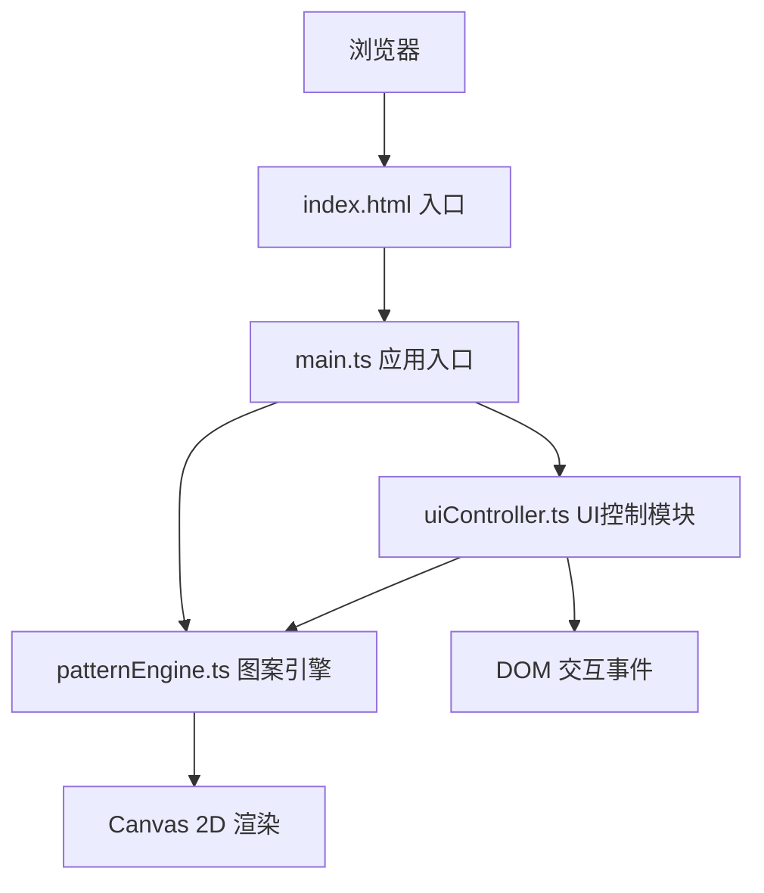

## 1. 架构设计



## 2. 技术描述

- **前端**：原生 TypeScript + Vite，无额外框架
- **构建工具**：Vite，支持 HMR 热更新
- **语言**：TypeScript 严格模式，目标 ES2020，模块 ESNext
- **渲染**：HTML5 Canvas 2D API

## 3. 模块职责

| 文件 | 职责 |
|------|------|
| `index.html` | 入口页面，全屏深色背景、画布容器、控制面板、工具栏、样式引入 |
| `src/main.ts` | 应用入口，初始化画布、事件监听、UI交互、驱动动画循环 |
| `src/patternEngine.ts` | 核心图案生成逻辑：对称计算、颜色映射、次级装饰层随机生成与过渡，接收控制参数输出绘制指令集 |
| `src/uiController.ts` | UI控制模块：面板滑块、拾色器、按钮、预设下拉菜单的DOM绑定与事件响应，读取UI状态传递给patternEngine |

## 4. 数据模型

### 4.1 控制参数接口

```typescript
interface PatternParams {
  symmetryOrder: number;      // 对称阶数 2-12
  rotationSpeed: number;      // 旋转速度 0-5 度/帧
  colorShiftSpeed: number;    // 颜色变化速度 0-0.1
  bgColor: string;            // 底色
  primaryColor: string;       // 主色
  secondaryColor: string;     // 辅色
}

interface ViewState {
  offsetX: number;            // X轴偏移
  offsetY: number;            // Y轴偏移
  zoom: number;               // 缩放比例 0.5-3.0
  rotation: number;           // 当前旋转角度
  frozen: boolean;            // 旋转是否冻结
}

interface DecorationElement {
  type: 'star' | 'dashArc' | 'dot';
  x: number;
  y: number;
  size: number;               // 3-8px
  colorRatio: number;         // 0-1 主色到辅色插值
}

interface Preset {
  name: string;
  params: PatternParams;
}
```

### 4.2 预设定义

- **极光幻彩**：高对称阶数、慢速旋转、蓝绿紫渐变
- **熔岩矩阵**：低对称阶数、快速旋转、红橙黄渐变
- **星际旋涡**：中等对称、中速旋转、深蓝银白渐变

## 5. 渲染流程

1. **动画帧触发** → requestAnimationFrame
2. **状态更新** → 更新旋转角度、颜色相位、装饰层过渡
3. **图案引擎计算** → 根据参数生成对称绘制指令
4. **Canvas 绘制** → 清空画布、应用视图变换、绘制主对称层、绘制次级装饰层、绘制坐标指示器
5. **下一帧调度**

## 6. 性能优化策略

- 图案对称计算复用：一次计算单元形状，通过旋转变换复制到各对称扇区
- 装饰层状态双缓冲：新旧状态对象，0.3秒内线性插值过渡
- 避免每帧创建对象：复用路径、变换矩阵等临时对象
- 颜色计算缓存：主色辅色之间的渐变颜色值缓存
