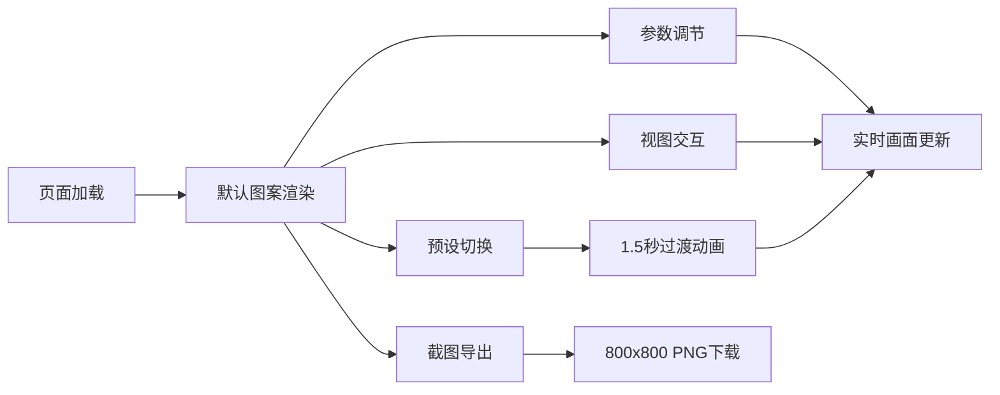

## 1. 产品概述

万花镜动态几何图样生成器是一款基于浏览器的创意工具，让用户通过直观的参数调节实时生成并预览具有复杂对称性、色彩渐变和动态旋转效果的万花镜图案，支持状态保存与高质量图片导出。

- 主要解决用户在平面画布上难以通过直觉化参数调节实时生成复杂对称图案的问题
- 目标用户为设计师、艺术家、教育工作者及创意爱好者

## 2. 核心功能

### 2.1 功能模块

1. **主画布区域**：600x600 像素正方形画布，实时渲染万花镜图案
2. **参数控制面板**：对称阶数、旋转速度、颜色变化速度滑块及三色拾色器
3. **交互控制**：鼠标拖拽平移、滚轮缩放、坐标指示器
4. **次级装饰层**：对称单元内随机分布的星点、虚线弧、小圆点，周期性更新并平滑过渡
5. **顶部工具栏**：重置视角、冻结旋转、截图保存、图案预设下拉菜单

### 2.2 功能详情

| 页面名称 | 模块名称 | 功能描述 |
|-----------|-------------|---------------------|
| 主页面 | 画布渲染 | 6重对称万花镜图案，圆环/直线/三角组合，品红到青蓝渐变，每帧0.5度旋转 |
| 主页面 | 参数控制 | 对称阶数(2-12)、旋转速度(0-5)、颜色变化速度(0-0.1)滑块，底色/主色/辅色拾取器，实时更新 |
| 主页面 | 视图控制 | 鼠标拖拽平移、滚轮缩放(0.5-3.0倍)，四角坐标指示器显示偏移量和缩放 |
| 主页面 | 次级装饰 | 每对称单元5-10个装饰元素，每2秒重新随机，0.3秒平滑过渡 |
| 主页面 | 工具栏 | 重置视角、冻结旋转(高亮绿#00FF88)、800x800 PNG截图、三种预设(极光幻彩/熔岩矩阵/星际旋涡)带1.5秒过渡动画 |

## 3. 核心流程

用户打开页面 → 画布默认渲染6重对称万花镜图案 → 通过滑块/拾色器调节参数实时预览 → 鼠标拖拽平移/滚轮缩放调整视角 → 切换预设或冻结旋转 → 点击截图导出高质量PNG图片

## 4. 用户界面设计

### 4.1 设计风格

- **主色调**：深空暗色调，背景 #0A0A0F，面板 #1A1A24，高亮边框 #4444AA，激活色 #00FF88
- **默认色彩渐变**：品红 #FF007F → 青蓝 #00E5FF
- **按钮/控件**：圆角 8px、2px 高亮边框、悬停边框 #6666CC 且缩放 1.05、点击缩放 0.95
- **过渡动画**：所有数值变化和状态切换 0.3 秒 CSS 过渡

### 4.2 页面布局

| 页面名称 | 模块名称 | UI 元素 |
|-----------|-------------|-------------|
| 主页面 | 工具栏 | 高48px、深灰#14141E、2px底部分隔线#333355、圆角8px，从左到右按钮与下拉菜单 |
| 主页面 | 画布 | 600x600、背景#0A0A0F、四角灰色小号坐标指示器 |
| 主页面 | 控制面板 | 宽240px、#1A1A24CC半透明、圆角12px、2px发光边框#4444AA，滑块与拾色器纵向排列 |

### 4.3 响应式适配

- **桌面端（≥900px）**：控制面板位于画布右侧
- **平板端（600-900px）**：控制面板移至画布下方，高度压缩为160px横向布局
- **移动端（<600px）**：画布缩小为窗口宽度减20px正方形，字体和控件缩小0.8倍

## 5. 性能要求

- 任意参数调节时帧率稳定在 55 FPS 以上
- 图案生成与渲染延迟不超过 16ms
