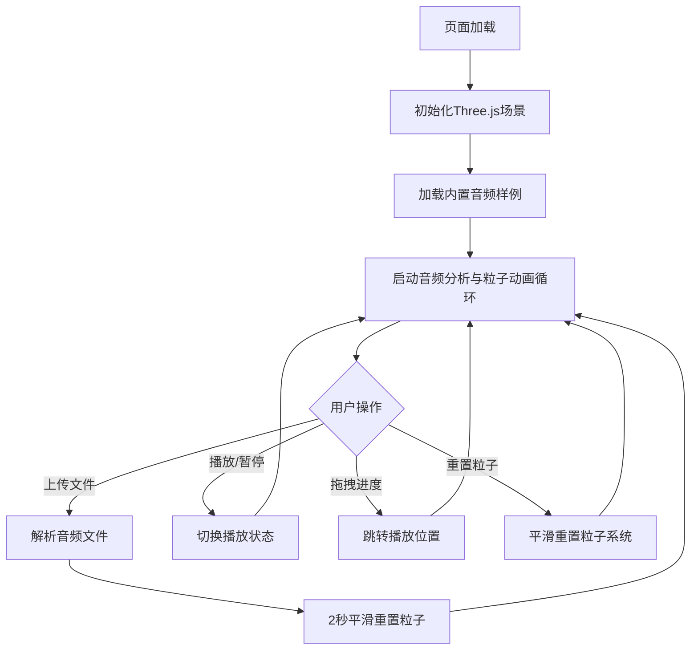

## 1. 产品概述

「音波星图」是一款3D交互式音乐可视化应用，通过实时音频频谱分析驱动动态粒子星系，为用户打造沉浸式音乐视觉体验。用户可上传自定义音频或享受预置音乐，粒子根据频率和音量动态变化，形成随音乐律动的星空视觉效果。

- 目标用户：音乐爱好者、视觉艺术爱好者、寻求沉浸式体验的普通用户
- 产品价值：将抽象的音乐转化为具象的视觉艺术，增强音乐欣赏的感官体验

## 2. 核心功能

### 2.1 功能模块

1. **3D粒子星系渲染**：8000粒子构成的动态星系，随音乐实时变化
2. **音频频谱分析**：实时解析32个频率段能量值与瞬时音量
3. **音频播放控制**：播放/暂停、进度条拖拽跳转、文件上传
4. **视角交互控制**：鼠标拖拽旋转、滚轮缩放
5. **粒子系统重置**：切换音频时平滑重置粒子分布

### 2.3 页面详情

| 页面名称 | 模块名称 | 功能描述 |
|-----------|-------------|---------------------|
| 主页面 | 3D渲染容器 | 全屏Three.js场景，展示粒子星系动画 |
| 主页面 | 顶部控制栏 | 文件上传、播放/暂停、粒子重置按钮 |
| 主页面 | 底部信息栏 | 音频文件名、播放进度条、FPS计数器 |

## 3. 核心流程

用户打开页面后默认加载内置30秒电子音乐样例，粒子星系自动开始律动。用户可通过右上角按钮上传自定义音频文件，系统解析后平滑重置粒子系统并开始播放。用户可随时暂停/播放音乐，通过底部进度条跳转播放位置，通过鼠标与3D场景交互。

## 4. 用户界面设计

### 4.1 设计风格

- **主色调**：深空蓝黑渐变背景（#080810到#101020）
- **粒子色**：青紫渐变（#00DDFF到#9966FF）默认旋转，按频率映射紫/青/粉色系
- **UI风格**：现代化扁平风，按钮圆角8px，悬停白色光晕，点击缩放反馈
- **字体**：简洁现代无衬线字体

### 4.2 页面设计概要

| 页面名称 | 模块名称 | UI元素 |
|-----------|-------------|-------------|
| 主页面 | 3D场景 | 深空背景、8000粒子星系、动态连线效果 |
| 主页面 | 顶部按钮组 | 上传按钮、播放/暂停按钮、重置按钮（右对齐，间距12px） |
| 主页面 | 底部信息栏 | 高60px半透明黑底，中央80%宽度进度条，左下角绿色FPS计数器 |

### 4.3 响应式设计

采用全屏布局，UI元素固定定位。3D画布自适应窗口大小，按钮与进度条在不同屏幕尺寸下保持可用。

### 4.4 3D场景指导

- **环境**：纯深空渐变背景，无额外光源，粒子自发光
- **相机**：PerspectiveCamera，初始位置z=20，OrbitControls控制，缩放范围5-40
- **粒子**：Points + ShaderMaterial实现高性能8000粒子渲染
- **连线**：LineSegments动态生成，阈值1.5单位
- **动画**：整体星系旋转 + 频率驱动位置/颜色/大小偏移 + 节奏峰值脉冲散射
