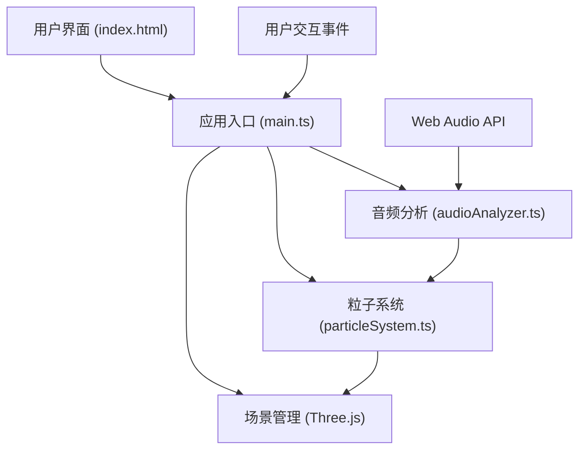

## 1. 架构设计



## 2. 技术说明

- **前端框架**：TypeScript + 原生Three.js（不使用React/Vue，按用户指定文件结构）
- **构建工具**：Vite 5.x，支持HMR热更新
- **3D渲染**：Three.js r160+，使用BufferGeometry + ShaderMaterial优化性能
- **音频处理**：Web Audio API (AudioContext, AnalyserNode, AudioBufferSourceNode)
- **无后端**：纯前端应用，所有处理在浏览器端完成

## 3. 文件结构

| 文件路径 | 作用 |
|----------|------|
| `package.json` | 项目依赖与脚本配置 |
| `index.html` | 入口HTML页面，含3D容器与UI元素 |
| `tsconfig.json` | TypeScript严格模式配置 |
| `vite.config.js` | Vite构建配置 |
| `src/main.ts` | 应用入口，场景初始化、事件监听、主循环 |
| `src/audioAnalyzer.ts` | 音频解析与实时频谱分析模块 |
| `src/particleSystem.ts` | 粒子系统创建与每帧更新逻辑 |

## 4. 核心数据结构

```typescript
// 音频分析输出
interface AudioData {
  frequencyBins: Float32Array; // 32个频率段平均能量 [0, 1]
  volume: number;              // 瞬时音量 [0, 1]
  isBeat: boolean;             // 是否节奏峰值
}

// 粒子状态
interface Particle {
  position: Vector3;      // 初始位置（半径15球体内随机）
  velocity: Vector3;      // 运动速度
  colorIndex: number;     // 频率映射颜色索引
}
```

## 5. 性能优化策略

1. **粒子渲染**：使用单个BufferGeometry + Points材质，单次Draw Call渲染8000粒子
2. **连线优化**：每帧仅重建距离阈值内的线段索引，使用LineSegments
3. **音频分析**：AnalyserNode fftSize=256，每帧调用getByteFrequencyData一次
4. **缓动动画**：粒子重置使用lerp线性插值，2秒内完成平滑过渡
5. **帧率控制**：requestAnimationFrame主循环，deltaTime驱动运动确保动画速度一致
