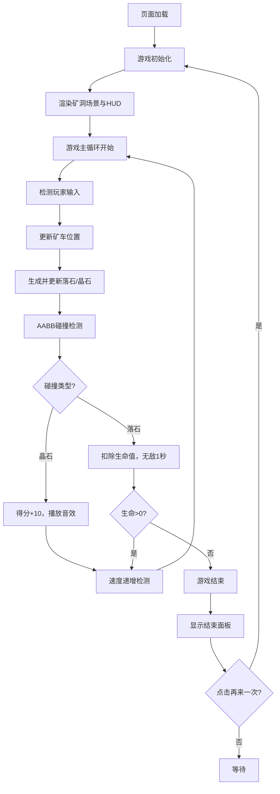

## 1. 产品概述
「幻影矿车」是一款垂直卷轴躲避类网页小游戏，玩家在不断下落的矿洞中控制矿车左右移动，躲避落石、收集能量晶石，考验反应速度和操作能力。
- 核心玩法：控制矿车躲避下落障碍物并收集得分道具，速度随分数递增
- 目标用户：休闲游戏爱好者、喜欢挑战反应速度的玩家
- 产品价值：提供轻松有趣的碎片化娱乐体验，操作简单但挑战性强

## 2. 核心特性

### 2.1 功能模块
1. **游戏主界面**：矿洞场景、矿车、落石、能量晶石、HUD状态栏
2. **游戏控制系统**：键盘左右键 / 鼠标点击左右半区控制矿车移动
3. **碰撞检测系统**：AABB包围盒检测矿车与落石、晶石的碰撞
4. **计分与生命系统**：晶石收集得分、落石击中扣命、难度递增
5. **音频系统**：背景音乐循环、收集晶石音效、被击中音效
6. **游戏结束界面**：最终得分、晶石总数、再来一次按钮

### 2.2 页面详情
| 页面名称 | 模块名称 | 功能描述 |
|---------|---------|---------|
| 游戏主界面 | 矿洞背景 | 深色岩壁纹理，上下粗糙石块边缘，左右渐变阴影 |
| 游戏主界面 | 矿车实体 | 梯形铁灰色方块带轮，底部水平移动，300px/s |
| 游戏主界面 | 普通落石 | 三角形(30px)，灰色，200px/s下落，扣1条命 |
| 游戏主界面 | 大型落石 | 六边形(50px)，深灰色，80px/s下落，扣2条命 |
| 游戏主界面 | 能量晶石 | 钻石形(20px)，三色随机，1.5秒闪烁周期，+10分 |
| 游戏主界面 | HUD状态栏 | 半透明黑底圆角，显示得分/命数/晶石数，白色等宽字体18px |
| 游戏结束面板 | 遮罩层 | 半透明黑色(0.7)覆盖全屏 |
| 游戏结束面板 | 信息面板 | 深灰色圆角面板(360x280px)，含标题/得分/晶石/按钮 |
| 游戏结束面板 | 再来一次按钮 | 蓝青渐变，悬停扩展增亮，点击重置游戏 |

## 3. 核心流程
玩家进入页面后游戏自动开始，矿车位于屏幕底部中央，通过键盘或鼠标控制左右移动。落石和晶石从顶部随机生成下落，玩家需躲避落石并收集晶石。每收集一颗晶石得10分，分数达到阈值后下落速度加快。被落石击中损失生命值，无敌1秒闪烁。生命归零时触发游戏结束，显示最终得分与晶石数量，点击再来一次可重新开始。

## 4. 用户界面设计

### 4.1 设计风格
- **主色调**：铁灰色(#6B5B4F)、深褐色(#4A3A2E)、冷青色(#00E5FF)点缀
- **辅助色**：品红(#FF007F)、金色(#FFD700)、深灰(#2A2D3A)
- **按钮风格**：圆角12px，蓝青渐变背景，悬停扩展+亮度提升
- **字体**：等宽字体(Consolas/Monaco)，白色文字，18px常规/24px标题/36px得分
- **布局**：固定480x720px游戏画布居中，全屏黑色背景
- **视觉效果**：1px投影增加立体感、CSS关键帧闪烁动画、发光滤镜

### 4.2 页面设计概览
| 页面名称 | 模块名称 | UI元素 |
|---------|---------|--------|
| 游戏主界面 | 矿洞背景 | 深色岩壁、上下石块纹理、左右渐变阴影 |
| 游戏主界面 | 实体元素 | 梯形矿车带轮子、三角/六边形落石、钻石晶石(发光闪烁) |
| 游戏主界面 | HUD | 半透明黑底圆角8px，白色等宽字体显示三项数据 |
| 游戏结束面板 | 遮罩 | 黑色半透明0.7全屏覆盖 |
| 游戏结束面板 | 结束面板 | 深灰#2A2D3A圆角16px，360x280px居中 |
| 游戏结束面板 | 标题 | 白→红渐变动画，24px字体 |
| 游戏结束面板 | 得分 | 金色#FFD700，36px，2px发光效果 |
| 游戏结束面板 | 按钮 | 160x44px，#00D4FF→#007BFF渐变，圆角12px |

### 4.3 响应式
- 桌面端优先，固定480x720px游戏画布在页面中央
- 画布外区域为纯黑色背景，底部显示操作提示文字
- 支持键盘和鼠标双输入方式
