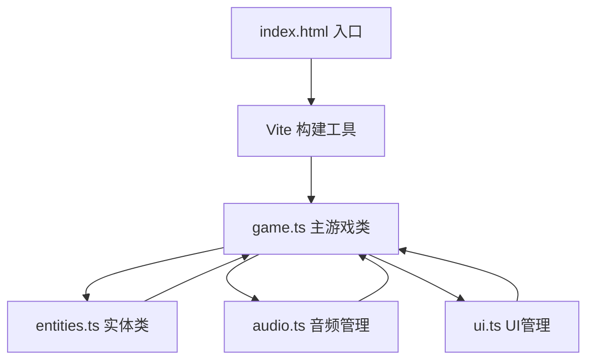

## 1. 架构设计



## 2. 技术说明
- **前端**：TypeScript + Vite，纯Canvas 2D渲染，无UI框架
- **初始化工具**：Vite vanilla-ts 模板
- **后端**：无后端，纯前端游戏
- **数据库**：无数据库
- **音频**：Web Audio API 原生生成音效与背景音乐

## 3. 目录结构
```
.
├── package.json
├── tsconfig.json
├── vite.config.js
├── index.html
└── src/
    ├── game.ts       # 主游戏类：循环、状态、碰撞、渲染协调
    ├── entities.ts   # 实体类：矿车、落石、晶石
    ├── audio.ts      # Web Audio API封装
    └── ui.ts         # HUD、结束面板、按钮交互
```

## 4. 核心类型定义

```typescript
// 游戏状态
type GameState = 'playing' | 'gameover';

// 位置与尺寸
interface Rect {
  x: number;
  y: number;
  width: number;
  height: number;
}

// 矿车
interface MineCart {
  x: number;
  y: number;
  width: 60;
  height: 40;
  speed: 300;
  invincible: boolean;
  invincibleTimer: number;
}

// 落石类型
type RockType = 'normal' | 'large';
interface Rock {
  x: number;
  y: number;
  type: RockType;
  speed: number;
  size: number;
  damage: number;
}

// 晶石颜色
type CrystalColor = 'cyan' | 'magenta' | 'gold';
interface Crystal {
  x: number;
  y: number;
  color: CrystalColor;
  size: 20;
  speed: number;
  glowPhase: number;
}
```

## 5. 性能与实现要点
- **游戏循环**：requestAnimationFrame，时间差驱动，60FPS
- **碰撞检测**：AABB轴对齐包围盒，矿车与所有实体逐一检测
- **实体上限**：最多8颗落石 + 3颗晶石同时存在
- **渲染**：Canvas 2D API，纯几何图形绘制
- **动画**：晶石闪烁用时间相位计算CSS发光效果
- **音频**：Web Audio API OscillatorNode生成音效，无外部音频文件
- **输入**：键盘keydown/keyup事件、鼠标mousedown事件
