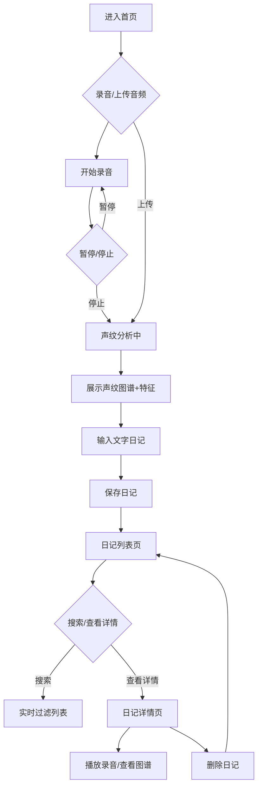

## 1. 产品概述

「声纹日记」是一款创新的多媒体日记Web应用，让用户通过录音或上传音频片段，结合声纹分析技术，生成可视化的声纹图谱并与文字日记关联，形成可播放和回顾的沉浸式多媒体日记体验。

- 解决问题：传统文字日记缺乏情感维度，声音记录难以直观回顾和检索
- 目标用户：喜欢记录生活、追求个性化表达的年轻用户和日记爱好者
- 产品价值：通过声纹可视化技术，让声音日记具有视觉表现力，增强回忆的沉浸感

## 2. 核心功能

### 2.1 用户角色

| 角色 | 注册方式 | 核心权限 |
|------|----------|----------|
| 普通用户 | 无需注册，本地存储 | 创建、查看、搜索、删除日记 |

### 2.2 功能模块

1. **录音页面**：圆形录音按钮、实时波形显示、录音时长计时、暂停/继续功能
2. **声纹分析页面**：环形进度条、声纹图谱Canvas绘制、音频特征分析结果展示
3. **日记编辑页面**：文字输入区、Markdown支持、字数统计、保存功能
4. **日记列表页面**：时间倒序排列、搜索过滤、缩略图谱展示、淡入淡出动画
5. **日记详情页面**：音频播放器、完整声纹图谱、文字内容、删除功能

### 2.3 页面详情

| 页面名称 | 模块名称 | 功能描述 |
|----------|----------|----------|
| 录音页面 | 录音控制区 | 圆形呼吸按钮（默认）、红色脉冲按钮（录音中）、时长显示（0-60秒）、暂停/继续 |
| 录音页面 | 实时波形 | Canvas绘制实时音量波形，帧率≥30fps |
| 声纹分析页面 | 进度指示 | 环形进度条动画，2-3秒完成分析 |
| 声纹分析页面 | 声纹图谱 | 300x240px Canvas，X轴时间、Y轴频率(0-8kHz)、颜色映射音量（绿→紫渐变） |
| 声纹分析页面 | 特征摘要 | 语速（正常/偏快/偏慢）、平均音量(dB)、语调起伏（平稳/波动大），每项带图标和色块 |
| 日记编辑页面 | 文字输入 | textarea宽100%高120px，浅米色背景#F5F0E8，圆角8px，字体14px，深灰色#333 |
| 日记编辑页面 | Markdown支持 | 加粗、列表、分隔线简单排版 |
| 日记编辑页面 | 字数统计 | 上限300字，实时统计显示 |
| 日记列表页面 | 搜索框 | 宽200px，圆角20px，placeholder「搜索日记内容...」，清空按钮，实时模糊搜索 |
| 日记列表页面 | 日记卡片 | 摘要前50字、录音时长、120x60px马赛克缩略图、相对时间，平滑淡入淡出300ms |
| 日记详情页面 | 音频播放 | 波形进度条播放器，图谱和波形呼吸动画（透明度1.0→0.85，周期2s） |
| 日记详情页面 | 内容展示 | 完整声纹图谱、完整文字内容、删除按钮 |

## 3. 核心流程

用户从首页开始，点击录音按钮开始录制语音日记，或上传已有音频文件。录音完成后系统自动进行声纹分析，展示声纹图谱和音频特征。用户输入文字内容后保存日记，系统跳转到日记列表页。用户可在列表页搜索、查看日记详情，或删除日记。

## 4. 用户界面设计

### 4.1 设计风格

- 主背景色：`#0F141A`（深色极简）
- 卡片背景色：`#1E2730`，圆角12px，内边距24px，阴影`0 4px 20px rgba(0,0,0,0.3)`
- 主色调：青色`#00BFA5`、深蓝`#1A2C42`
- 辅助色：紫色`#7E57C2`用于高亮
- 音量渐变：低音量绿色`#00E676` → 高音量紫色`#E040FB`
- 文字背景：浅米色`#F5F0E8`，文字颜色深灰`#333`
- 按钮样式：圆形录音按钮直径80px，深蓝背景
- 过渡动画：录音按钮、卡片悬停、导航链接均为0.2s ease-in-out
- 呼吸动画：透明度循环，默认0.1→0.3，录音中0.6，详情页图谱1.0→0.85（周期2s）

### 4.2 页面设计概述

| 页面名称 | 模块名称 | UI元素 |
|----------|----------|--------|
| 录音页面 | 录音按钮 | 深蓝圆形#1A2C42，呼吸光晕，点击变红脉冲，时长显示在上 |
| 录音页面 | 波形显示 | Canvas实时绘制，绿色线条，跟随音量变化 |
| 分析页面 | 进度环 | SVG环形进度条，青色描边，旋转动画 |
| 分析页面 | 声纹图谱 | 300x240px Canvas，彩色频谱图，绿→紫渐变 |
| 分析页面 | 特征卡片 | 三个小卡片，图标+色块+数值，水平排列 |
| 编辑页面 | 文字区 | 浅米色textarea，圆角8px，Markdown预览提示 |
| 列表页面 | 搜索框 | 圆角20px，青色边框，清空按钮，左对齐 |
| 列表页面 | 日记项 | 卡片布局，左缩略图，右文字+时间，悬停微上浮 |
| 详情页面 | 播放器 | 波形进度条，播放按钮，时间显示 |
| 详情页面 | 图谱区 | Canvas完整图谱，呼吸动画，边框高亮 |

### 4.3 响应式设计

- 桌面端优先设计，移动端自适应（min-width: 320px）
- 卡片在小屏幕下变为单列布局
- 录音按钮在移动端适当缩小（直径64px）
- 搜索框在移动端宽度自适应
- 图谱Canvas按比例缩放

### 4.4 动效规范

- 录音按钮呼吸光晕：`@keyframes breathe { 0%,100% { opacity:0.1 } 50% { opacity:0.3 } }`
- 录音中脉冲：`@keyframes pulse { 0%,100% { opacity:0.6; transform:scale(1) } 50% { opacity:0.8; transform:scale(1.05) } }`
- 列表项淡入淡出：`transition: opacity 300ms ease-in-out`
- 详情页呼吸：`@keyframes detailBreathe { 0%,100% { opacity:1.0 } 50% { opacity:0.85 } }`，周期2s
