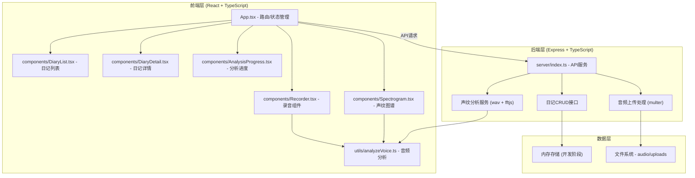
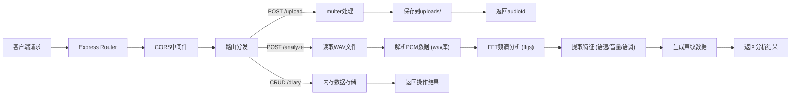
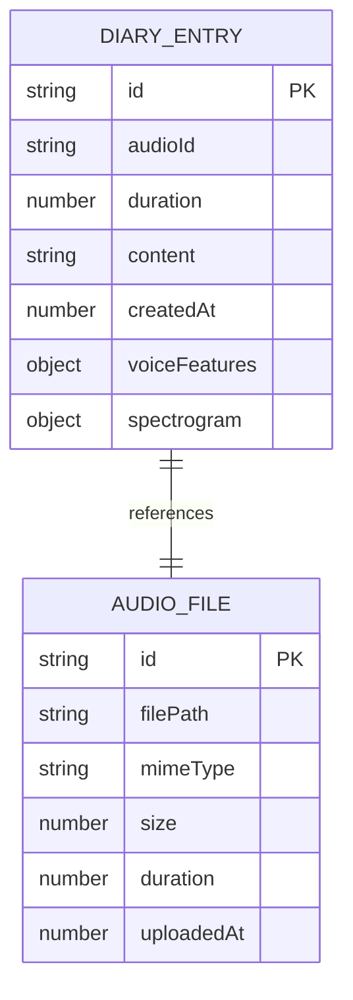

## 1. 架构设计



## 2. 技术选型说明

- **前端框架**：React 18 + TypeScript + Vite
  - React：组件化开发，生态成熟
  - TypeScript：类型安全，提升代码质量
  - Vite：极速开发体验，HMR支持
- **后端框架**：Express 4 + TypeScript
  - Express：轻量级Node.js框架，适合API服务
  - multer：处理音频文件上传
- **音频处理**：
  - MediaRecorder API：浏览器端录音
  - Web Audio API：实时音频分析、波形绘制
  - fftjs：FFT快速傅里叶变换，频域分析
  - wav：WAV文件解析
- **状态管理**：React Hooks (useState, useReducer) + Context
- **路由**：React Router DOM 6
- **代码规范**：严格模式TypeScript (tsconfig strict: true)

## 3. 路由定义

| 前端路由 | 页面/组件 | 用途 |
|----------|-----------|------|
| `/` | Recorder + Home | 首页录音入口 |
| `/analyze` | AnalysisProgress + Spectrogram | 声纹分析与图谱展示 |
| `/edit` | DiaryEditor | 日记文字编辑 |
| `/list` | DiaryList | 日记列表（含搜索） |
| `/diary/:id` | DiaryDetail | 日记详情与播放 |

## 4. API 定义

### 4.1 TypeScript 类型定义

```typescript
interface VoiceFeatures {
  speechRate: 'normal' | 'fast' | 'slow';
  speechRateValue: number;
  averageVolume: number;
  volumeVariance: number;
  pitchVariance: number;
  intonation: 'steady' | 'fluctuating';
  duration: number;
}

interface SpectrogramData {
  timeBins: number;
  freqBins: number;
  data: number[][];
  minFreq: number;
  maxFreq: number;
}

interface DiaryEntry {
  id: string;
  audioUrl: string;
  audioBuffer?: ArrayBuffer;
  voiceFeatures: VoiceFeatures;
  spectrogram: SpectrogramData;
  content: string;
  createdAt: number;
  duration: number;
}

interface ApiResponse<T> {
  success: boolean;
  data?: T;
  error?: string;
}
```

### 4.2 接口定义

| 方法 | 路径 | 请求 | 响应 | 用途 |
|------|------|------|------|------|
| POST | `/api/upload` | multipart/form-data: audio file | `ApiResponse<{ audioId: string, duration: number }>` | 上传音频文件 |
| POST | `/api/analyze` | JSON: `{ audioId: string }` | `ApiResponse<{ features: VoiceFeatures, spectrogram: SpectrogramData }>` | 分析声纹特征 |
| POST | `/api/diary` | JSON: `{ audioId, features, spectrogram, content }` | `ApiResponse<{ id: string }>` | 创建日记 |
| GET | `/api/diary` | Query: `?search=xxx` | `ApiResponse<DiaryEntry[]>` | 获取日记列表（支持搜索） |
| GET | `/api/diary/:id` | - | `ApiResponse<DiaryEntry>` | 获取单条日记 |
| DELETE | `/api/diary/:id` | - | `ApiResponse<{}>` | 删除日记 |
| GET | `/api/audio/:id` | - | audio/wav binary stream | 获取音频文件 |

## 5. 服务端架构



## 6. 数据模型

### 6.1 ER 图



### 6.2 内存存储结构

开发阶段使用内存Map存储：

```typescript
interface DataStore {
  diaries: Map<string, DiaryEntry>;
  audioFiles: Map<string, {
    path: string;
    buffer: Buffer;
    uploadedAt: number;
  }>;
}
```

## 7. 性能优化策略

### 7.1 录音性能（≥30fps）
- 使用`requestAnimationFrame`绘制波形，避免阻塞主线程
- 音频数据处理使用Web Worker（可选优化）
- 限制波形绘制数据点数量（最多200点）

### 7.2 声纹分析（≤3秒）
- 使用快速FFT算法（fftjs），窗口大小2048
- 音频降采样到16kHz，减少计算量
- 分帧处理，帧移512样本
- 对60秒音频：约(60×16000)/512 ≈ 1875帧，每帧2048点FFT

### 7.3 图谱绘制（≤100ms）
- Canvas离屏预渲染
- 使用`ImageData`批量像素操作
- 时间轴降采样，300px宽度对应300个时间bin
- 缓存图谱绘制结果

## 8. 项目文件结构

```
├── package.json
├── index.html
├── vite.config.js
├── tsconfig.json
├── server/
│   └── index.ts
├── src/
│   ├── App.tsx
│   ├── main.tsx
│   ├── index.css
│   ├── components/
│   │   ├── Recorder.tsx
│   │   ├── Spectrogram.tsx
│   │   ├── DiaryList.tsx
│   │   ├── DiaryDetail.tsx
│   │   ├── DiaryEditor.tsx
│   │   └── AnalysisProgress.tsx
│   └── utils/
│       ├── analyzeVoice.ts
│       ├── audioUtils.ts
│       └── timeUtils.ts
└── uploads/
    └── (音频文件存储目录)
```
