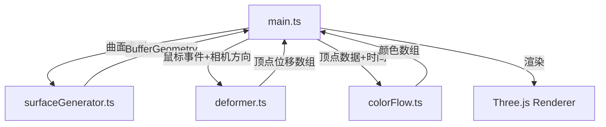

# 技术架构文档

## 1. 技术栈
- **框架**: Three.js
- **语言**: TypeScript
- **构建**: Vite
- **控制**: OrbitControls, TransformControls (three/addons)

## 2. 项目结构

```
auto275/
├── package.json
├── vite.config.js
├── tsconfig.json
├── index.html
└── src/
    ├── main.ts              # 核心入口
    ├── surfaceGenerator.ts  # 曲面生成模块
    ├── deformer.ts        # 变形交互模块
    └── colorFlow.ts      # 颜色流动模块
```

## 3. 模块职责与数据流向



### 3.1 surfaceGenerator.ts
- 输入：曲面类型（'torus' | 'klein'）
- 数学公式生成顶点网格
- 输出：BufferGeometry（顶点位置、法线、UV坐标）

### 3.2 deformer.ts
- 输入：鼠标坐标、相机方向、笔刷参数
- 计算顶点受影响范围
- 输出：更新后的顶点位置数组

### 3.3 colorFlow.ts
- 输入：变形顶点数据、当前时间
- HSV到RGB映射
- 输出：颜色数组

## 4. 核心技术方案

### 4.1 曲面数学公式

**环面（Torus）：
- x = (R + r·cos(v))·cos(u)
- y = (R + r·cos(v))·sin(u)
- z = r·sin(v)

**克莱因瓶（Klein Bottle）：
- 经典参数化方程

### 4.2 变形算法
- 射线拾取确定点击位置
- 高斯衰减：exp(-d²/(2σ²))
- 沿法线与拖拽方向合成

### 4.3 颜色系统
- HSL插值：蓝色→紫色→洋红
- 时间驱动明度正弦波动

## 5. 性能优化
- BufferGeometry直接操作
- 顶点属性按需更新
- requestAnimationFrame主循环
