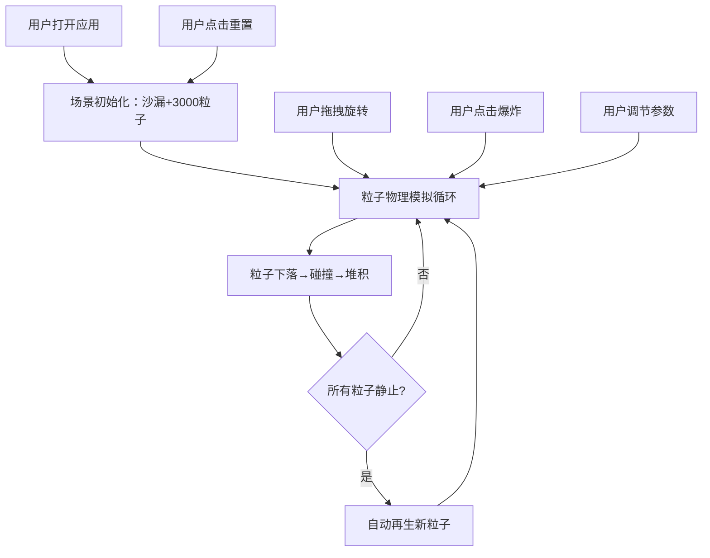

## 1. 产品概述

「元素沙漏」是一款3D交互式粒子沙漏模拟应用，让用户在三维空间中实时观察数千个彩色粒子在沙漏容器中下落、碰撞、堆积的全过程。通过精美的视觉效果和流畅的交互体验，打造一场动态的视觉盛宴。

- 主要目的：提供沉浸式的3D粒子物理模拟体验，让用户通过调节参数探索粒子动力学
- 目标用户：对物理模拟、视觉艺术、交互体验感兴趣的用户

## 2. 核心功能

### 2.1 用户角色
无需用户注册，所有访客均可直接使用所有功能。

### 2.2 功能模块
1. **3D沙漏场景**：两个玻璃锥体与细颈构成的沙漏容器，透明玻璃材质带淡蓝色光泽
2. **粒子物理系统**：3000个彩色粒子的重力下落、碰撞检测、堆积模拟
3. **鼠标交互**：拖拽旋转场景、滚轮缩放、点击粒子触发爆炸效果
4. **参数控制面板**：重力方向角度调节、粒子大小缩放、颜色渐变模式切换
5. **实时状态展示**：FPS计数器、粒子总数显示、自动再生机制
6. **重置功能**：右下角重置按钮，一键重置所有粒子位置

### 2.3 页面详情
| 页面名称 | 模块名称 | 功能描述 |
|-----------|-------------|---------------------|
| 主页面 | 3D渲染场景 | 全屏显示沙漏与粒子，居中布局，暗色星空背景渐变 |
| 主页面 | 顶部标题 | 显示"元素沙漏"文字 |
| 主页面 | 右侧控制面板 | 深色半透明面板，滑块与按钮，控制重力、粒子大小、颜色模式 |
| 主页面 | 底部状态栏 | 实时FPS计数器和当前粒子总数 |
| 主页面 | 右下角重置按钮 | 重置粒子到初始位置 |

## 3. 核心流程

用户打开应用 → 观看默认场景中粒子从顶部锥体内下落 → 鼠标拖拽旋转观察不同角度 → 点击粒子触发爆炸效果 → 通过右侧面板调节参数改变模拟效果 → 粒子全部落到底部后自动再生 → 随时点击重置按钮重新开始

## 4. 用户界面设计

### 4.1 设计风格
- **主色调**：暗色星空背景（#0A0A14 → #121224 径向渐变）
- **玻璃色调**：淡蓝色光泽 #C8E6F0，透明度0.3
- **粒子渐变模式1**：品红 #FF3366 → 青蓝 #00CCFF
- **粒子渐变模式2**：金黄 → 翠绿
- **粒子渐变模式3**：紫罗兰 → 桃红
- **面板背景**：深色半透明 #1A1A24CC，圆角8px
- **按钮风格**：圆角，渐变边框，悬停微亮效果
- **字体**：现代无衬线字体，标题醒目，正文清晰

### 4.2 页面设计概述
| 页面名称 | 模块名称 | UI元素 |
|-----------|-------------|-------------|
| 主页面 | 3D场景 | 全屏WebGL画布，居中沙漏，星空渐变背景 |
| 主页面 | 标题 | 顶部居中，大号字体，发光文字效果 |
| 主页面 | 控制面板 | 右侧悬浮，深色半透明卡片，标签+滑块+按钮组 |
| 主页面 | 状态栏 | 左下角，小字体，显示FPS和粒子数 |
| 主页面 | 重置按钮 | 右下角，圆角按钮，重置图标 |

### 4.3 响应式
- 桌面端为主，场景自动适配窗口大小
- 窗口缩放时相机和渲染器自动调整
- 控制面板保持合理位置，最小窗口宽度限制

### 4.4 3D场景指引
- **环境/背景**：径向渐变星空背景（#0A0A14 → #121224），营造深空氛围
- **光照设置**：环境光提供基础照明，两盏点光源从沙漏两侧打光，突出玻璃高光和粒子色彩
- **相机设置**：透视相机，初始距离约15单位，OrbitControls控制旋转缩放
- **构图与焦点**：沙漏居中，占据视觉中心，粒子运动为主要视觉焦点
- **交互与动画**：OrbitControls拖拽旋转，滚轮缩放，射线拾取点击粒子触发爆炸动画
- **后处理效果**：粒子拖尾（透明度随速度0.6→0.1渐变），碰撞光晕（半径0.2，透明度0.3）
- **性能预算**：3000粒子稳定60FPS，5000粒子不低于40FPS
