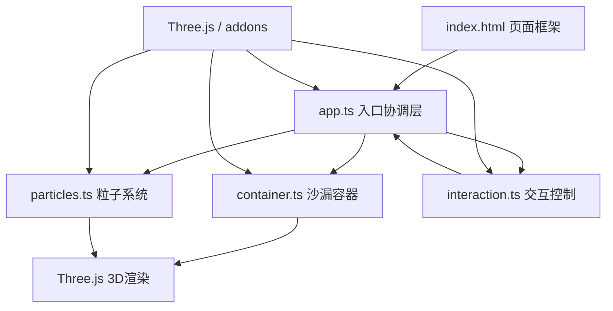

## 1. 架构设计



## 2. 技术描述

- **前端框架**：TypeScript（严格模式，ES2020目标）
- **构建工具**：Vite（支持HMR热更新）
- **3D引擎**：Three.js 最新版本 + three/addons
- **类型支持**：@types/three
- **渲染目标**：WebGL，60FPS目标帧率

## 3. 文件结构

```
project-root/
├── package.json
├── index.html
├── tsconfig.json
├── vite.config.js
└── src/
    ├── app.ts          # 入口：场景初始化、相机、光源、动画循环
    ├── container.ts    # 沙漏容器：两个锥体+细颈，透明玻璃材质
    ├── particles.ts    # 粒子系统：生成、物理模拟、碰撞、颜色渐变
    └── interaction.ts  # 交互：OrbitControls、射线拾取爆炸、参数面板
```

## 4. 模块数据流向

### 4.1 app.ts
- 初始化 Three.js Scene、PerspectiveCamera、WebGLRenderer、光源
- 组合 container.ts 与 particles.ts 的输出
- 启动 requestAnimationFrame 动画循环
- 协调每帧更新：particles.update() → container.sync() → renderer.render()
- 数据流向：接收 particles 的位置/颜色数据，传递给渲染循环

### 4.2 container.ts
- 构建沙漏几何：顶部锥体（倒）、底部锥体（正）、细颈圆柱
- 材质：MeshPhysicalMaterial，透明，淡蓝色 #C8E6F0，透明度0.3
- 线框辅助：EdgesGeometry 显示沙漏轮廓
- 提供锥体碰撞检测所需的几何参数接口
- 数据流向：接收粒子位置用于可视参考，传递几何参数给 particles

### 4.3 particles.ts
- 粒子数据：使用 Float32Array 存储位置、速度、颜色、半径
- 渲染：THREE.Points + ShaderMaterial 或 PointsMaterial
- 物理模拟：
  - 重力：方向可调，加速度9.8
  - 锥体内壁碰撞：弹性反弹，系数0.3
  - 粒子间排斥：空间网格哈希加速，避免完全重叠
  - 堆积检测：速度阈值<0.01判定静止
- 拖尾效果：透明度随速度插值（0.6→0.1）
- 碰撞光晕：粒子碰撞时临时放大透明度
- 爆炸效果：球形区域内粒子赋予径向速度，1秒后恢复
- 自动再生：所有粒子静止后，在顶部锥体内重新生成
- 数据流向：计算位置/颜色 → 传递给 Points 几何体 → 渲染循环

### 4.4 interaction.ts
- OrbitControls：鼠标左键拖拽旋转场景，滚轮缩放
- 射线拾取：Raycaster 检测点击粒子，触发爆炸
- 参数面板 DOM 元素：
  - 重力角度滑块（0-360°，默认0°向下）
  - 粒子大小缩放滑块（0.5-2.0，默认1.0）
  - 颜色渐变模式按钮（3种模式切换）
- FPS计数器：使用 performance.now() 计算
- 数据流向：更新相机视角、物理参数、粒子大小、颜色模式

## 5. 性能优化策略

| 优化项 | 方案 |
|--------|------|
| 粒子数据存储 | 使用 TypedArray（Float32Array）连续内存，避免GC |
| 粒子渲染 | THREE.Points 单次绘制调用，而非 Mesh 实例化 |
| 碰撞检测 | 空间网格哈希（Uniform Grid），O(n) 复杂度 |
| 爆炸近似 | 爆炸期间简化物理计算，仅施加径向速度 |
| 渲染帧率 | requestAnimationFrame + deltaTime 时间步长 |
| 内存管理 | 预分配缓冲区，避免运行时频繁创建对象 |
| 粒子上限 | 最多5000，超过时复用最早下落的粒子 |
