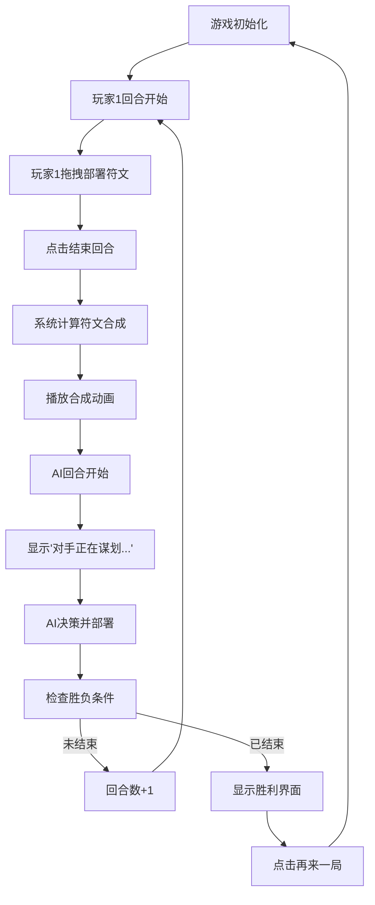

## 1. 产品概述

「符文回声」是一款轻量级双人同屏回合制策略对战游戏，在浏览器中模拟带有符文合成与区域控制的即时策略对决体验。

- 主要目的：解决在没有网络和实体卡牌的情况下，两位玩家无法快速体验符文对战的问题
- 目标用户：喜欢策略卡牌游戏、需要随时进行快速对战的玩家
- 核心价值：提供离线可玩、操作简单、带有策略深度的双人同屏竞技体验

## 2. 核心功能

### 2.1 用户角色
| 角色 | 说明 | 核心权限 |
|------|------|----------|
| 玩家1（人类） | 左侧阵营，暗红色系 | 部署符文、结束回合、查看战场 |
| 玩家2（AI） | 右侧阵营，暗蓝色系 | 自动部署符文、自动合成 |

### 2.2 功能模块
1. **战场系统**：8x6六边形网格战场，支持领地占领和可视化
2. **符文系统**：4种基础符文（太阳、月亮、星星、火焰），支持拖拽部署和相邻合成
3. **回合系统**：回合制对战，每回合30秒倒计时，最多15回合
4. **AI对战**：简单贪心策略AI，自动决策部署位置
5. **胜负判定**：占领超过半数格子或15回合后占领数多者获胜

### 2.3 页面详情
| 页面名称 | 模块名称 | 功能描述 |
|-----------|-------------|---------------------|
| 游戏主界面 | 六边形战场 | 8x6网格，显示领地占领状态和已部署符文 |
| 游戏主界面 | 玩家手牌区 | 左右两侧各显示4张手牌，支持拖拽部署 |
| 游戏主界面 | 回合信息栏 | 顶部显示当前回合数和剩余时间倒计时 |
| 游戏主界面 | 结束回合按钮 | 中央圆形按钮，点击结束当前回合 |
| 游戏主界面 | AI等待提示 | 顶部显示"对手正在谋划..."闪烁动画 |
| 游戏主界面 | 胜利界面遮罩 | 半透明遮罩显示胜利方、统计数据和重开按钮 |

## 3. 核心流程

游戏开始后，玩家1从手牌区拖拽符文牌到己方相邻或空格子上部署，部署完成后点击「结束回合」按钮。系统自动计算相邻相同符文的合成效果并播放动画，然后AI玩家在0.5-1.5秒思考后自动执行部署。双方轮流进行，直到一方占领超过24格或15回合结束，弹出胜负界面。

## 4. 用户界面设计

### 4.1 设计风格
- **主色调**：深紫黑 #1A1620，古铜色 #8B7355
- **阵营色**：玩家1暗红 #5C2E2E，玩家2暗蓝 #2E3A5C
- **强调色**：金色 #FFD700（合成动画），警示红 #C83A3A（倒计时<10秒）
- **按钮风格**：结束回合为圆形按钮（直径48px），悬停发光效果；重开按钮为矩形（120x44px），圆角8px
- **字体**：奇幻风格，标题加粗80px，回合信息18px，倒计时20px
- **布局风格**：横屏自适应（最小1200x700），战场居中，手牌区分列左右
- **动效风格**：缓入缓出，合成环形扩散，AI思考文字闪烁

### 4.2 页面设计概述
| 页面名称 | 模块名称 | UI元素 |
|-----------|-------------|-------------|
| 游戏主界面 | 六边形网格 | 边长32px，边距2px，径向渐变背景，古铜色边框 |
| 游戏主界面 | 领地格子 | 玩家1暗红 #5C2E2E，玩家2暗蓝 #2E3A5C |
| 游戏主界面 | 符文卡牌 | 60x80px，圆角6px，SVG矢量图案，随阵营变色 |
| 游戏主界面 | 手牌区 | 宽120px高560px，半透明深色背景 #1C1822 |
| 游戏主界面 | 回合信息 | 字体18px #C8B898，倒计时20px，<10秒变红闪烁 |
| 游戏主界面 | 结束回合按钮 | 圆形#8B7355，直径48px，悬停发光 |
| 游戏主界面 | AI思考提示 | 文字#A89880，每0.8秒透明度0.3-1.0切换 |
| 游戏主界面 | 胜利界面 | 半透明遮罩#000000CC，阵营色大字80px加粗 |

### 4.3 响应式
- 桌面优先设计，最小分辨率1200x700
- 战场区域居中显示，手牌区固定在两侧
- Canvas根据窗口大小自适应缩放

### 4.4 性能要求
- 帧率：保持60FPS
- 渲染：六边形网格和符文使用Canvas 2D，手牌区使用DOM
- 交互反馈：200ms内触发
- 包体积：控制在500KB以内
