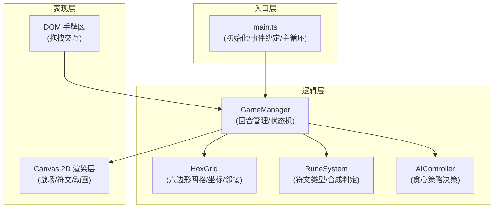

## 1. 架构设计



## 2. 技术描述

- **前端框架**：原生 TypeScript（无React/Vue，用户明确要求轻量级）
- **构建工具**：Vite
- **渲染方式**：Canvas 2D（战场、符文、动画）+ DOM（手牌区拖拽）
- **无后端**：纯前端单机游戏
- **无数据库**：状态保存在内存中

## 3. 文件组织

| 文件路径 | 用途 |
|-------|---------|
| `package.json` | 依赖：typescript、vite；启动脚本：npm run dev |
| `index.html` | 入口页面，游戏容器div和样式初始化 |
| `tsconfig.json` | 严格模式，目标ES2020，模块ESNext |
| `vite.config.js` | 基本Vite构建配置，支持HMR |
| `src/main.ts` | 游戏主入口，初始化Canvas、加载游戏管理器、绑定resize事件和start按钮，启动主循环 |
| `src/core.ts` | 核心逻辑：六边形网格坐标、相邻关系、符文枚举、领地判定、回合状态、合成判定 |
| `src/renderer.ts` | Canvas渲染：六边形网格、领地高亮、符文图案、合成动画、胜利遮罩，requestAnimationFrame驱动 |
| `src/ai.ts` | AI对手策略：简单贪心算法，返回行动类型、目标坐标、符文牌索引 |

## 4. 核心数据结构

### 4.1 六边形坐标系统
```typescript
// 使用 axial 坐标系统 (q, r)
interface HexCoord {
  q: number;  // 列
  r: number;  // 行
}
```

### 4.2 符文类型
```typescript
enum RuneType {
  SUN = 'sun',        // 太阳
  MOON = 'moon',      // 月亮
  STAR = 'star',      // 星星
  FLAME = 'flame',    // 火焰
  CORONA = 'corona',  // 日冕（合成）
}
```

### 4.3 格子状态
```typescript
interface HexCell {
  coord: HexCoord;
  owner: PlayerId | null;     // 占领者
  rune: RuneType | null;      // 放置的符文
  isComposite: boolean;       // 是否为合成符文
  defense: number;            // 防御力
}
```

### 4.4 玩家状态
```typescript
interface PlayerState {
  id: PlayerId;
  hand: RuneType[];           // 手牌
  territoryCount: number;     // 占领格数
}
```

### 4.5 游戏状态
```typescript
interface GameState {
  turn: number;               // 当前回合 1-15
  currentPlayer: PlayerId;    // 当前行动玩家
  phase: 'deploy' | 'aiThinking' | 'ended';
  timer: number;              // 剩余秒数
  winner: PlayerId | null;
}
```

## 5. 性能优化策略

1. **Canvas分层**：静态网格预渲染到离屏Canvas，仅重绘变动区域
2. **脏矩形渲染**：只重绘状态变化的格子和动画区域
3. **requestAnimationFrame**：统一动画驱动，避免setTimeout
4. **对象池**：动画对象复用，减少GC压力
5. **DOM最小化**：手牌区使用4个固定DOM元素，避免频繁创建销毁
6. **合成计算优化**：相邻检查使用预计算的邻接表，O(1)查询
