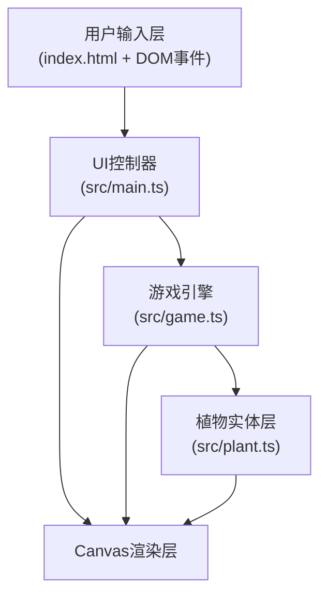

## 1. 架构设计



## 2. 技术描述

- **前端框架**：原生 TypeScript + HTML5 Canvas（用户明确指定，不使用React/Vue）
- **构建工具**：Vite 5.x
- **语言标准**：TypeScript 严格模式，目标 ES2020，模块 ESNext
- **无后端**：纯前端单页应用，无服务端依赖
- **无数据库**：所有状态存储在内存中

## 3. 文件结构

```
├── package.json          # 项目依赖和启动脚本（vite、typescript）
├── index.html            # 入口页面，全屏canvas容器、顶部状态栏、左侧工具栏
├── tsconfig.json         # TypeScript严格模式配置
├── vite.config.js        # Vite基础构建配置
└── src/
    ├── main.ts           # 入口文件：画布初始化、UI控制器、事件绑定、游戏循环
    ├── game.ts           # 核心逻辑：网格状态管理、回合生长计算、竞争判定、数据存储
    └── plant.ts          # 植物类定义：基类+三个子类（树木/灌木/草本），属性和更新方法
```

## 4. 核心数据结构

### 4.1 网格单元 (GridCell)

```typescript
interface GridCell {
  x: number;              // 网格X坐标 (0-49)
  y: number;              // 网格Y坐标 (0-49)
  moisture: number;       // 土壤水分 0.0-1.0
  plant: Plant | null;    // 该格上的植物（每格最多一株）
  nutrientTurns: number;  // 养分剩余回合数（0=无养分，>0=棕色）
}
```

### 4.2 植物基类 (Plant)

```typescript
abstract class Plant {
  id: string;                     // 唯一标识
  type: 'tree' | 'shrub' | 'herb';// 植物类型
  x: number;                      // 网格X坐标
  y: number;                      // 网格Y坐标
  height: number;                 // 当前高度（像素格数）
  maxHeight: number;              // 最大高度
  growthRate: number;             // 基础生长速率
  nutrientConsumption: number;    // 养分消耗速率
  health: number;                 // 血量
  maxHealth: number;              // 最大血量
  rootDepth: number;              // 根系深度（影响水分获取）
  rootSpread: number;             // 根系广度（影响水分获取）
  growthValue: number;            // 当前累积生长值
  growthThreshold: number;        // 升级高度所需生长值
  isSqueezed: boolean;            // 当前是否被挤压（动画状态）
  squeezeStartTime: number;       // 挤压动画开始时间
  growthAnimationStart: number;   // 生长动画开始时间
  prevHeight: number;             // 动画用：上一帧高度
  age: number;                    // 存活回合数
}
```

### 4.3 动画对象

```typescript
interface RippleAnimation {
  x: number;           // 画布像素坐标
  y: number;
  startTime: number;   // 开始时间戳
  duration: number;    // 持续时间 300ms
  color: string;       // 对应植物类型颜色
}
```

### 4.4 游戏状态 (GameState)

```typescript
interface GameState {
  grid: GridCell[][];           // 50x50网格
  plants: Map<string, Plant>;   // 所有存活植物
  turn: number;                 // 当前回合数
  selectedPlantType: 'tree' | 'shrub' | 'herb';
  ripples: RippleAnimation[];   // 活跃波纹动画
}
```

## 5. 核心算法

### 5.1 光照获取量计算

```
for each plant p:
  shade = 0
  for each neighbor n above p (smaller y) within column:
    if n.height > p.height:
      shade += (n.height - p.height) * 0.1
  light = max(0, 1.0 - shade)
```

### 5.2 水分获取量计算

```
for each plant p:
  moistureSum = 0
  cellCount = 0
  for dx in [-p.rootSpread ... p.rootSpread]:
    for dy in [0 ... p.rootDepth]:
      nx = p.x + dx, ny = p.y + dy
      if inBounds(nx, ny):
        moistureSum += grid[ny][nx].moisture
        cellCount++
  water = moistureSum / cellCount  // 平均水分
```

### 5.3 生长值更新

```
growthValue += light * water * growthRate * (1 + nutrientBonus)
if adjacent taller plant exists:
  growthValue *= 0.8  // 生长率减慢20%
if growthValue >= growthThreshold:
  height += 1
  growthValue = 0
  growthThreshold *= 1.5  // 下一级更高
```

### 5.4 空间挤压判定

```
for each plant p:
  for each 4-direction neighbor n:
    if n exists and (p.height + n.height) > CANVAS_HEIGHT_LIMIT:
      shorter = min(p, n by height)
      taller = max(p, n by height)
      shorter.health -= 10
      shorter.isSqueezed = true
      shorter.squeezeStartTime = now
      if shorter.health <= 0:
        killPlant(shorter)
        grid[shorter.y][shorter.x].nutrientTurns = 5
```

## 6. 渲染流程（每帧）

1. 清空画布，绘制浅绿到深绿垂直渐变背景
2. 遍历50x50网格，绘制：
   - 水分颜色叠加（蓝度与moisture成正比）
   - 养分棕色方块（nutrientTurns > 0 时）
   - 灰色细网格边框
3. 遍历所有植物，按高度升序渲染：
   - 根据植物类型颜色绘制高度对应像素格
   - 应用挤压动画缩放（scale 0.9 → 1.0，0.2s）
   - 应用生长动画（prevHeight → height 插值）
4. 绘制活跃波纹动画（圆形扩散，透明度线性衰减，0.3s）
5. 更新顶部状态栏回合数和植物数量

## 7. 性能优化

- **网格数据使用二维数组**：O(1) 随机访问
- **植物使用 Map 存储**：O(1) 增删查
- **回合计算分阶段批处理**：先收集所有植物计算结果，再统一更新状态，避免迭代中修改导致的不一致
- **动画使用 requestAnimationFrame**：与浏览器刷新率同步，时间戳驱动而非帧计数
- **离屏状态与渲染分离**：动画插值在渲染层计算，不修改逻辑状态
- **避免每帧 GC**：复用临时数组和对象，减少内存分配
