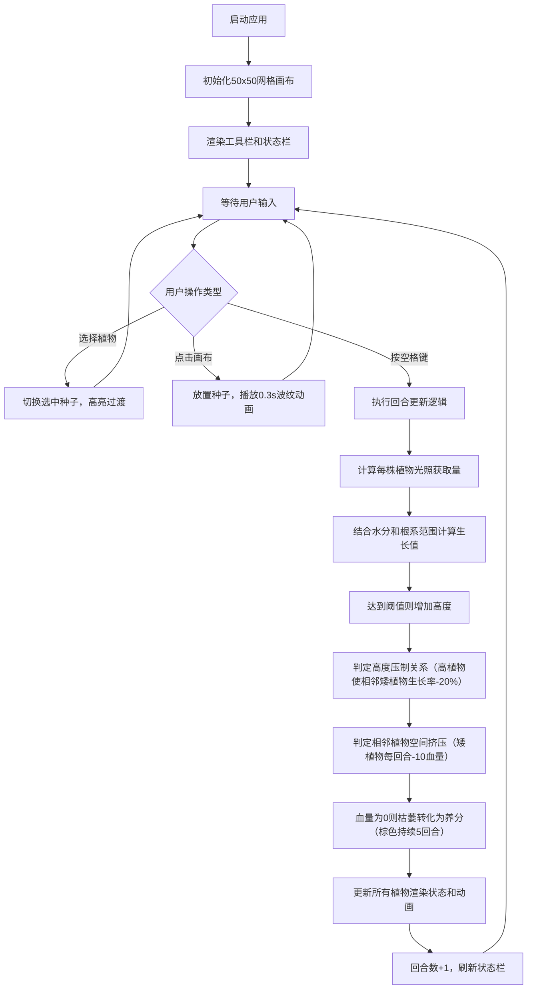

## 1. 产品概述

本产品是一个交互式生态模拟游戏应用，通过2D网格画布模拟植物在复杂环境下的生长与竞争过程，帮助用户直观观察和理解植物间争夺光照、水分和空间的自然竞争机制。

- 核心功能：用户可在50x50网格画布上放置三种植物种子（树木、灌木、草本），通过回合制模拟观察植物生长、光照竞争、水分吸收和空间挤压等生态现象
- 目标用户：对生态学、植物学感兴趣的学习者、教育工作者及游戏爱好者

## 2. 核心功能

### 2.1 功能模块

1. **主画布模块**：50x50网格画布，支持植物放置、水分可视化、植物渲染和动画效果
2. **工具栏模块**：左侧固定工具栏，包含三种植物种子选择，支持高亮切换
3. **信息展示模块**：顶部状态栏，显示当前回合数和植物总数量
4. **回合系统模块**：空格键触发回合更新，执行生长计算、竞争判定和状态变更
5. **动画效果模块**：种子波纹扩散、植物挤压微缩、平滑生长过渡等视觉反馈

### 2.2 页面详情

| 页面名称 | 模块名称 | 功能描述 |
|-----------|-------------|---------------------|
| 主游戏页面 | 网格画布 | 50x50单元格，鼠标左键点击放置选中植物种子，显示水分分布（深浅蓝色渐变）和植物生长状态 |
| 主游戏页面 | 左侧工具栏 | 三种植物种子图标（树木：深绿色树冠、灌木：浅绿色草丛、草本：黄色小点），选中后淡黄色高亮，0.2秒平滑过渡 |
| 主游戏页面 | 顶部状态栏 | 黑色粗体显示当前回合数，右侧显示总植物数量 |
| 主游戏页面 | 动画层 | 种子放置0.3秒扩散波纹、被挤压植物0.2秒微缩、所有生长帧平滑动画（60FPS） |

## 3. 核心流程

用户打开应用 → 从左侧工具栏选择植物类型 → 在画布网格上点击放置种子（触发波纹动画） → 按空格键推进回合 → 系统计算光照、水分、生长值和竞争关系 → 更新植物高度/血量/状态 → 渲染所有动画 → 循环放置或推进回合直至结束

## 4. 用户界面设计

### 4.1 设计风格

- **主色调**：浅绿到深绿垂直渐变背景（模拟草原环境），深绿(#1a5f2a)树木、浅绿(#7cb342)灌木、黄色(#fdd835)草本、棕色(#8d6e63)养分
- **辅助色**：深浅蓝色渐变表示水分（#64b5f6 到 #1565c0）、灰色(#9e9e9e)网格边框、淡黄色(#fff9c4)选中高亮
- **字体**：系统默认无衬线字体，回合数使用黑色粗体
- **布局**：左侧100px固定工具栏、顶部60px状态栏、中间自适应画布区域
- **动画**：所有交互伴随平滑过渡，整体保持60FPS

### 4.2 页面设计概述

| 页面名称 | 模块名称 | UI元素 |
|-----------|-------------|-------------|
| 主游戏页面 | 网格画布 | 50x50像素网格，灰色细边框，单元格内渲染植物高度（像素格数）、水分颜色叠加、养分棕色方块 |
| 主游戏页面 | 左侧工具栏 | 垂直排列三个图标按钮，按钮宽80px高80px，间距16px，图标为Canvas绘制形状，选中时淡黄色背景，0.2s CSS transition过渡 |
| 主游戏页面 | 顶部状态栏 | 水平排列，左侧显示"回合: X"黑色粗体18px，右侧显示"植物: Y"黑色常规14px |
| 主游戏页面 | 动画效果 | 波纹：以点击为中心的圆形扩散，透明度渐变0.3s；挤压：被挤压植物scale 0.9→1.0，0.2s过渡；生长：高度像素格逐帧递增 |

### 4.3 响应性

- 桌面端优先设计，画布区域根据窗口大小自适应缩放，保持50x50网格的正方形比例
- 工具栏和状态栏固定尺寸，不随窗口缩放
- 支持鼠标精确点击网格单元格

### 4.4 性能要求

- 每次回合计算时间 ≤ 20ms
- 渲染帧率稳定在60FPS
- 支持最多数百株植物同时模拟而不卡顿
