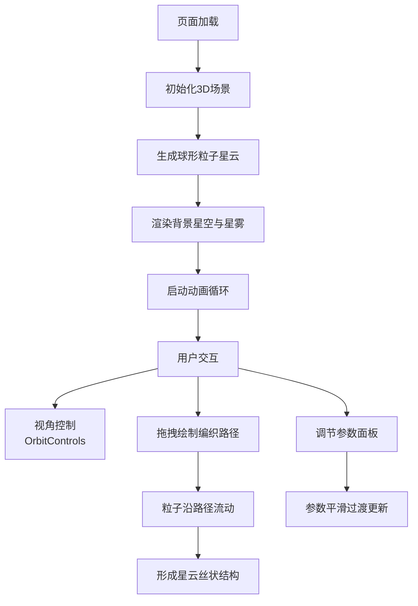

## 1. 产品概述
星尘编织者 - 一款浏览器端3D交互式星云生成与动态编织应用，让用户通过直觉化手势在三维空间中用数千颗发光粒子实时编织出具有复杂流动纹理和渐变色彩的动态星云。
- 解决现有星云生成器交互性差、无法实时调节粒子参数和编织路径的痛点
- 面向创意设计师、视觉艺术家、天文爱好者及普通用户，提供沉浸式的星云创作体验

## 2. 核心功能

### 2.1 用户角色
无用户角色区分，所有访客可直接使用全部功能。

### 2.2 功能模块
1. **3D星云场景**：球形粒子系统、粒子旋转与浮动、发光尾迹效果
2. **路径编织交互**：鼠标拖拽绘制贝塞尔曲线路径、粒子沿路径流动形成丝状结构
3. **参数控制面板**：粒子数量、大小、流速、颜色渐变、编织强度实时调节
4. **背景氛围系统**：静态闪烁星星、紫色星雾气

### 2.3 页面详情
| 页面名称 | 模块名称 | 功能描述 |
|-----------|-------------|---------------------|
| 主场景 | 3D粒子星云 | 1500颗半透明粒子球形分布，Z轴旋转+正弦浮动，品红到青蓝渐变 |
| 主场景 | 路径编织系统 | 鼠标拖拽绘制曲线路径（最多8控制点贝塞尔插值），粒子沿路径流动 |
| 主场景 | 背景星空 | 200颗随机闪烁星星 + 100颗飘动星雾气 |
| 左侧面板 | 参数控制 | 粒子数(500-5000)、大小(0.02-0.5)、流速(0.1-2.0)、起止颜色、编织强度(0-1.0) |
| 底部 | FPS计数器 | 实时显示帧率，监控性能 |

## 3. 核心流程
用户进入页面后，默认展示旋转的球形星云。用户可通过鼠标拖拽旋转视角、滚轮缩放观察星云。按住鼠标拖拽可绘制编织路径，粒子会沿路径流动形成丝状星云结构。左侧面板可实时调节各项参数，所有变化带有0.3-0.5秒平滑过渡。

## 4. 用户界面设计

### 4.1 设计风格
- **主色调**：深空蓝黑渐变背景（#0A0A14 → #121224），品红#FF3366到青蓝#00CCFF的粒子渐变色
- **控制面板**：半透明毛玻璃效果（#1A1A2ECC），圆角16px
- **交互元素**：平滑滑块带轨道光晕反馈，颜色选择器采用原生样式优化
- **字体**：现代无衬线字体，深空科技感
- **动效**：所有过渡和参数变化0.3-0.5秒ease-out动画，粒子发光尾迹0.5秒长度

### 4.2 页面设计概述
| 页面名称 | 模块名称 | UI元素 |
|-----------|-------------|-------------|
| 主场景 | 3D渲染区 | 全屏Canvas，渐变背景，发光粒子，毛玻璃面板悬浮左侧 |
| 左侧面板 | 参数控制区 | 垂直排列滑块组、颜色选择器，标签文字浅色半透明 |
| 底部 | FPS计数器 | 右下角小字体，浅色半透明显示 |

### 4.3 响应性
桌面端优先设计，全屏3D场景适配任意窗口尺寸。鼠标交互为主，不做移动端触控优化。

### 4.4 3D场景指导
- **环境**：深空蓝黑渐变背景，无外部HDRI，纯程序化氛围
- **光照**：粒子自发光为主，无外部光源，Additive Blending实现发光效果
- **相机**：PerspectiveCamera，初始距离约15单位，OrbitControls控制旋转缩放
- **构图**：球形星云居中，粒子密度均匀，四周分布星雾气增强纵深感
- **交互**：OrbitControls视角控制，鼠标拖拽绘制路径（Raycaster拾取3D坐标）
- **后处理**：使用Additive Blending实现粒子发光叠加效果，无额外后期处理通道
- **性能**：1500颗粒子稳定60FPS，5000颗粒子不低于30FPS，使用BufferGeometry批处理
