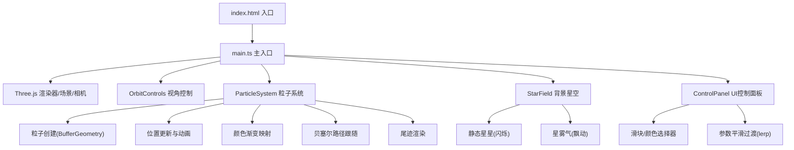

## 1. 架构设计



## 2. 技术描述
- **前端框架**：原生 TypeScript（无React/Vue），面向模块化组织
- **3D引擎**：Three.js r160+，使用three/addons中的OrbitControls
- **构建工具**：Vite 5.x，支持HMR热更新
- **语言目标**：ES2020，严格模式TypeScript
- **状态管理**：模块内部状态，通过事件/回调通信，无额外状态管理库

## 3. 模块文件结构
| 文件路径 | 职责 |
|----------|------|
| `package.json` | 项目依赖：three、typescript、vite、@types/three |
| `index.html` | 入口页面，全屏Canvas容器，底部FPS显示 |
| `tsconfig.json` | TS配置，严格模式，target ES2020 |
| `vite.config.js` | Vite基础配置，HMR支持 |
| `src/main.ts` | 入口：初始化渲染器/场景/相机、动画循环、模块协调 |
| `src/particleSystem.ts` | 粒子系统：创建、更新、颜色、路径跟随、尾迹 |
| `src/controlPanel.ts` | UI面板：生成DOM、事件绑定、参数平滑过渡 |
| `src/starField.ts` | 背景：静态星星闪烁 + 星雾气飘动 |

## 4. 核心数据结构

### 粒子参数接口
```typescript
interface ParticleParams {
  count: number;          // 粒子数量 500-5000
  size: number;           // 粒子大小 0.02-0.5
  flowSpeed: number;      // 流速 0.1-2.0
  colorStart: string;     // 渐变起始色
  colorEnd: string;       // 渐变结束色
  weaveStrength: number;  // 编织强度 0-1.0
}
```

### 粒子数据
- `Float32Array` positions：粒子三维坐标
- `Float32Array` colors：粒子RGB颜色
- `Float32Array` sizes：每颗粒子大小
- `Float32Array` phases：每颗粒子浮动相位
- `Float32Array` trailPositions：尾迹历史位置（每颗粒子存N帧）

### 路径数据
- `THREE.Vector3[]` controlPoints：控制点（最多8个）
- `THREE.CatmullRomCurve3` curve：插值生成的平滑曲线

## 5. 性能优化策略
1. **BufferGeometry批处理**：所有粒子使用单一BufferGeometry + PointsMaterial，一次Draw Call
2. **Additive Blending**：使用`THREE.AdditiveBlending`实现发光效果，无需后期处理
3. **尾迹复用**：使用位置历史环形缓冲，避免数组频繁分配
4. **参数lerp平滑**：参数变化通过线性插值逐帧过渡，避免突变
5. **离屏检测**：星星和星雾气粒子始终在视锥内，无需视锥剔除额外计算

## 6. 关键实现要点
- 贝塞尔曲线：使用CatmullRomCurve3对控制点进行平滑插值，`curve.getPoint(t)`获取路径上的点
- 粒子路径跟随：每颗粒子维护独立的pathProgress参数，结合weaveStrength在原位和路径位置之间插值
- 正弦浮动：`position.y += sin(time * freq + phase) * amplitude`
- 颜色渐变：`THREE.Color().lerpColors(startColor, endColor, t)`，t为粒子在球体内径向距离或路径进度
- 毛玻璃效果：CSS `backdrop-filter: blur(12px)` + 半透明背景色
