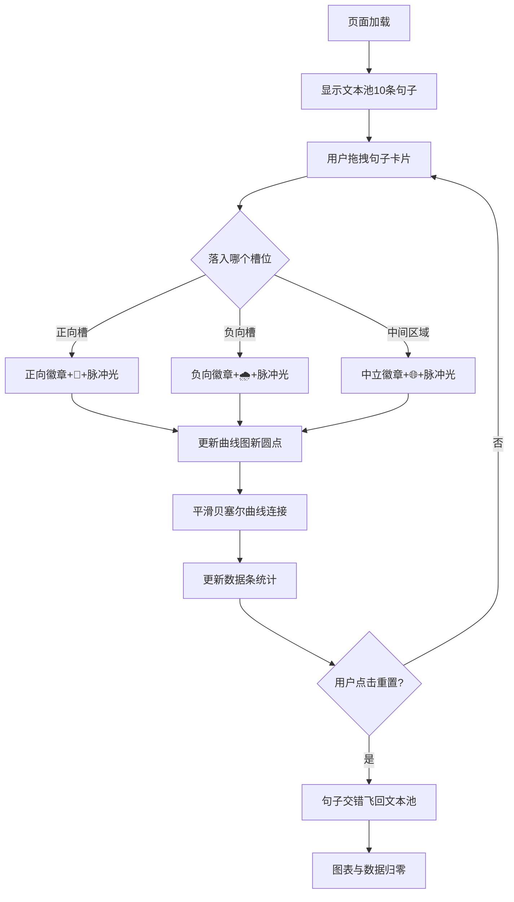

## 1. 产品概述
「流光索引」是一款交互式文本情绪分类可视化工具，允许用户通过鼠标拖拽将英文句子或URL链接分类到正向、负向、中立三个情绪槽位中，实时呈现情绪色彩分析结果与整体情绪波动曲线。
- 核心价值：将抽象的文本情绪转化为直观的视觉反馈与动态曲线，帮助用户快速感知与分析文本集合的情绪分布
- 目标用户：内容分析人员、UX研究员、学生与普通用户

## 2. 核心功能

### 2.1 功能模块
1. **主界面**：文本池区、分类槽区、情绪曲线图面板、实时数据条、重置按钮
2. **拖拽交互系统**：句子卡片拖拽、槽位碰撞检测、槽位高亮反馈、动画脉冲效果
3. **情绪分析引擎**：文本情绪分值计算（-1到1）、渐变色徽章生成、情绪图标匹配
4. **可视化渲染系统**：Canvas心电图式平滑曲线、动态圆点标记、缓动动画过渡
5. **数据统计模块**：实时分类计数、情绪比例条、百分比显示

### 2.2 页面详情
| 页面名称 | 模块名称 | 功能描述 |
|---------|---------|---------|
| 主页面 | 文本池区 | 展示10条预置英文句子卡片，初始为中性灰背景 |
| 主页面 | 正向分类槽 | 接收用户拖入的正向情绪句子，浅薄荷绿背景，虚线边框 |
| 主页面 | 负向分类槽 | 接收用户拖入的负向情绪句子，浅玫瑰粉背景，虚线边框 |
| 主页面 | 中立隐式槽 | 两个槽位之间的区域，拖入后自动归类为中立 |
| 主页面 | 情绪曲线图面板 | Canvas绘制的心电图式情绪波动曲线，Y轴-1到1，X轴1-10 |
| 主页面 | 实时数据条 | 深灰蓝背景，显示已分类数量和情绪比例条 |
| 主页面 | 重置按钮 | 圆形浅灰按钮，点击后所有句子飞回文本池，图表清空 |

## 3. 核心流程
用户进入页面后看到预置的10条句子卡片，通过鼠标拖拽将每张句子卡片拖入正向、负向或中立区域。每次分类完成后：句子卡片变为对应渐变色徽章并显示情绪图标与脉冲光；曲线图新增一个圆点并以贝塞尔曲线平滑连接；数据条实时更新分类计数与情绪比例。用户可随时点击重置按钮，所有句子以交错动画飞回文本池，整体状态归零。

## 4. 用户界面设计

### 4.1 设计风格
- **主色调**：浅灰蓝背景 #E8ECF1，白色卡片主体
- **情绪色板**：正向 #66BB6A→#43A047 渐变、负向 #EF5350→#E53935 渐变、中立 #90A4AE→#78909C 渐变
- **槽位色**：正向槽浅薄荷绿 #C8E6C9（边框#81C784）、负向槽浅玫瑰粉 #F8BBD0（边框#E57373）
- **数据条**：深灰蓝 #455A64 背景
- **圆角风格**：卡片16px、数据条8px、按钮圆形、句子卡片圆角矩形
- **字体**：内嵌简洁现代字体
- **图标**：emoji形式 🌟正向、🌧️负向、🌐中立
- **阴影**：卡片轻微内敛阴影

### 4.2 页面设计概述
| 页面名称 | 模块名称 | UI元素 |
|---------|---------|--------|
| 主页面 | 整体布局 | 浅灰蓝背景，中央900x600白色卡片，右侧无缝拼接280x600曲线图面板 |
| 主页面 | 文本池区 | 高280px，10个60x180圆角矩形卡片，中性灰初始背景 |
| 主页面 | 分类槽区 | 两个360x200并排虚线边框槽位，中间区域为中立隐式槽 |
| 主页面 | 曲线图面板 | 白色背景，圆角右16px，Canvas画布 |
| 主页面 | 数据条 | 860x32，深灰蓝，圆角8px，含计数与三色比例条 |
| 主页面 | 重置按钮 | 36x36圆形，浅灰#ECEFF1，↻图标16px |

### 4.3 响应式
桌面端优先设计，核心画布固定尺寸900+280=1180px宽度，保证视觉精度。

### 4.4 动效设计
- **拖拽高亮**：槽位触碰到边框时<100ms反馈为更深填充色
- **脉冲光**：句子下边缘2px高彩色渐变到透明，2秒后消失
- **曲线动画**：圆点重新分类时0.3秒ease-out缓动跳变
- **重置动画**：句子依次0.1秒间隔ease-in-out飞回，总时长<2秒
- **性能目标**：60FPS，拖拽与图表重绘延迟<16ms，动画帧率≥50FPS
