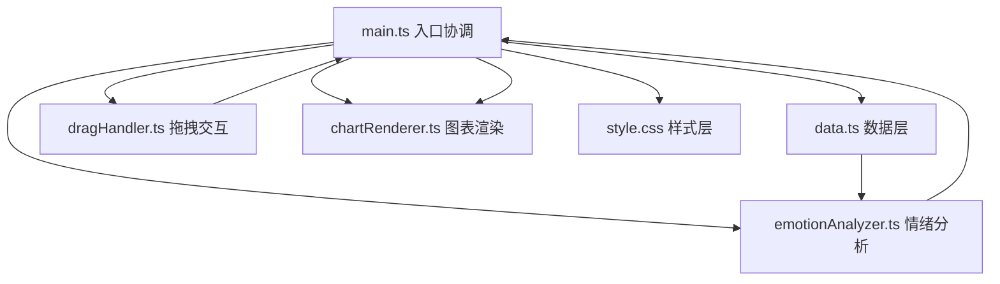

## 1. 架构设计
纯前端单页应用，无后端服务，采用 TypeScript + Vite 构建。架构分为：数据层、逻辑层（情绪分析+拖拽处理）、渲染层（Canvas图表+DOM样式）、入口协调层。



## 2. 技术说明
- **前端**：TypeScript（严格模式，目标ES2020，模块ESNext）+ Vite（HMR热更新）
- **构建工具**：Vite
- **渲染技术**：原生 DOM + CSS3 动画 + Canvas 2D API
- **状态管理**：main.ts 内通过模块变量维护应用状态
- **无外部UI库**：纯手写CSS，保证轻量与60FPS性能

## 3. 文件结构
```
├── package.json          # 依赖与脚本
├── index.html            # 入口HTML
├── tsconfig.json         # TS配置
├── vite.config.js        # Vite配置
└── src/
    ├── main.ts           # 应用入口，状态协调，事件绑定
    ├── data.ts           # 10条预置句子样本
    ├── emotionAnalyzer.ts # 情绪分值计算、颜色、图标
    ├── dragHandler.ts    # 拖拽逻辑、碰撞检测、高亮反馈
    ├── chartRenderer.ts  # Canvas曲线、平滑算法、动画
    └── style.css         # 全部样式、动画关键帧
```

## 4. 核心类型定义
```typescript
type Sentiment = 'positive' | 'neutral' | 'negative';

interface Sentence {
  id: number;
  text: string;
  sentiment: Sentiment | null;
  score: number | null;
  element: HTMLElement | null;
}

interface AppState {
  sentences: Sentence[];
  classifiedCount: number;
}
```

## 5. 数据模型
### 5.1 预置句子数据（data.ts）
10条英文短句，覆盖正向、负向、中立情绪各3-4条，用于演示拖拽分类效果。

### 5.2 状态流转
- 初始：所有句子 sentiment=null，位于文本池
- 分类：sentence.sentiment 设为对应值，score 在-1~1之间
- 重置：sentiment 回到 null，DOM 元素以动画飞回
