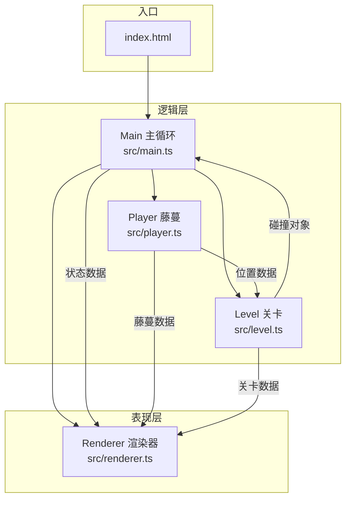

## 1. 架构设计



## 2. 技术描述
- 前端：TypeScript + Vite
- 渲染：HTML5 Canvas 2D API
- 无后端，纯浏览器端游戏
- 初始化方式：手动创建配置文件，不使用Vite模板脚手架

## 3. 文件结构

```
项目根目录/
├── package.json            # 项目配置和依赖
├── vite.config.js          # Vite构建配置
├── tsconfig.json           # TypeScript编译配置
├── index.html              # 入口HTML页面
└── src/
    ├── main.ts             # 游戏主入口，初始化和主循环
    ├── player.ts           # 玩家藤蔓类（物理、输入、碰撞）
    ├── level.ts            # 关卡生成类（树枝、果实、毒刺）
    └── renderer.ts         # 渲染器类（所有绘制逻辑）
```

### 3.1 数据流向

```
输入事件（键盘/鼠标）
    ↓
main.ts → 分发给 Player 类
    ↓
Player.update() → 更新藤蔓位置、速度、角度
    ↓
Level.update(playerY) → 根据高度生成/移除层，返回碰撞对象
    ↓
碰撞检测（main.ts中执行）
    ├─ 碰到果实 → 分数+10，粒子效果
    └─ 碰到毒刺 → gameOver = true
    ↓
Renderer.render(state) → 绘制所有元素到Canvas
```

## 4. 核心类设计

### 4.1 Player 类 (src/player.ts)
```typescript
interface PlayerState {
  rootX: number;           // 根部X坐标（底部中央）
  rootY: number;           // 根部Y坐标
  angle: number;           // 当前摆动角度（弧度）
  angularVelocity: number; // 角速度
  length: number;          // 当前藤蔓长度（80-200px）
  joints: Array<{x, y}>;   // 3个关节的链式跟随位置
  tipX: number;            // 藤蔓顶部X
  tipY: number;            // 藤蔓顶部Y
}
```
- 方法：update(dt)、swingLeft()、swingRight()、getTipPosition()、checkCollision(objects)

### 4.2 Level 类 (src/level.ts)
```typescript
interface Branch {
  x: number; y: number; width: number; side: 'left'|'right';
}
interface Fruit {
  x: number; y: number; collected: boolean; glowPhase: number;
}
interface Thorn {
  x: number; y: number; minX: number; maxX: number; direction: 1|-1; speed: number;
}
interface Particle {
  x: number; y: number; vx: number; vy: number; life: number; color: string;
}
```
- 方法：update(playerY, scrollSpeed)、getCollidables()、getLayers()、reset()

### 4.3 Renderer 类 (src/renderer.ts)
- 方法：render(state)、drawBackground()、drawBranches()、drawVine()、drawFruits()、drawThorns()、drawParticles()、drawUI()、drawGameOver()

## 5. 核心算法

### 5.1 藤蔓摆动物理
- 使用简谐运动模拟摆动：angularAcceleration = -gravity * sin(angle) / length
- 长度根据角度自动伸缩：length = baseLength + amplitude * |sin(angle)|
- 关节链式跟随：每个关节基于前一个关节位置 + 固定距离计算

### 5.2 关卡动态生成
- 根据玩家高度生成新树枝层，每层Y间距60-100px
- 移除屏幕下方不可见的旧层
- 果实：每层0-2个，随机分布在树枝上
- 毒刺：每3-4层1个，水平匀速来回移动

### 5.3 难度递增
- 每攀爬10层，滚动速度 × 1.05
- 毒刺移动速度同步增加
- 最高速度为初始速度的2倍
