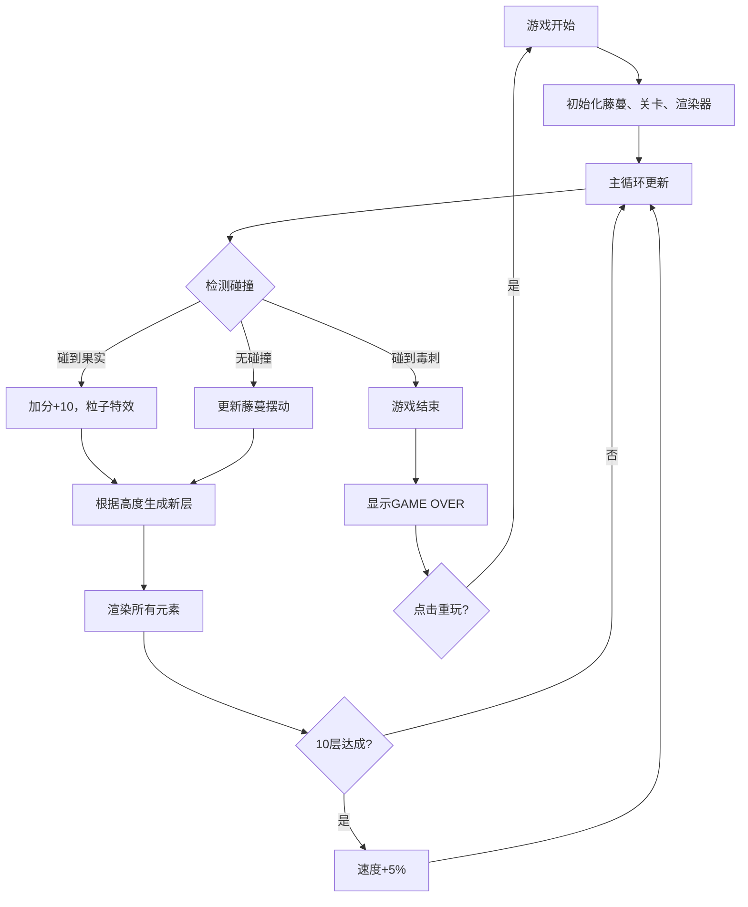

## 1. 产品概述

「重力古树」是一款像素风格的Canvas攀爬小游戏。玩家控制一根弹性藤蔓，在随机生成的古树枝叶间摆动攀爬，收集发光的金色果实，同时避开移动的紫色毒刺，考验玩家的反应速度与预判能力。

- 目标用户：像素艺术爱好者、休闲游戏玩家
- 产品价值：提供一款操作简单但具有挑战性的浏览器小游戏，展现像素艺术与物理模拟的结合

## 2. 核心功能

### 2.1 功能模块
1. **游戏主界面**：全屏Canvas游戏区域、顶部信息栏（分数/层数）、右上角重置按钮
2. **藤蔓控制系统**：鼠标/键盘控制藤蔓摆动、物理摆动物理、链式关节跟随
3. **关卡生成系统**：树枝分层生成、果实刷新、毒刺随机出现、动态难度递增
4. **渲染系统**：像素风格渲染、粒子特效、发光动画、渐变背景
5. **游戏状态管理**：开始/结束状态、分数统计、重置功能

### 2.2 页面详情
| 页面名称 | 模块名称 | 功能描述 |
|---------|---------|---------|
| 游戏主页面 | Canvas游戏区 | 800x600像素游戏区域，居中显示，自适应屏幕 |
| 游戏主页面 | 顶部信息栏 | 半透明黑底，显示当前分数和攀爬层数 |
| 游戏主页面 | 重置按钮 | 右上角圆角按钮，点击重置游戏 |
| 游戏主页面 | 游戏结束弹窗 | 显示"GAME OVER"红字，带渐变覆盖和重玩按钮 |

## 3. 核心流程

玩家通过鼠标点击或键盘左右键控制藤蔓顶部摆动 → 藤蔓在重力作用下自然摆动，长度自动伸缩 → 藤蔓顶部碰到果实得分+10，播放粒子特效 → 碰到毒刺游戏结束 → 每攀爬10层速度增加5%，最高2倍加速 → 可随时点击重置按钮重新开始

## 4. 用户界面设计

### 4.1 设计风格
- **主色调**：深绿色系（#1A331A → #0D1F0D）背景，模拟森林阴暗氛围
- **树枝**：棕褐色（#4A3A2A）带深色（#2E221A）锯齿边缘
- **藤蔓**：亮绿色（#66CC66）带浅色（#99FF99）高光
- **果实**：金色圆点带径向渐变光晕
- **毒刺**：紫黑色（#4A0066）配黄色眼球
- **像素风格**：所有元素保留1px纯黑轮廓

### 4.2 页面设计
| 页面名称 | 模块名称 | UI元素 |
|---------|---------|---------|
| 游戏主页面 | 背景 | 深绿到墨绿径向渐变 |
| 游戏主页面 | 信息条 | 半透明#000000CC，顶部横条，白色像素字体 |
| 游戏主页面 | 树枝 | 棕褐色矩形，3x3深色点阵纹理，锯齿边缘 |
| 游戏主页面 | 藤蔓 | 亮绿色线条，浅色高光，3关节链式跟随，弹动尾迹 |
| 游戏主页面 | 果实 | 金色圆形，呼吸光晕动画 |
| 游戏主页面 | 毒刺 | 紫色六边形，水平游动，黄色眼球 |
| 游戏主页面 | 粒子 | 金色爆散粒子，最多50个 |
| 游戏结束弹窗 | 覆盖层 | 半透明黑色渐变覆盖 |
| 游戏结束弹窗 | 按钮 | 半透明圆角按钮，像素字体 |

### 4.3 响应式
- 桌面优先设计，游戏区域800x600像素居中显示
- Canvas宽度自适应屏幕，高度按4:3比例缩放
- 保持游戏区域始终居中

## 5. 性能要求
- 平均帧率不低于50FPS
- 粒子效果不超过50个粒子
- 使用Canvas离屏渲染减少重绘区域
