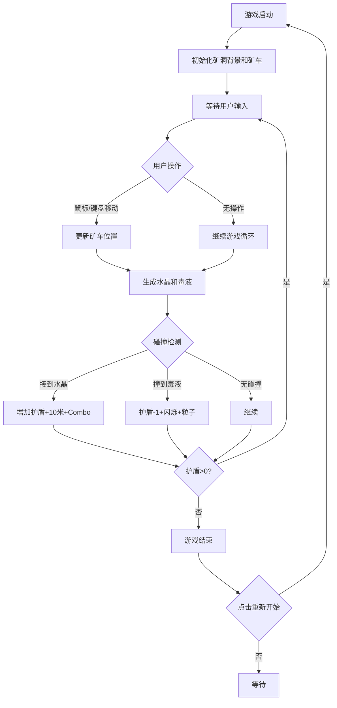

## 1. 产品概述

「浮空矿车」是一款垂直卷轴休闲游戏，玩家在不断向上延伸的矿洞中控制悬浮矿车，收集能量水晶并躲避毒液团，挑战更高的高度分数。

- 核心玩法：左右移动矿车接取水晶、躲避毒液，护盾系统增加策略深度
- 目标用户：休闲游戏爱好者，碎片化时间娱乐
- 产品价值：操作简单易上手，视觉效果精美，有良好的重玩性

## 2. 核心特性

### 2.1 功能模块

1. **游戏主界面**：垂直矿洞场景、矿车控制、水晶与毒液生成
2. **护盾系统**：接取水晶增加护盾层，碰撞毒液减少护盾层
3. **计分系统**：高度计分、Combo连击计数
4. **粒子特效系统**：推进粒子、碎裂粒子、金色尾迹粒子
5. **UI界面**：高度显示、Combo显示、护盾层数指示器、重新开始按钮

### 2.2 功能详情

| 功能模块 | 子功能 | 功能描述 |
|---------|-------|---------|
| 矿车控制 | 鼠标移动 | 鼠标左右移动控制矿车水平位置 |
| 矿车控制 | 键盘控制 | A/D键或方向键控制矿车水平移动 |
| 水晶系统 | 水晶生成 | 从左右岩壁随机位置弹出，1.2-2.5秒间隔 |
| 水晶系统 | 碰撞检测 | 矿车接触水晶后获得护盾层和高度分数 |
| 毒液系统 | 毒液生成 | 从顶部随机位置坠落，2-4秒间隔 |
| 毒液系统 | 碰撞检测 | 矿车接触毒液后护盾层减一，触发粒子特效 |
| 护盾系统 | 层数管理 | 最多4层护盾，颜色逐级变化 |
| 计分系统 | 高度计分 | 每接一个水晶上升10米 |
| 计分系统 | Combo计数 | 连续接取水晶累加Combo，碰撞中断 |
| 粒子系统 | 推进粒子 | 矿车底部持续生成蓝色推进粒子 |
| 粒子系统 | 碎裂粒子 | 碰撞毒液时生成红色碎裂粒子 |
| 粒子系统 | 尾迹粒子 | Combo>15时矿车尾部拖出金色尾迹 |
| UI系统 | 数据条 | 顶部显示当前高度和Combo数 |
| UI系统 | 护盾指示器 | 四个六边形指示器显示当前护盾层数 |
| UI系统 | 重新开始按钮 | 游戏结束或随时点击重置游戏 |

## 3. 核心流程

## 4. 用户界面设计

### 4.1 设计风格

- **主色调**：深色矿洞背景（#12161F / #1B1F2A / #0D1018径向渐变）
- **强调色**：矿车蓝（#5D8FC4）、水晶金（#FFD700）、护盾绿（#4CAF50）、护盾橙（#FF9800）、护盾红（#F44336）、毒液紫（#6A1B9A）
- **按钮样式**：圆角12px，背景#3A506B，悬停#4A607B，点击#2A405B，过渡0.3s ease
- **字体**：'Segoe UI', sans-serif，无衬线字体
- **边框**：深灰蓝边框（#2C3A4A），圆角12px

### 4.2 页面设计

| 区域 | UI元素 | 设计细节 |
|-----|-------|---------|
| 游戏区域 | 垂直矿洞 | 420px × 780px，深色径向渐变背景，两侧粗糙石柱 |
| 游戏区域 | 矿车 | 六边形悬浮平台，70×40px，蓝色发光，底部推进粒子 |
| 游戏区域 | 水晶 | 菱形发光体，12px边长，金橙渐变，脉动光晕 |
| 游戏区域 | 毒液 | 深紫色渐变球体，16-24px直径，不规则波纹边缘 |
| 顶部数据条 | 高度显示 | 左侧，显示"高度：XXX米"，白色字体 |
| 顶部数据条 | Combo显示 | 右侧，显示"Combo：X"，白色字体 |
| 护盾指示器 | 六边形指示器 | 四个小六边形横向排列，点亮对应护盾颜色，带上升闪烁动画 |
| 底部按钮 | 重新开始 | 圆角按钮，#3A506B背景，#E8E8E8字体，悬停/点击过渡效果 |

### 4.3 响应式设计

- 桌面端优先，游戏区域固定尺寸
- 整体页面居中布局，背景填充深色
