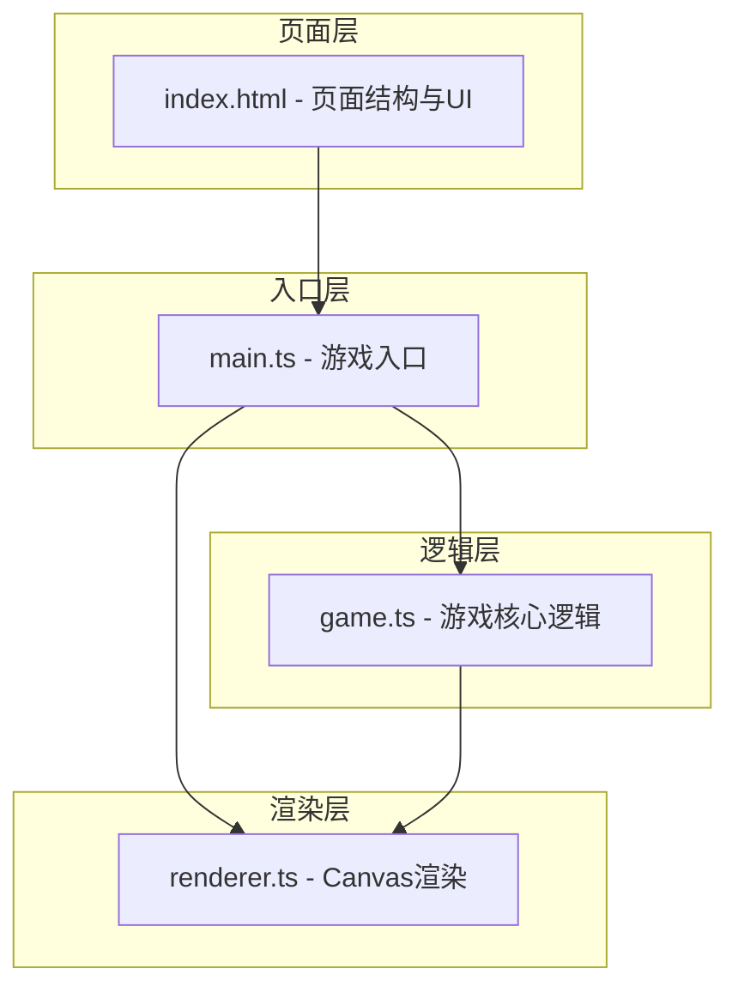

## 1. 架构设计



## 2. 技术说明

- **构建工具**：Vite@5.x
- **开发语言**：TypeScript@5.x（严格模式，target ES2020）
- **渲染技术**：HTML5 Canvas 2D
- **主循环驱动**：requestAnimationFrame
- **无框架依赖**：纯TypeScript + Canvas实现

## 3. 文件结构

```
├── package.json
├── index.html
├── tsconfig.json
├── vite.config.js
└── src/
    ├── main.ts      # 游戏主循环和初始化入口
    ├── game.ts      # 核心游戏逻辑
    └── renderer.ts  # Canvas渲染模块
```

## 4. 核心数据模型

### 4.1 矿车状态

```typescript
interface Cart {
  x: number;           // 水平位置
  y: number;           // 垂直位置
  vx: number;          // 水平速度
  width: number;       // 宽度
  height: number;      // 高度
  maxSpeed: number;    // 最大速度
  acceleration: number;// 加速度
  damping: number;     // 阻尼系数
  shieldLayers: number;// 护盾层数 (0-4)
  isBlinking: boolean; // 是否闪烁
  blinkTimer: number;  // 闪烁计时器
}
```

### 4.2 水晶对象

```typescript
interface Crystal {
  x: number;          // 位置x
  y: number;          // 位置y
  vx: number;         // 水平速度
  vy: number;         // 垂直速度
  size: number;       // 大小
  glowRadius: number; // 光晕半径
  glowPhase: number;  // 光晕动画相位
  collected: boolean; // 是否已收集
}
```

### 4.3 毒液对象

```typescript
interface Poison {
  x: number;          // 位置x
  y: number;          // 位置y
  vy: number;         // 下落速度
  radius: number;     // 半径
  ripplePhase: number;// 波纹相位
}
```

### 4.4 粒子对象

```typescript
interface Particle {
  x: number;          // 位置x
  y: number;          // 位置y
  vx: number;         // 速度x
  vy: number;         // 速度y
  life: number;       // 剩余寿命
  maxLife: number;    // 最大寿命
  size: number;       // 大小
  color: string;      // 颜色
  type: 'thrust' | 'break' | 'trail';
}
```

### 4.5 游戏状态

```typescript
interface GameState {
  cart: Cart;
  crystals: Crystal[];
  poisons: Poison[];
  particles: Particle[];
  height: number;          // 当前高度（米）
  combo: number;           // 连击数
  maxCombo: number;        // 最大连击数
  poisonSpeed: number;     // 毒液基础速度
  crystalsCollected: number; // 已收集水晶数
  gameOver: boolean;       // 游戏是否结束
  lastCrystalSpawn: number;// 上次水晶生成时间
  lastPoisonSpawn: number; // 上次毒液生成时间
  targetX: number | null;  // 鼠标目标位置
  leftPressed: boolean;    // 左键按下
  rightPressed: boolean;   // 右键按下
}
```

## 5. 性能要求

- 帧率：稳定60FPS
- 粒子数量峰值：≤200
- 使用对象池模式复用粒子对象
- requestAnimationFrame驱动主循环，使用deltaTime计算物理
