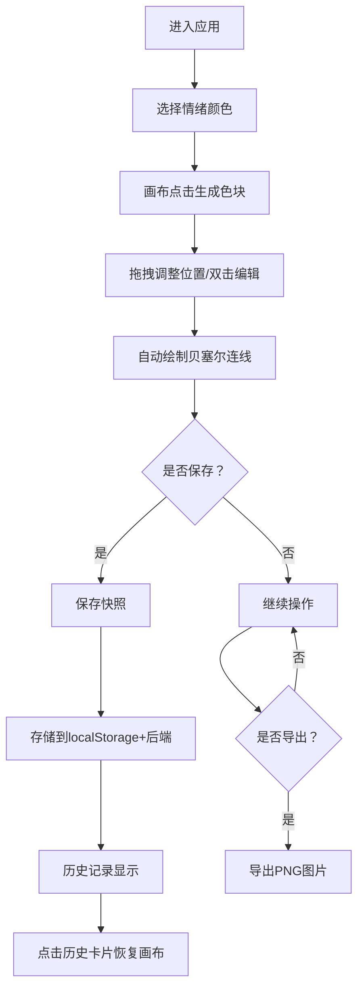

## 1. 产品概述

情绪调色盘是一款帮助用户在浏览器中创建和管理个人情绪记录的Web应用，通过将抽象情绪与具象色彩关联，提供直觉化的情绪记录与视觉化探索体验。

- 核心目的：解决用户难以用直觉化方式记录和回顾每日情绪变化的问题
- 目标用户：希望通过视觉化方式追踪、管理和理解自身情绪状态的普通用户
- 产品价值：将情绪转化为可交互的色彩艺术，让情绪记录成为一种创造性和治愈性的体验

## 2. 核心功能

### 2.1 功能模块

1. **主画布区域**：色彩绘制、色块拖拽、贝塞尔连线、双击编辑
2. **情绪输入区**：预设情绪颜色选择、画布点击生成色块
3. **历史记录区**：按日期分组展示、缩略图预览、画布状态还原、筛选搜索
4. **顶部工具栏**：保存快照、清空画布、导出为图片

### 2.2 功能详情

| 页面/模块 | 子模块 | 功能描述 |
|-----------|--------|----------|
| 主画布区域 | 色块生成 | 点击颜色选择器后在画布点击，生成随机半径(10-30px)圆形色块，带扩散动画 |
| 主画布区域 | 色块拖拽 | 拖拽已存在色块重新排布，有弹性缩放效果，连接线自动重绘 |
| 主画布区域 | 色块编辑 | 双击色块弹出编辑框，可修改颜色、添加文字标签(≤20字)、日期时间戳 |
| 主画布区域 | 贝塞尔连线 | 色块间自动以柔和贝塞尔曲线连接，颜色取两端平均色，流动虚线动画 |
| 情绪输入区 | 颜色选择器 | 预设10种情绪颜色(快乐、忧伤、愤怒、平静、焦虑、希望、疲惫、爱、惊讶、内疚) |
| 历史记录区 | 卡片列表 | 按日期分组显示情绪卡片，缩略版色块图，淡入动画 |
| 历史记录区 | 画布还原 | 点击历史卡片恢复画布到该日期完整状态 |
| 历史记录区 | 筛选搜索 | 按情绪颜色多选筛选、按日期范围搜索 |
| 顶部工具栏 | 保存快照 | 存储到localStorage并同步到后端 |
| 顶部工具栏 | 清空画布 | 带二次确认弹窗，震动动画效果 |
| 顶部工具栏 | 导出图片 | Canvas转PNG下载，文件名格式：情绪调色盘_YYYY-MM-DD_HHmmss.png |

## 3. 核心流程

用户进入应用后，选择情绪颜色→在画布上点击生成色块→拖拽调整色块位置→可双击编辑色块信息→色块间自动连线形成情绪图谱→保存当前快照到历史记录→可通过历史记录查看和恢复过往情绪状态→可导出为图片保存。

## 4. 用户界面设计

### 4.1 设计风格

- **主色调**：米白色背景(#FDF8F0)，暖白+浅木色主题，卡片区域(#F5F0E8)
- **按钮样式**：圆角8px，悬停0.2秒背景色渐变(#E8E0D4→#D4CAB8)
- **卡片样式**：圆角16px，阴影0 4px 12px rgba(0,0,0,0.06)
- **字体**：系统默认无衬线字体
- **情绪色块**：柔和发光效果(box-shadow: 0 0 8px rgba(当前色,0.3))
- **连接线**：流动虚线(stroke-dasharray: 4 4，0.5秒循环stroke-dashoffset动画)

### 4.2 页面布局

| 区域 | 尺寸/位置 | UI元素 |
|------|-----------|--------|
| 整体页面 | 100vh高度，响应式布局 | 顶部工具栏+左右两栏主体 |
| 顶部工具栏 | 全宽，水平排列 | 保存快照、清空画布、导出图片按钮 |
| 左侧画布区 | 600x500px | 情绪色块、贝塞尔连接线 |
| 右侧历史区 | 宽280px | 历史卡片列表、颜色筛选、日期搜索 |

### 4.3 响应式设计

- 桌面端：画布和历史区域左右并排
- 移动端(宽度<768px)：画布和历史区域上下堆叠

### 4.4 动画效果

- 色块生成：0.3秒扩散动画(半径0→目标半径，透明度0.4→0.8)
- 色块拖拽：弹性缩放(放大1.1倍，释放回弹)
- 历史卡片：淡入动画(0.2秒，从下向上滑动20px)
- 清空弹窗：震动动画效果
- 连接线：流动虚线动画(0.5秒循环)

## 5. 性能要求

- 画布渲染帧率：稳定30FPS以上
- 最大色块数量：支持100个色块同时显示无卡顿
- 拖拽响应时间：<50ms
