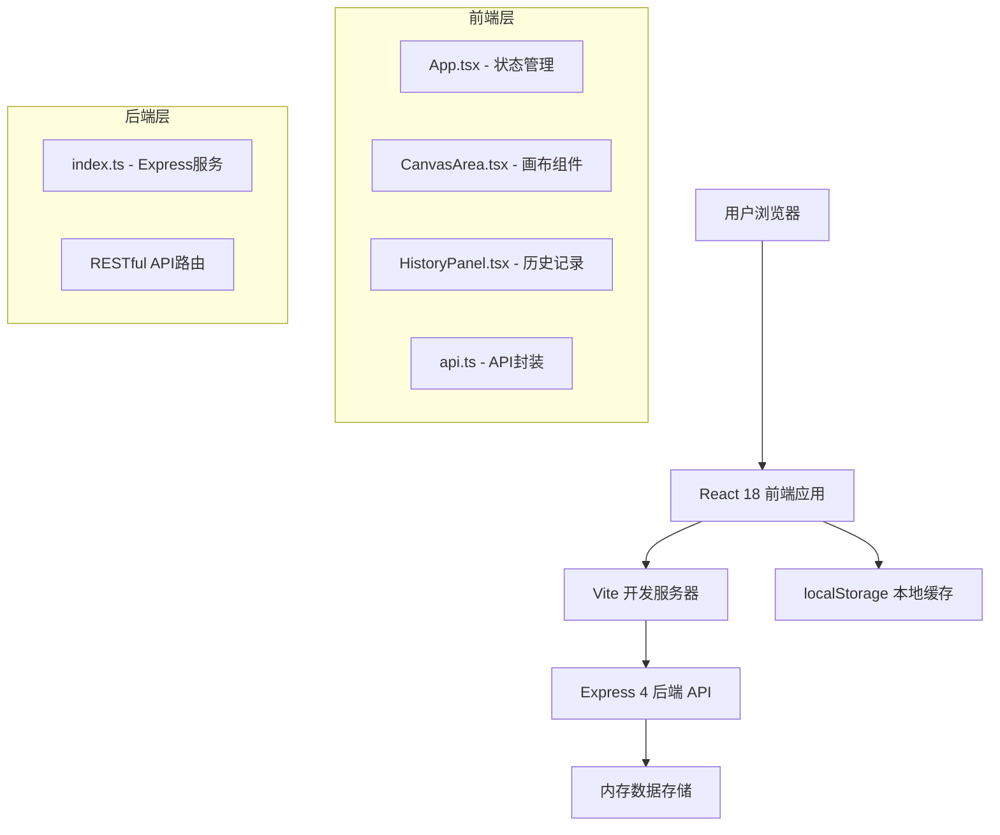
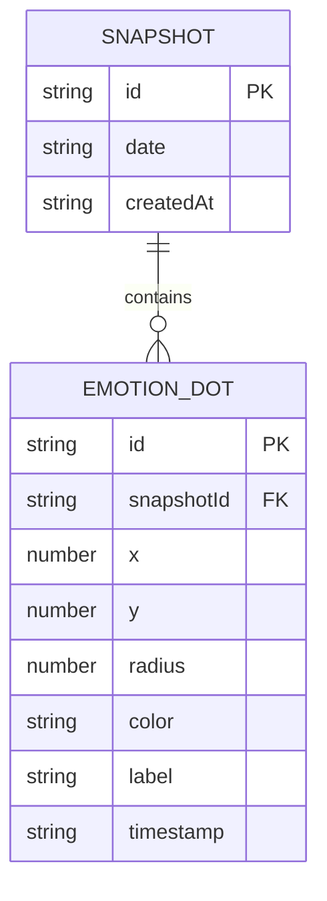

## 1. 架构设计



## 2. 技术说明

- **前端框架**：React 18 + TypeScript
- **构建工具**：Vite
- **后端框架**：Express 4
- **数据存储**：后端内存数组 + 浏览器localStorage
- **API通信**：fetch + CORS

## 3. 路由定义

| 路由 | 用途 |
|------|------|
| / | 主应用页面（情绪调色盘） |
| /api/snapshots (POST) | 保存情绪快照 |
| /api/snapshots (GET) | 获取所有快照列表 |
| /api/snapshots/search (GET) | 按颜色/日期筛选快照 |

## 4. API定义

### 4.1 数据类型定义

```typescript
interface EmotionDot {
  id: string;
  x: number;
  y: number;
  radius: number;
  color: string;
  label?: string;
  timestamp: string;
  animationProgress: number;
}

interface Snapshot {
  id: string;
  date: string;
  createdAt: string;
  dots: EmotionDot[];
}
```

### 4.2 API请求/响应

#### POST /api/snapshots
- 请求体：`{ dots: EmotionDot[], date: string }`
- 响应：`{ success: true, snapshot: Snapshot }`

#### GET /api/snapshots
- 响应：`{ snapshots: Snapshot[] }`

#### GET /api/snapshots/search
- 查询参数：`color?: string`、`startDate?: string`、`endDate?: string`
- 响应：`{ snapshots: Snapshot[] }`

## 5. 项目文件结构

```
auto287/
├── package.json
├── vite.config.js
├── tsconfig.json
├── index.html
├── src/
│   ├── App.tsx
│   ├── CanvasArea.tsx
│   ├── HistoryPanel.tsx
│   └── api.ts
└── server/
    └── index.ts
```

## 6. 数据模型

### 6.1 实体关系



### 6.2 预设情绪颜色

| 情绪 | 颜色值 |
|------|--------|
| 快乐 | #FFD700 |
| 忧伤 | #5B8FA8 |
| 愤怒 | #E74C3C |
| 平静 | #A8D5BA |
| 焦虑 | #C9A0DC |
| 希望 | #F4A261 |
| 疲惫 | #8E8E8E |
| 爱 | #FF6B81 |
| 惊讶 | #6AB0E3 |
| 内疚 | #9C7C6B |
