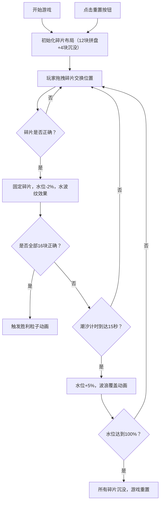

## 1. 产品概述

潮汐碑文沉浸式拼图解谜游戏——一款在浏览器中体验结合潮汐运动机制与古老碑文碎片拼合的解谜游戏。玩家需要在不断上升的潮汐水位下，将沉没的古老碑文碎片拼合复原，体验古文明解谜的乐趣。

- **核心目标**：解决玩家在没有实体道具和即时反馈的情况下，无法体验沉浸式拼图解谜的问题
- **目标用户**：喜欢解谜游戏、古文明题材的休闲玩家
- **产品价值**：通过独特的潮汐时间压力机制与精美的沉没古文明视觉风格，提供紧张刺激又富有美感的拼图解谜体验

## 2. 核心功能

### 2.1 功能模块

1. **核心游戏界面**：海浪纹理背景游戏区域、4x4碑文碎片拼盘、潮汐水位指示器、水下凹槽
2. **碎片交互系统**：鼠标拖拽交换、正确拼合判定、粒子消散动画
3. **潮汐系统**：水位周期性上升、波浪覆盖动画、碎片模糊效果、沉没重置逻辑
4. **进度与控制**：进度条显示、重置按钮、胜利/失败状态管理

### 2.2 功能详情

| 功能模块 | 子功能 | 功能描述 |
|---------|--------|---------|
| 游戏界面 | 背景渲染 | 800x600px游戏区域，浅蓝到深蓝径向渐变，半透明噪点纹理模拟水面波动 |
| 游戏界面 | 碎片拼盘 | 4x4网格（每格80x80px，间隔2px），正确拼合时呈现淡金色辉光边框 |
| 游戏界面 | 潮汐指示器 | 右侧垂直弧形刻度条（0%-100%），发光水滴图标表示当前水位 |
| 游戏界面 | 水下凹槽 | 拼盘下方4个凹槽，存放"沉没"状态的碎片 |
| 碎片系统 | 初始布局 | 12块乱序碎片在拼盘中（除中央4块外随机分布），4块沉没在凹槽中 |
| 碎片系统 | 碎片图案 | Canvas绘制的篆书风格古文字笔画片段 |
| 碎片系统 | 拖拽交互 | 鼠标点击拖动碎片到相邻空格或凹槽交换，拖拽时半透明+原位置闪烁 |
| 碎片系统 | 胜利判定 | 16块碎片全部正确拼合时触发胜利动画 |
| 潮汐系统 | 水位上升 | 每15秒水位上升5% |
| 潮汐系统 | 波浪覆盖 | 水位上升时蓝色波浪动画，覆盖碎片模糊且不可拖拽 |
| 潮汐系统 | 水位下降 | 每正确拼合1块碎片，水位下降2%，触发水波纹效果 |
| 潮汐系统 | 游戏重置 | 水位达到100%时所有碎片沉没，游戏重新开始 |
| 进度控制 | 进度条 | 底部250x8px进度条，显示已稳固碎片数（X/16） |
| 进度控制 | 重置按钮 | 圆形按钮（直径40px），点击重置游戏 |

## 3. 核心流程

玩家进入游戏后，看到乱序排列的碑文碎片。通过鼠标拖拽交换碎片位置，尝试将碎片拼合成完整的古文字图案。与此同时，潮汐水位每15秒上升5%，被水覆盖的碎片会变模糊且无法操作。玩家每正确拼合一块碎片，水位会下降2%并获得水波纹反馈。若在水位到达100%前完成全部16块碎片的拼合，则触发胜利动画；否则游戏重置，重新开始挑战。

## 4. 用户界面设计

### 4.1 设计风格

- **色彩体系**：深蓝（#0B2A4B、#2E4A62、#0B1E32）为基调，金铜色（#C9A96E、#FFD700、#D4C9B3）为点缀，浅蓝色（#8EC5FC、#A0C4FF）为辅助
- **视觉主题**：沉没的古文明风格——流动水面纹路、深蓝渐变背景、金铜色碑文、海浪粒子动画
- **字体风格**：无衬线简洁字体，古文字使用篆书风格线条绘制
- **动画风格**：平滑过渡（0.2s）、粒子消散（1s）、波浪覆盖（0.8s）

### 4.2 界面元素设计

| 元素 | 规格 | 颜色/样式 |
|------|------|----------|
| 游戏区域 | 800x600px | 径向渐变 #8EC5FC → #0B2A4B，半透明噪点纹理 |
| 格子 | 80x80px，间隔2px | 背景#2E4A62，边框1.5px实线#C9A96E |
| 正确格子边框 | - | 淡金色辉光效果 |
| 潮汐刻度条 | 右侧垂直弧形 | 刻度线白色半透明，水滴图标发光 |
| 水下凹槽 | 80x80px | 背景#0B1E32，边沿2px虚线#4B6E8C |
| 碎片线条 | - | #D4C9B3，2px粗细，篆书风格 |
| 拖拽中碎片 | - | 半透明#A0C4FF，原位置白色边框闪烁1.5px |
| 进度条 | 250x8px，圆角4px | 底色#3D5A6E，填充#FFD700 |
| 进度文字 | 14px | #D4C9B3，"已稳固：X/16" |
| 重置按钮 | 直径40px圆形 | 背景#6B4E3A，悬停#8B6E5A，逆时针箭头#D4C9B3 |
| 胜利古文字符 | 120px | #FFD700发光，旋转渐稳 |

### 4.3 响应式设计

- **桌面端**：800x600px游戏区域，网格80x80px
- **窄屏（最小480px）**：网格缩小到60x60px，整体布局自适应
- **触摸优化**：支持触屏拖拽操作

## 5. 性能要求

- 碎片拖拽响应时间 < 30ms
- 粒子消散动画帧率 ≥ 30fps
- 潮汐波浪动画流畅不卡顿
- 所有交互提供即时视觉反馈
