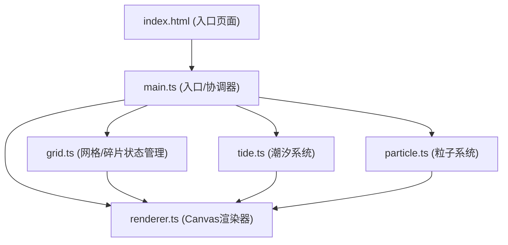

## 1. 架构设计

本项目为纯前端Canvas游戏，采用模块化分层架构，各模块职责单一、低耦合高内聚。



## 2. 技术描述

- **构建工具**：Vite 5.x（支持HMR热更新）
- **编程语言**：TypeScript 5.x（严格模式，目标ES2020）
- **渲染引擎**：HTML5 Canvas 2D API
- **状态管理**：模块内部状态（非框架式全局状态）
- **动画系统**：requestAnimationFrame循环驱动
- **事件系统**：原生DOM事件监听（鼠标/触摸）

## 3. 目录结构

```
auto290/
├── index.html              # 入口HTML
├── package.json            # 依赖与脚本
├── vite.config.js          # Vite配置
├── tsconfig.json           # TypeScript配置
└── src/
    ├── main.ts             # 应用入口，协调各模块
    ├── grid.ts             # 4x4网格状态、碎片交换逻辑
    ├── tide.ts             # 潮汐水位、波浪动画、沉没逻辑
    ├── particle.ts         # 粒子生成、更新、渲染
    └── renderer.ts         # Canvas绘制（背景/碎片/UI/效果）
```

## 4. 核心数据模型

### 4.1 碎片数据结构

```typescript
interface Piece {
  id: number;          // 碎片ID (0-15)
  correctRow: number;  // 正确行位置 (0-3)
  correctCol: number;  // 正确列位置 (0-3)
  currentRow: number;  // 当前行位置 (0-3) 或 -1表示沉没
  currentCol: number;  // 当前列位置 (0-3) 或 沉没槽索引
  isCorrect: boolean;  // 是否已正确放置
  isSunk: boolean;     // 是否处于沉没状态
}
```

### 4.2 网格状态

```typescript
class Grid {
  pieces: Piece[];                  // 16块碎片数组
  grid: (Piece | null)[][];         // 4x4网格矩阵
  sunkSlots: (Piece | null)[];      // 4个沉没槽
  draggingPiece: Piece | null;      // 当前拖拽中的碎片
  dragOffset: { x: number; y: number }; // 拖拽偏移量
}
```

### 4.3 潮汐状态

```typescript
class TideSystem {
  waterLevel: number;         // 当前水位 (0-100)
  isRising: boolean;          // 是否正在上升
  waveProgress: number;       // 波浪动画进度 (0-1)
  lastTickTime: number;       // 上次计时时间
  coveredRows: Set<number>;   // 被水覆盖的行
}
```

### 4.4 粒子系统

```typescript
interface Particle {
  x: number; y: number;       // 位置
  vx: number; vy: number;     // 速度
  life: number;               // 生命值 (0-1)
  maxLife: number;            // 最大生命周期
  size: number;               // 粒子大小
  color: string;              // 粒子颜色
}
```

## 5. 模块接口定义

### 5.1 grid.ts

```typescript
// 初始化网格与碎片
initGrid(): void;
// 判断碎片是否可交互（未被水覆盖）
isPieceInteractive(piece: Piece): boolean;
// 开始拖拽碎片
startDrag(row: number, col: number, mouseX: number, mouseY: number): void;
// 更新拖拽位置
updateDrag(mouseX: number, mouseY: number): void;
// 结束拖拽，尝试交换
endDrag(targetRow: number, targetCol: number): boolean;
// 交换两个位置的碎片
swapPieces(from: CellPos, to: CellPos): void;
// 检查并更新碎片是否正确放置
checkPieceCorrect(piece: Piece): boolean;
// 检查全部完成
isAllCorrect(): boolean;
// 重置所有碎片到沉没状态
sinkAllPieces(): void;
// 重置游戏
reset(): void;
```

### 5.2 tide.ts

```typescript
// 更新潮汐计时（每帧调用）
update(deltaTime: number): void;
// 获取某行是否被水覆盖
isRowCovered(row: number): boolean;
// 获取某格是否被水覆盖
isCellCovered(row: number, col: number): boolean;
// 正确拼合触发水位下降
onPieceCorrect(): void;
// 触发水波纹效果
triggerRipple(x: number, y: number): void;
// 判断是否游戏失败（水位满）
isGameOver(): boolean;
// 重置潮汐状态
reset(): void;
```

### 5.3 particle.ts

```typescript
// 在指定位置生成胜利粒子（金色消散）
emitVictoryParticles(x: number, y: number, count: number): void;
// 生成水波纹粒子
emitRippleParticles(x: number, y: number): void;
// 更新所有粒子（每帧调用）
update(deltaTime: number): void;
// 渲染所有粒子
render(ctx: CanvasRenderingContext2D): void;
// 清空所有粒子
clear(): void;
```

### 5.4 renderer.ts

```typescript
// 渲染整个画面
render(): void;
// 绘制背景（渐变+噪点+水面动画）
drawBackground(): void;
// 绘制4x4网格拼盘
drawGrid(): void;
// 绘制单个碎片（含古文字笔画）
drawPiece(piece: Piece, x: number, y: number, size: number, isDragging: boolean): void;
// 绘制水下凹槽
drawSunkSlots(): void;
// 绘制潮汐水位指示器
drawTideIndicator(): void;
// 绘制波浪覆盖效果
drawWaveOverlay(): void;
// 绘制水波纹效果
drawRipples(): void;
// 绘制进度条
drawProgressBar(): void;
// 绘制重置按钮
drawResetButton(): void;
// 绘制胜利动画（中央发光古文字）
drawVictoryAnimation(): void;
```

## 6. 渲染循环与事件处理

### 6.1 主循环

```typescript
// requestAnimationFrame 驱动
function gameLoop(timestamp: number) {
  const deltaTime = timestamp - lastTimestamp;
  
  tide.update(deltaTime);      // 更新潮汐
  particle.update(deltaTime);  // 更新粒子
  grid.updateDrag(...)         // 更新拖拽
  renderer.render();           // 渲染画面
  
  requestAnimationFrame(gameLoop);
}
```

### 6.2 事件绑定

- `mousedown` / `touchstart`：开始拖拽碎片
- `mousemove` / `touchmove`：更新拖拽位置
- `mouseup` / `touchend`：结束拖拽，判定交换
- `click`：重置按钮点击

## 7. 性能优化策略

1. **Canvas分层**：静态背景（渐变+噪点）缓存到离屏Canvas，避免每帧重绘
2. **脏矩形渲染**：仅重绘变化区域（非必需时可跳过优化）
3. **粒子池化**：复用Particle对象，减少GC压力
4. **requestAnimationFrame**：统一动画驱动，与浏览器刷新同步
5. **节流/防抖**：拖拽事件适当节流，保证<30ms响应
6. **避免内存泄漏**：游戏重置时清理所有定时器和粒子
