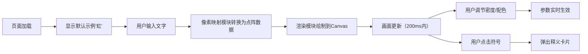

## 1. 产品概述
像素转译器是一款将中文字符实时转换为像素风格象形图案的创意工具。用户输入任意中文，浏览器画布上会渲染出由像素方块构成的对应象形符号画，支持调节点阵密度与配色方案。
- 目标用户：对中文象形文化、像素艺术、创意设计感兴趣的用户
- 产品价值：以可视化的方式展现汉字的象形美感，提供交互式汉字艺术体验

## 2. 核心功能

### 2.1 功能模块
1. **主画布区域**：展示米黄色仿古纸纹理画布，渲染像素象形图案
2. **文字输入区**：实时输入中文字符并更新画面
3. **参数控制区**：点阵密度滑块、预设配色方案选择、锁定按钮
4. **释义弹窗**：点击画布上的符号弹出汉字释义卡片

### 2.2 页面详情
| 页面名称 | 模块名称 | 功能描述 |
|-----------|-------------|---------------------|
| 主页面 | 画布渲染 | 700x500px仿古纸纹理画布，支持Canvas像素绘制与动画 |
| 主页面 | 文字输入 | 输入框实时监听，200ms内完成画面渲染 |
| 主页面 | 密度调节 | 4x4到12x12点阵密度滑块，默认6x6 |
| 主页面 | 配色切换 | 5种预设配色（白模/暖阳/深海/烈焰/荧光），点击即时切换 |
| 主页面 | 锁定功能 | 暂停实时更新，调节参数后点击"应用"再刷新 |
| 主页面 | 释义卡片 | 点击符号弹出汉字完整释义卡片 |

## 3. 核心流程
用户打开页面 → 默认显示示例字"虹"的6x6点阵彩色弧线 → 用户在输入框输入文字 → 画布实时渲染对应像素图案 → 用户通过滑块调节密度或点击配色方案 → 画面即时更新 → 点击画布上的符号 → 弹出汉字释义卡片

## 4. 用户界面设计
### 4.1 设计风格
- **主色调**：浅灰蓝背景#F0F4F8，深褐色#3E2723文字，米黄色画布#F5F0E8
- **按钮风格**：圆角8px输入框，边框#C0A882，背景#FFFBF0
- **字体**：Georgia serif，标题2rem
- **布局**：画布居中（700x500px），上方输入区，左侧参数控制区
- **画布装饰**：2px深褐色边框#6B4E3A，内侧0.5px金色装饰线#BD894E

### 4.2 页面设计概述
| 页面名称 | 模块名称 | UI元素 |
|-----------|-------------|-------------|
| 主页面 | 标题区 | 居中"像素转译器"标题，Georgia字体，2rem，#3E2723 |
| 主页面 | 输入区 | 圆角输入框（8px）、锁定/应用按钮 |
| 主页面 | 画布区 | 700x500px径向渐变画布，带边框和装饰线，随机棕色噪点 |
| 主页面 | 控制面板 | 密度滑块（轨道#E8DCC8，按钮#8B6D52）、5组配色圆形色块 |
| 主页面 | 释义弹窗 | 点击符号时浮现的卡片式弹窗 |

### 4.3 响应式
桌面优先设计，画布固定尺寸居中布局。
