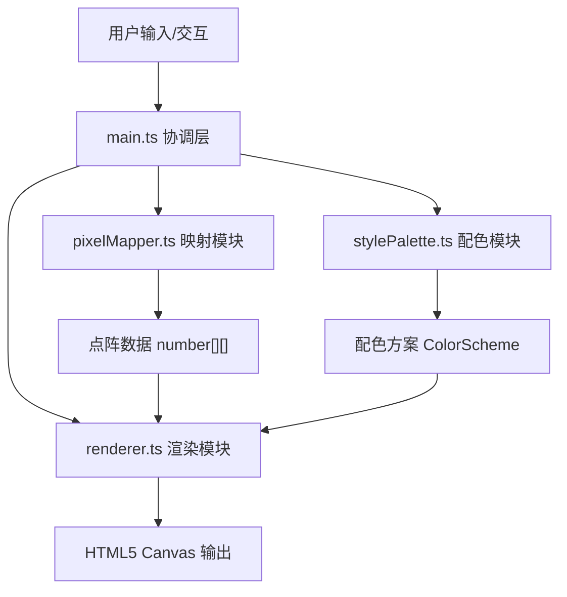

## 1. 架构设计



## 2. 技术描述
- **前端框架**：无UI框架，纯原生TypeScript
- **构建工具**：Vite（支持HMR）
- **渲染方式**：HTML5 Canvas 2D API 纯绘制
- **语言规范**：TypeScript 严格模式，target ES2020，module ESNext

## 3. 模块与文件结构
| 文件路径 | 职责 |
|-------|---------|
| package.json | 项目依赖与脚本配置 |
| index.html | 入口HTML，页面结构与样式 |
| tsconfig.json | TypeScript编译配置 |
| vite.config.js | Vite构建配置 |
| src/main.ts | 应用入口，初始化Canvas、绑定事件、协调模块 |
| src/pixelMapper.ts | 中文字符到点阵图案的映射（string → number[][]） |
| src/renderer.ts | Canvas渲染引擎，绘制像素、配色、动画效果 |
| src/stylePalette.ts | 5种预设配色方案定义与接口 |

## 4. 核心数据结构
```typescript
// 点阵数据：二维数组，1表示填充，0表示空白
type PixelGrid = number[][];

// 配色方案
interface ColorScheme {
  name: string;
  colors: string[];
  background: string;
}

// 应用状态
interface AppState {
  text: string;
  density: number;          // 4-12
  colorScheme: string;      // 配色方案名称
  locked: boolean;          // 是否锁定实时更新
  pendingDensity: number;
  pendingColorScheme: string;
}
```

## 5. 像素图案预设规则
| 汉字 | 图案规则 |
|-----|---------|
| 雨 | 稀疏倾斜的短蓝线模拟雨丝 |
| 山 | 三个渐变绿色三角堆叠 |
| 火 | 闪烁的红橙色小方块从下往上飘（动画） |
| 虹 | 从左上到右下的彩色弧线，末端带光晕 |
| 日 | 中央圆形，周围放射状短线 |
| 月 | 弯月形状 |
| 水 | 波浪状横向曲线 |
| 木 | 竖线加左右分叉 |
| 人 | 两条斜线组成的人形 |
| 口 | 方框形状 |
| 田 | 方框内加十字分割 |
| 默认 | 基于汉字Unicode生成伪随机点阵 |

## 6. 性能要求
- 输入文字后画面在200ms内完成渲染
- 动画使用requestAnimationFrame，避免卡顿
- 像素绘制缓存优化，避免重复计算
