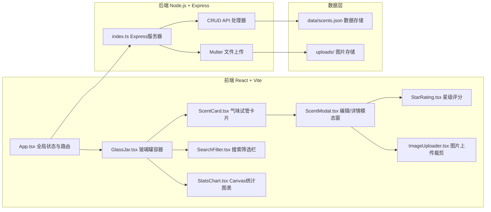
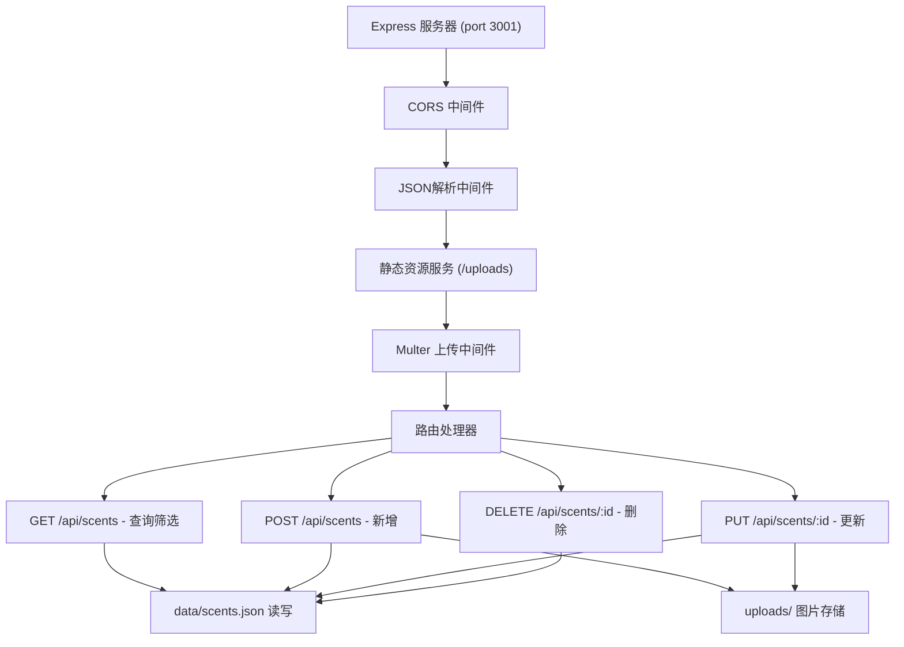
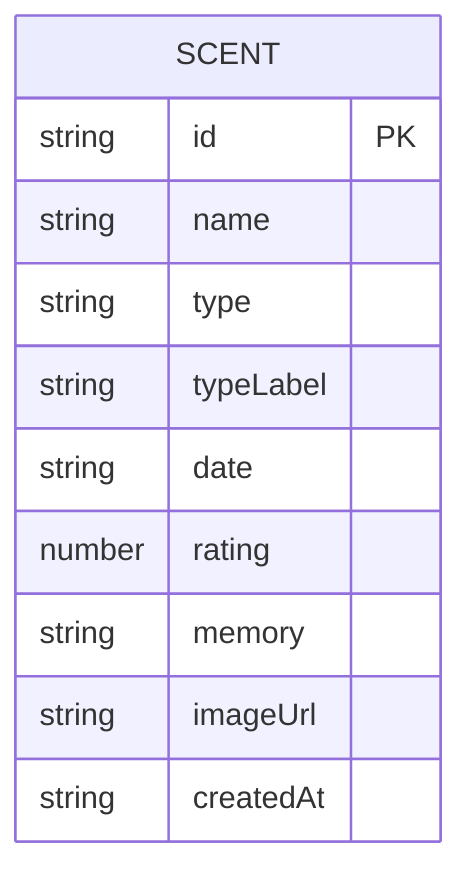

## 1. 架构设计



## 2. 技术说明

- **前端框架**：React@18 + TypeScript
- **构建工具**：Vite@5
- **后端框架**：Express@4 + TypeScript
- **运行时**：tsx（TypeScript执行器）
- **并发启动**：concurrently
- **文件上传**：multer
- **ID生成**：uuid
- **跨域支持**：cors
- **图标库**：lucide-react

## 3. 路由定义

| 路由 | 说明 |
|------|------|
| / | 主页，展示玻璃罐容器和所有功能模块 |

## 4. API定义

### 4.1 类型定义

```typescript
interface Scent {
  id: string;
  name: string;
  type: 'floral' | 'fruity' | 'woody' | 'spicy' | 'marine' | 'smoky' | 'gourmand' | 'other';
  typeLabel: string;
  date: string;
  rating: number;
  memory: string;
  imageUrl: string | null;
  createdAt: string;
}
```

### 4.2 接口列表

| 方法 | 路径 | 参数 | 说明 |
|------|------|------|------|
| GET | /api/scents | ?type=&search= | 获取所有气味，支持类型和关键词筛选 |
| POST | /api/scents | FormData(name,type,date,rating,memory,image) | 添加新气味（multipart表单） |
| PUT | /api/scents/:id | 同POST | 更新指定气味 |
| DELETE | /api/scents/:id | - | 删除指定气味 |

## 5. 服务端架构



## 6. 数据模型

### 6.1 数据结构



### 6.2 数据文件

JSON文件存储于 `data/scents.json`，结构：
```json
{
  "scents": [
    {
      "id": "uuid",
      "name": "雨后泥土",
      "type": "woody",
      "typeLabel": "木质",
      "date": "2024-01-15",
      "rating": 5,
      "memory": "夏日雷雨后的泥土清香，混合青草气息...",
      "imageUrl": "/uploads/xxx.jpg",
      "createdAt": "2024-01-15T10:30:00.000Z"
    }
  ]
}
```

### 6.3 气味类型映射

| type值 | 标签 | 主题色 |
|--------|------|--------|
| floral | 花香 | #F4A7BB |
| fruity | 果香 | #F7DC6F |
| woody | 木质 | #A67B5B |
| spicy | 辛香 | #E67E22 |
| marine | 海洋 | #85C1E9 |
| smoky | 烟熏 | #7F8C8D |
| gourmand | 美食 | #D4A574 |
| other | 其他 | #BB8FCE |
