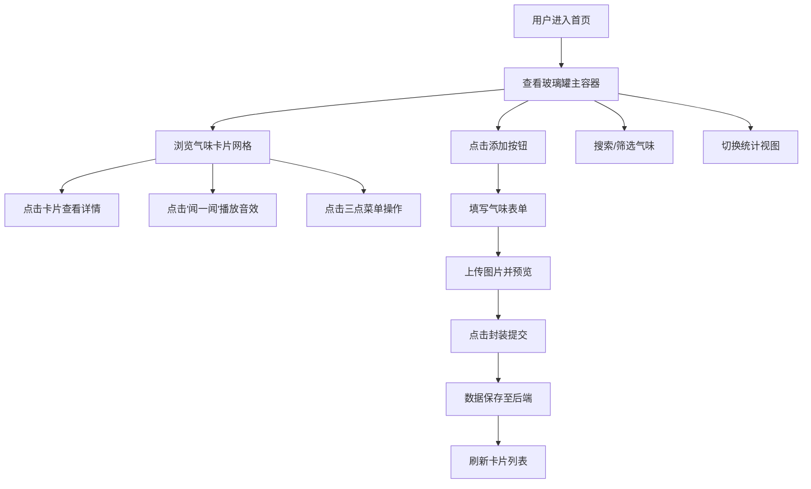

## 1. 产品概述

「气味博物馆」是一款面向气味爱好者的Web应用，帮助用户系统化记录、分享和探索各种气味体验，将抽象的气味感受与视觉、文字元素关联起来，打造个人专属的气味记忆收藏馆。

- **目标用户**：香水爱好者、调香师、生活美学追求者、感官体验记录者
- **核心价值**：让无形的气味变得可记录、可回忆、可分享，建立独特的个人气味数字档案

## 2. 核心功能

### 2.1 功能模块

1. **主页面**：玻璃罐容器、用户信息展示、添加气味入口、气味卡片网格
2. **气味编辑模态窗**：表单录入（名称、类型、日期、评分、记忆文字、图片上传）
3. **气味卡片组件**：试管造型、气味信息展示、"闻一闻"播放音效、三点菜单（编辑/删除/分享）
4. **搜索筛选栏**：实时搜索、类型筛选、时间筛选、仅带图片筛选
5. **统计视图**：Canvas环形图可视化气味类型占比
6. **气味详情页**：大图展示、完整信息、"记录新体验"、"生成回忆海报"
7. **后端API**：RESTful CRUD接口、文件上传、JSON数据存储

### 2.2 页面详情

| 页面名称 | 模块名称 | 功能描述 |
|---------|---------|---------|
| 主页面 | 玻璃罐容器 | 600x700px毛玻璃圆角卡片，承载用户信息与气味列表 |
| 主页面 | 用户信息区 | 头像、用户名展示，添加新气味按钮（悬停变色） |
| 主页面 | 搜索筛选栏 | 实时搜索（300ms防抖）、类型/时间/图片筛选（下划线动画） |
| 主页面 | 气味卡片网格 | 3列布局，试管造型卡片，展示名称/评分/缩略图/闻一闻按钮 |
| 主页面 | 统计视图切换 | Canvas环形图展示类型占比，悬停tooltip |
| 详情模态窗 | 气味详情 | 大图展示、完整字段信息、操作按钮 |
| 添加模态窗 | 气味编辑 | 表单录入、图片上传裁剪、星级评分选择、封装提交 |

## 3. 核心流程

## 4. 用户界面设计

### 4.1 设计风格

- **整体风格**：深色复古实验室美学，仿旧金属纹理质感
- **主色调**：
  - 背景色：#1C1A1E（深暗复古棕黑）
  - 强调色：#D4A373（琥珀色）
  - 金属色：#8E7D4B（古铜色）
  - 文字高亮：#EAE2D6（米白色）
  - 金色评分：#F4A261
- **字体**：选用复古感衬线字体搭配现代无衬线字体
- **卡片风格**：毛玻璃半透明效果（backdrop-filter: blur），细致阴影与微光晕
- **动效**：0.2s ease过渡，悬停微交互，星级弹跳动画，下划线滑动动画

### 4.2 页面设计概览

| 页面名称 | 模块名称 | UI元素 |
|---------|---------|--------|
| 主页面 | 玻璃罐容器 | 600x700px圆角，半透明磨砂，1px rgba(255,255,255,0.15)边框，阴影光晕 |
| 主页面 | 添加按钮 | 玻璃瓶图标，悬停液体从透明变为琥珀色#D4A373 |
| 主页面 | 气味卡片 | 试管造型，顶部塞子#C9A96E，主题色渐变管体，白色模糊阴影文字 |
| 主页面 | 评分星级 | 点击选中从灰色变金色#F4A261，轻微弹跳动画 |
| 主页面 | 筛选按钮 | 选中时底部下划线从0到100%滑动，0.3s ease |
| 模态窗 | 毛玻璃层 | backdrop-filter: blur(12px) |
| 统计视图 | Canvas环形图 | 弧线#D4A373到#8E7D4B渐变，中心总数文字，悬停tooltip |

### 4.3 响应式

- 桌面端优先，最小宽度1200px
- 固定布局设计，无需移动端适配
