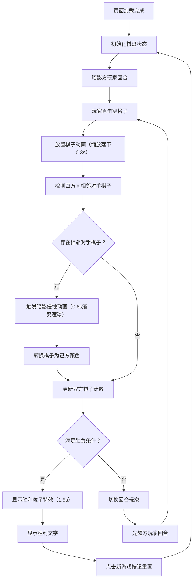

## 1. 产品概述

「暗影棋局」是一款即时回合制双人对战棋类游戏，两位玩家在8x8棋盘上轮流放置棋子，通过「暗影侵蚀」机制夺取对手相邻棋子，最终占领棋盘多数区域获胜。

- 产品定位：具有暗黑神秘美学风格的策略对战小游戏
- 目标用户：喜欢策略棋类游戏的休闲玩家
- 核心玩法：落子夺子策略对战

## 2. 核心功能

### 2.1 用户角色

| 角色 | 说明 | 核心权限 |
|------|------|----------|
| 玩家1（暗影方） | 本地双人对战玩家，先手 | 放置暗紫色棋子，触发暗影侵蚀 |
| 玩家2（光耀方） | 本地双人对战玩家，后手 | 放置亮金色棋子，触发光耀侵蚀 |

### 2.2 功能模块

1. **游戏主界面**：8x8棋盘渲染、信息面板、新游戏按钮
2. **棋子系统**：棋子放置动画、粒子光环/光晕动画、悬停预览
3. **暗影侵蚀机制**：相邻对手棋子判定、格子渐变遮罩、棋子颜色转换
4. **胜负判定**：棋子数量统计、超过半数胜利、无子可放判定
5. **结束动画**：粒子扩散特效、渐变胜利文字

### 2.3 页面详情

| 页面名称 | 模块名称 | 功能描述 |
|----------|----------|----------|
| 游戏主页面 | 棋盘区域 | 8x8网格，支持点击放置棋子，显示侵蚀动画 |
| 游戏主页面 | 信息面板 | 显示当前回合玩家、双方棋子数量、新游戏按钮 |
| 游戏主页面 | 结束弹窗 | 显示胜利粒子特效和胜利文字 |

## 3. 核心流程

游戏主要流程：玩家轮流点击空格放置棋子 → 系统检测相邻对手棋子 → 触发暗影侵蚀转换棋子颜色 → 更新棋子计数 → 检测胜负条件 → 若满足则显示胜利动画，否则切换回合。

## 4. 用户界面设计

### 4.1 设计风格

- **主色调**：深紫黑色渐变背景（#0B0B1A到#1A1030）
- **棋盘格子**：深蓝紫色交替（#1A1A2E和#16213E），边框#0F3460
- **棋盘边框**：暗金色2px边框（#C9A96E）
- **玩家1棋子**：暗紫色#6B3FA0，带旋转粒子光环（抖动频率0.1）
- **玩家2棋子**：亮金色#E8C36A，带扩散光晕（44px→50px，周期2秒）
- **信息面板**：半透明深色#1F1A2E，圆角12px，边框#3A2A5C
- **按钮**：背景渐变#2A1B3D到#1F1430，文字#C9A96E，悬停#3A2A5C
- **胜利文字**：金色到白色渐变动画，font-size 48px加粗

### 4.2 页面设计概览

| 页面名称 | 模块名称 | UI元素 |
|----------|----------|--------|
| 游戏主页面 | 棋盘 | 8x8网格60x60px格子，交替深蓝紫色，暗金色外边框，居中显示 |
| 游戏主页面 | 棋子 | 圆形直径40px，暗紫色/亮金色，带动画特效，悬停半透明预览 |
| 游戏主页面 | 侵蚀动画 | 0.8秒从对手颜色渐变到己方颜色的遮罩 |
| 游戏主页面 | 信息面板 | 右侧180px宽，回合头像+文字、棋子计数、新游戏按钮 |
| 游戏主页面 | 胜利动画 | 中心扩散粒子（胜利方颜色，1.5秒），渐变胜利文字 |

### 4.3 响应式

- 视口宽度600px-1200px自动缩放
- 棋盘格子：最小45px，最大70px
- 信息面板宽度随棋盘比例相应调整
- Desktop-first设计，触摸操作优化

### 4.4 动画与性能

- 所有动画运行在60fps，帧间隔≤16ms
- 棋子放置：从上方缩放落下，持续0.3秒
- 侵蚀转换：格子颜色渐变+棋子颜色切换同步，0.8秒
- 胜利粒子：从中心扩散，1.5秒后显示文字
- 游戏状态更新到界面重绘延迟≤50ms
