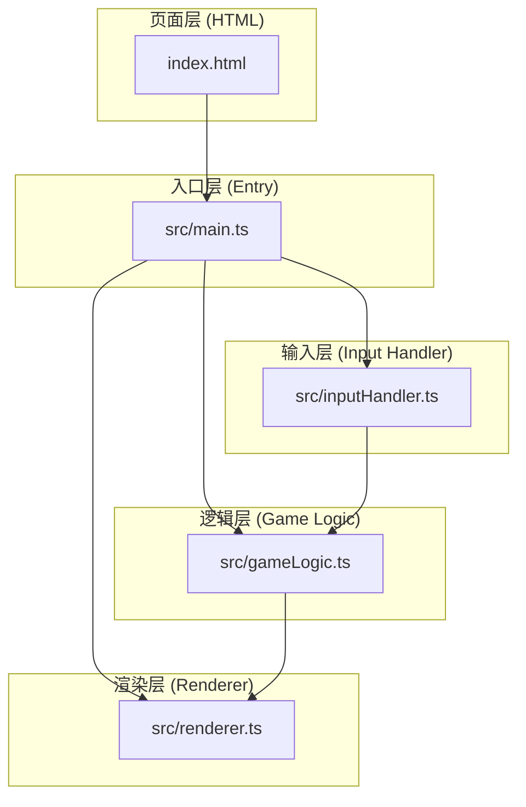

## 1. 架构设计



**架构说明：**
- 纯前端Canvas游戏，无需后端
- 采用MVC-like分层：逻辑层(model)、渲染层(view)、输入层(controller)
- main.ts作为入口协调各模块，启动游戏循环

## 2. 技术说明

- **构建工具**：Vite（支持HMR热更新）
- **语言**：TypeScript（严格模式，目标ES2020）
- **渲染**：HTML5 Canvas 2D API
- **状态管理**：纯函数式状态管理，gameLogic维护棋盘状态
- **动画**：requestAnimationFrame驱动，60fps游戏循环

## 3. 项目文件结构

| 文件 | 职责说明 |
|------|----------|
| package.json | 依赖管理（typescript、vite）、启动脚本 |
| vite.config.js | Vite构建配置，HMR支持 |
| tsconfig.json | TypeScript配置，严格模式，ES2020 |
| index.html | 入口页面，Canvas容器+UI层 |
| src/main.ts | 应用入口，初始化UI，启动游戏循环 |
| src/gameLogic.ts | 游戏核心逻辑：棋盘状态、暗影侵蚀、胜负判定 |
| src/renderer.ts | Canvas绘制：棋盘、棋子、动画、UI提示 |
| src/inputHandler.ts | 鼠标事件处理，坐标转换，触发逻辑更新 |

## 4. 核心数据结构定义

```typescript
// 棋子所有者：0-空, 1-暗影方, 2-光耀方
type Player = 0 | 1 | 2;

// 棋盘格子坐标
interface CellPosition {
    row: number;  // 0-7
    col: number;  // 0-7
}

// 动画中的棋子
interface AnimatedPiece {
    row: number;
    col: number;
    owner: Player;
    isNew: boolean;          // 是否新放置
    placeProgress: number;   // 放置动画进度 0-1
    isConverting: boolean;   // 是否正在转换
    convertProgress: number; // 转换动画进度 0-1
    convertFrom: Player;     // 转换前颜色
    convertTo: Player;       // 转换后颜色
}

// 游戏状态
interface GameState {
    board: Player[][];           // 8x8棋盘
    currentPlayer: Player;       // 当前回合玩家
    isAnimating: boolean;        // 是否动画中（阻止点击）
    animatedPieces: AnimatedPiece[]; // 正在动画的棋子列表
    hoverCell: CellPosition | null; // 悬停预览位置
    gameOver: boolean;           // 游戏是否结束
    winner: Player;              // 胜利方
    winProgress: number;         // 胜利动画进度 0-1
    particles: Particle[];       // 胜利粒子
    cellSize: number;            // 当前格子尺寸（响应式）
}

// 粒子特效
interface Particle {
    x: number;
    y: number;
    vx: number;
    vy: number;
    color: string;
    life: number;    // 0-1
    maxLife: number;
    size: number;
}
```

## 5. 核心接口定义

### 5.1 gameLogic.ts

```typescript
// 初始化棋盘
function initBoard(): Player[][];

// 尝试放置棋子，返回被侵蚀的相邻格子列表
function tryPlacePiece(
    board: Player[][],
    row: number,
    col: number,
    player: Player
): { success: boolean; capturedCells: CellPosition[] };

// 检测是否存在可放置位置
function hasValidMove(board: Player[][], player: Player): boolean;

// 获取棋子数量
function countPieces(board: Player[][]): { player1: number; player2: number };

// 检测胜负
function checkWinner(
    board: Player[][],
    player1Count: number,
    player2Count: number
): Player; // 0=未结束, 1=暗影方胜, 2=光耀方胜
```

### 5.2 renderer.ts

```typescript
class GameRenderer {
    constructor(canvas: HTMLCanvasElement);
    
    // 主渲染函数
    render(state: GameState): void;
    
    // 绘制棋盘
    private drawBoard(state: GameState): void;
    
    // 绘制棋子
    private drawPieces(state: GameState): void;
    
    // 绘制悬停预览
    private drawHoverPreview(state: GameState): void;
    
    // 绘制侵蚀渐变遮罩
    private drawConvertMasks(state: GameState): void;
    
    // 绘制胜利粒子
    private drawWinParticles(state: GameState): void;
    
    // 绘制胜利文字
    private drawWinText(state: GameState): void;
    
    // 计算渲染相关尺寸
    computeLayout(viewportWidth: number, viewportHeight: number): {
        cellSize: number;
        boardX: number;
        boardY: number;
        panelX: number;
        panelWidth: number;
    };
}
```

### 5.3 inputHandler.ts

```typescript
class InputHandler {
    constructor(
        canvas: HTMLCanvasElement,
        layout: () => { cellSize: number; boardX: number; boardY: number },
        callbacks: {
            onCellClick: (row: number, col: number) => void;
            onCellHover: (row: number, col: number | null) => void;
        }
    );
    
    // 坐标转换：画布像素→棋盘格子
    private pixelToCell(x: number, y: number): CellPosition | null;
}
```
