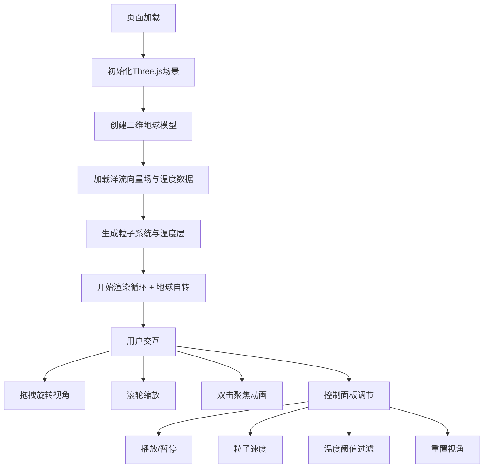

## 1. 产品概述

全球洋流三维可视化系统，面向气候研究人员和气象爱好者，在浏览器中以三维地球为载体直观展示全球洋流的动态流动与温度分布。用户可通过自由视角交互观察不同海域的洋流走向、速度及温度变化，为气候研究提供沉浸式数据探索体验。

## 2. 核心功能

### 2.1 功能模块
1. **三维地球场景**：低多边形地球模型，带大陆轮廓纹理，支持自转与暂停
2. **洋流粒子系统**：2000个动态粒子模拟洋流流动，带尾迹效果，温度映射颜色
3. **温度渐变层**：三维地球表面叠加全球温度分布网格
4. **视角交互系统**：鼠标拖拽旋转、滚轮缩放、双击聚焦动画
5. **控制面板**：播放/暂停、粒子速度调节、温度阈值过滤、视角重置

### 2.2 页面详情
| 页面名称 | 模块名称 | 功能描述 |
|----------|----------|----------|
| 主页面 | 三维渲染容器 | 全屏Three.js渲染器，深空蓝黑渐变背景 |
| 主页面 | 标题区域 | 左上角"全球洋流图"标题 |
| 主页面 | 图例区域 | 右下角温度色标与数值标注 |
| 主页面 | 控制面板 | 底部中央半透明磨砂玻璃风格控件组 |

## 3. 核心流程

用户打开页面后，三维地球自动开始自转，洋流粒子同步流动。用户可通过鼠标拖拽旋转视角、滚轮缩放观察距离；双击任意海域使该区域旋转至视野中心。通过底部控制面板调节播放状态、粒子速度、温度过滤范围，或重置视角至初始状态。右下角色标直观展示温度与颜色的对应关系。

## 4. 用户界面设计

### 4.1 设计风格
- **主色调**：深空蓝黑渐变背景（#0A0E1A → #050812）
- **强调色**：温度色标 深蓝(#00008B)→青蓝(#00BFFF)→黄绿(#ADFF2F)→橙红(#FF4500)
- **面板风格**：半透明磨砂玻璃（rgba(255,255,255,0.08)背景，1px rgba(255,255,255,0.15)边框，12px圆角）
- **交互反馈**：悬停白色发光（box-shadow: 0 0 8px rgba(255,255,255,0.3)），点击缩放至0.95
- **字体**：无衬线字体，字重300，暗色科技风

### 4.2 页面设计概览
| 页面名称 | 模块名称 | UI元素 |
|----------|----------|--------|
| 主页面 | 三维场景 | 低多边形地球、自转、2000粒子带尾迹、温度渐变层 |
| 主页面 | 标题 | 左上角白色"全球洋流图"文字，字重300 |
| 主页面 | 图例 | 右下角垂直色条（20×150px）、温度数值标注、淡白色外发光 |
| 主页面 | 控制面板 | 底部中央650×90px容器，含播放/暂停按钮、速度滑块、温度范围双滑块、重置按钮 |

### 4.3 响应式
- 桌面端（≥768px）：控制面板宽度650px，控件均匀分布
- 移动端（<768px）：控制面板宽度90%，控件间距缩小

### 4.4 3D场景指引
- **环境**：深空蓝黑渐变背景，无HDRI，营造深邃宇宙感
- **光照**：环境光（0x404040）+ 方向光模拟日光（0xffffff，强度1.0）
- **相机**：PerspectiveCamera，初始距离8单位，赤道上空45°俯角
- **地球**：IcosahedronGeometry（低多边形），半径2单位，程序生成槽纹理模拟大陆
- **粒子**：BufferGeometry + PointsMaterial，带Line尾迹（近5帧，透明度0.7→0.0）
- **动画**：requestAnimationFrame驱动，暂停时停止粒子更新
- **性能**：帧率≥45fps，单帧渲染≤20ms（2000粒子）
