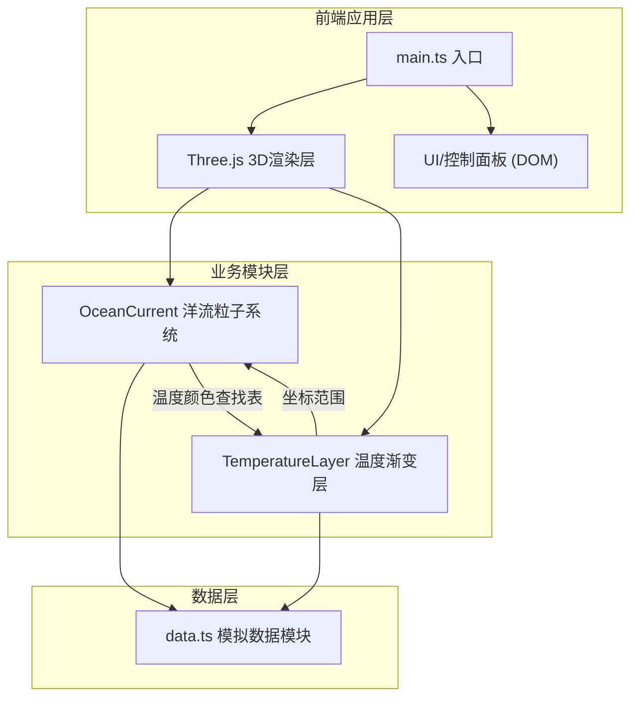

## 1. 架构设计



## 2. 技术栈说明
- **构建工具**：Vite 5.x（支持HMR和TypeScript）
- **语言**：TypeScript 5.x（严格模式，目标ES2020）
- **3D引擎**：Three.js r160+（含OrbitControls扩展）
- **数据可视化**：D3.js v7（用于颜色插值与比例尺）
- **渲染优化**：BufferGeometry、PointsMaterial、GPU加速粒子

## 3. 文件结构与调用关系

```
项目根目录/
├── index.html                    # 入口HTML，含#app容器与UI元素
├── package.json                  # 依赖与启动脚本
├── vite.config.js                # Vite构建配置
├── tsconfig.json                 # TypeScript配置（严格模式）
└── src/
    ├── main.ts                   # [入口] 初始化场景/相机/渲染器/控件，绑定resize，驱动渲染循环
    ├── oceanCurrent.ts           # [模块] 粒子系统：解析向量场→更新粒子位置→输出位置/颜色数组
    ├── temperatureLayer.ts       # [模块] 温度层：读取温度数据→生成纹理→输出颜色查找表
    └── data.ts                   # [数据] 导出洋流向量场数据与全球温度网格数据
```

**调用关系与数据流向**：
1. `main.ts` → 创建Three.js场景，实例化`OceanCurrent`和`TemperatureLayer`，启动动画循环
2. `OceanCurrent` → 从`data.ts`导入洋流向量场，每帧更新粒子位置，从`TemperatureLayer`获取颜色查找表映射粒子颜色
3. `TemperatureLayer` → 从`data.ts`导入温度网格数据，生成Mesh纹理，向`OceanCurrent`提供`getTemperatureAt(lat, lon)`接口
4. `main.ts` → UI事件（按钮/滑块）→ 调用`OceanCurrent`和`TemperatureLayer`的公共方法调节运行参数

## 4. 核心数据模型

### 4.1 洋流向量场数据
```typescript
interface OceanCurrentVector {
  lat: number;        // 纬度 -90 ~ 90
  lon: number;        // 经度 -180 ~ 180
  speed: number;      // 流速大小 (0 ~ 1)
  direction: number;  // 流向角度 (弧度，0=东)
}
```

### 4.2 温度网格数据
```typescript
interface TemperatureGrid {
  latStep: number;     // 纬度步长
  lonStep: number;     // 经度步长
  values: number[][];  // 二维温度数组 [latIndex][lonIndex], 单位°C
}
```

### 4.3 粒子状态
```typescript
interface Particle {
  position: THREE.Vector3;  // 当前三维坐标（球面）
  velocity: THREE.Vector3;  // 当前速度向量
  trail: THREE.Vector3[];   // 尾迹队列（最近5帧）
  temperature: number;      // 当前位置温度
}
```

## 5. 性能优化策略

| 策略 | 说明 |
|------|------|
| BufferGeometry | 粒子使用单一BufferGeometry存储全部2000粒子位置/颜色，避免逐对象draw call |
| PointsMaterial | 单点渲染，sizeAttenuation开启实现近大远小 |
| 尾迹复用 | 每粒子固定5帧尾迹，使用LineSegments + BufferAttribute循环覆盖 |
| 暂停优化 | isPaused时跳过粒子位置更新与尾迹推进，仅渲染 |
| requestAnimationFrame | 所有动画统一由RAF驱动，避免setTimeout抖动 |
| 按需更新 | 温度阈值变化时仅重建颜色数组，不重建几何 |
