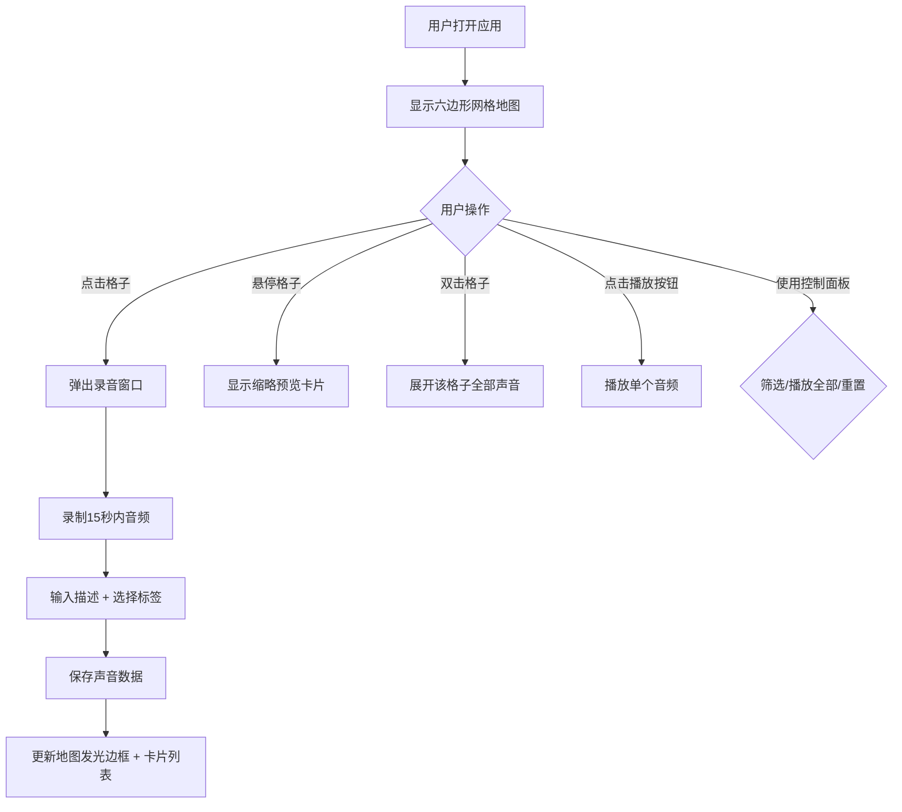

## 1. 产品概述

声景地图是一款帮助用户在浏览器中创建和管理个人声景地图的全栈Web应用，解决人们难以将日常生活中的环境声音与地理位置关联起来进行记录和回顾的问题。

- 核心价值：让用户以可视化的地图方式记录、管理和回顾生活中不同地点的环境声音记忆
- 目标用户：音频爱好者、环境研究者、日常生活记录者

## 2. 核心功能

### 2.1 功能模块

1. **主界面**：六边形网格地图 + 声音卡片列表双栏布局
2. **录音功能**：15秒内的环境声音录制，支持描述输入和标签选择
3. **地图交互**：点击录音、悬停预览、双击展开全部声音
4. **声音管理**：卡片瀑布流展示、单个播放、全部播放
5. **控制面板**：标签筛选、播放全部、重置数据

### 2.2 页面详情

| 页面名称 | 模块名称 | 功能描述 |
|-----------|-------------|---------------------|
| 主界面 | 六边形网格地图 | 30x30 Canvas绘制的抽象网格地图，根据声景密度渐变着色，点击格子录音，悬停预览，双击展开 |
| 主界面 | 录音浮动窗口 | 圆形录音按钮（带脉冲动画）、描述输入框、10种预设标签选择器 |
| 主界面 | 声音卡片列表 | Flex-wrap排列，圆形波形播放按钮，描述文本，标签和时间显示 |
| 主界面 | 悬浮控制面板 | 筛选器、播放全部、重置按钮 |

## 3. 核心流程

用户打开应用 → 查看六边形网格地图（已录音格子带发光边框）→ 点击任意格子 → 弹出录音窗口 → 录制环境声音（最长15秒）→ 输入描述并选择标签 → 确认保存 → 地图格子更新发光边框 → 右侧列表出现声音卡片 → 可悬停预览/双击展开/播放音频/筛选标签/播放全部/重置数据

## 4. 用户界面设计

### 4.1 设计风格

- **主色调**：深色渐变背景 #12121A → #1A1A28，主色深蓝紫到暗橙渐变
- **辅助色**：10种声景标签色（雨声#5B8FA8、风声#A8D5BA、鸟鸣#F4A261、车流#E74C3C、人声#C9A0DC、水流#6AB0E3、机械#8E8E8E、动物#9C7C6B、音乐#FF6B81、其他#D4A373）
- **材质**：半透明磨砂玻璃效果（backdrop-filter: blur(12px)），卡片背景 rgba(30,30,50,0.7)
- **按钮样式**：圆形录音按钮64px直径，圆角胶囊标签，圆角8px输入框
- **字体**：现代无衬线字体，主文字 #E0E0E0，次要文字 #8888AA
- **布局**：桌面端左右双栏（地图500px + 列表330px），移动端上下布局

### 4.2 页面设计概览

| 页面名称 | 模块名称 | UI元素 |
|-----------|-------------|-------------|
| 主界面 | 六边形网格地图 | Canvas绘制，30x30网格，边长12px六边形，深蓝到亮橙密度渐变，发光边框标识已录音格子 |
| 主界面 | 录音浮动窗口 | 圆角12px，背景#282838，脉冲录音按钮，描述输入框，标签胶囊选择器 |
| 主界面 | 声音卡片 | 150x200px圆角卡片，圆形波形播放按钮，两行溢出省略文本，标签胶囊，时间显示 |
| 主界面 | 控制面板 | 浮动右下角，圆角12px，三个功能按钮（筛选/播放全部/重置） |

### 4.3 交互动画

- 按钮点击：scale 0.95→1.0，200ms
- 按钮悬停：brightness 1.15，阴影加深
- 录音中：脉冲动画（半径64→120px，透明度0.6→0）
- 播放波形：同心圆向外扩散，透明度递减
- 卡片出现：淡入上移（opacity 0→1，translateY 10→0，300ms ease-out）

### 4.4 响应式设计

- 桌面端（>768px）：左右双栏布局，地图500x550px，卡片150x200px
- 移动端（<768px）：上下布局，地图width:100%顶部，列表横向滚动，卡片缩小为120x160px

### 4.5 性能要求

- 录音脉冲动画和波形扩散动画：≥30fps（requestAnimationFrame）
- 卡片列表滚动（>100格子数据）：≥48fps（IntersectionObserver懒加载/虚拟滚动）
